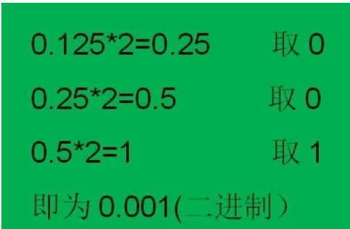
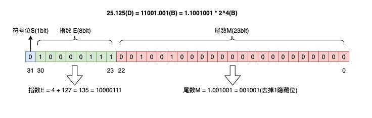
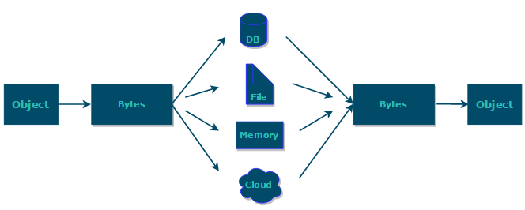
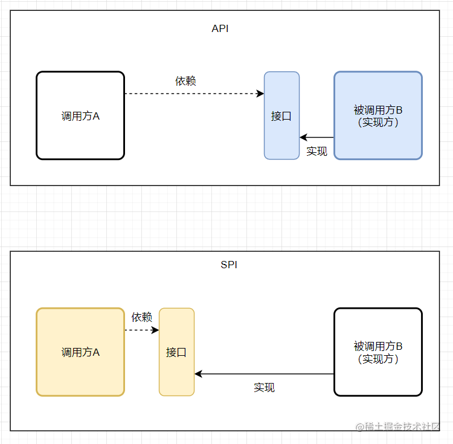

#文档
* https://javaguide.cn/java/basis/java-basic-questions-01.htm
#异常
* Exception
    * 受检查的异常，这种异常是强制我们catch或throw的异常。你遇到这种异常必须进行catch或throw，如果不处理，编译器会报错。比如：IOException
    * 继承自throw
* RuntimeException
    * 运行时异常，这种异常我们不需要处理，完全由虚拟机接管。比如我们常见的NullPointerException，我们在写程序时不会进行catch或throw
    * 继承自Exception
* Error
    * 严重的问题发生了，而且这种错误是不可恢复的
    * Error是一种严重的问题，可以被try-catach，但应用程序不应该捕捉它。
    * 继承自throw
* 当异常匹配某一个catch块的时候，
#java参数传递
* https://mp.weixin.qq.com/s?__biz=Mzg3NjIxMjA1Ng==&mid=2247488846&idx=3&sn=c0e0a00b756681524e169877b17e0a78&chksm=cf34ef79f843666f6d494f32c7f446a8f509415d316bbffced6712e6394ef00a33ed6f27a2d1&scene=21#wechat_redirect
* 当传递方法参数类型为基本数据类型（数字以及布尔值）时，传递是是值的拷贝，方法体内修改参数不影响原来参数的值
* 当传递方法参数类型为对象（引用类型）时，传递对象引用地址值的拷贝，方法体内修改对象参数会影响原来的参数
* 本质java只有值传递，但方便理解可以说基本数据类型是值传递，对象是引用传递（引用地址值的拷贝的传递）
# int a =1保存在哪里
* a作为类的成员变量，存放于方法区中；1保存在堆(Heap)的实例中
* a作为方法局部变量，存放于Java虚拟机栈(JVM Stacks)的局部变量表中；1也保存在栈内存中。
#包装类缓存
* 服务器.http://kaito-kidd.com/2018/08/08/computer-system-float-point/
* Byte,Short,Integer,Long 这 4 种包装类默认创建了数值 [-128，127] 的相应类型的缓存数据，Character 创建了数值在 [0,127] 范围的缓存数据
* 所有整型包装类对象之间值的比较，全部使用 equals 方法比较。
#包装类自动拆箱装箱
* 装箱其实就是调用了 包装类的valueOf()方法，拆箱其实就是调用了 xxxValue()方法。
* 如果频繁拆装箱的话，也会严重影响系统的性能。我们应该尽量避免不必要的拆装箱操作。
#浮点数精度丢失
* 十进制的 0.2 无法精确转换成二进制小数，而计算机在表示一个数字时，宽度是有限的，无限循环的小数存储在计算机时，只能被截断，所以就会导致小数精度发生损失的情况。
* BigDecimal时解决精度丢失，使用它的BigDecimal(String)构造器创建对象才有意义。其他的如BigDecimal b = new BigDecimal(1.01)这种，还是会发生精度丢失的问题。
* BigDecimal比较用compareTo方法：equals() 方法不仅仅会比较值的大小（value）还会比较精度（scale），而 compareTo() 方法比较的时候会忽略精度。
* 
* 
#浅拷贝与深拷贝
* https://zhuanlan.zhihu.com/p/311834569
* 浅拷贝仅仅复制所考虑的对象，而不复制它所引用的对象，深拷贝把要复制的对象所引用的对象都复制了一遍
* 深拷贝与浅拷贝问题中，会发生深拷贝的有java中的8中基本类型以及他们的封装类型，另外还有String类型。其余的都是浅拷贝
* 使用clone()对象需要实现Cloneable接口,Object.clone()自带的是浅拷贝，实现深拷贝要重写clone（）。
* 实现深拷贝可以使用序列化拷贝。

#String的不可变性
* https://www.cnblogs.com/think-in-java/p/6127804.html
* https://www.zhihu.com/question/20618891
* 首先String类是用final关键字修饰，这说明String不可继承。再看下面，String类的主力成员字段value是个被final修饰char[ ]数组，不可变。
* value不可变只是引用地址不可变，value数组在堆上内存可变的
* String的方法里很小心的没有去动value数组里的元素，没有暴露内部成员字段，String是不可变的关键都在底层的实现，而不是一个final
* 千万不要用可变类型做HashMap和HashSet键值。
#java序列化
## 参考文档
* https://www.cnblogs.com/9dragon/p/10901448.html
* https://www.cnblogs.com/weirdo-lenovo/p/11418905.html
##什么是序列化
* 序列化：将对象写入到IO流中
* 反序列化
    * 从IO流中恢复对象
    * 反序列化时必须有序列化对象的class文件
* 意义：序列化机制允许将实现序列化的Java对象转换位字节序列，这些字节序列可以保存在磁盘上，或通过网络传输，以达到以后恢复成原来的对象。序列化机制使得对象可以脱离程序的运行而独立存在。
* 使用场景：
    * 所有可在网络上传输的对象都必须是可序列化的，如传入的参数或返回的对象都是可序列化的，否则会出错；
    * 所有需要保存到磁盘的java对象都必须是可序列化的
 *    
##序列化实现方式
* https://www.cnblogs.com/rsapaper/p/9346321.html
* 通信比较流行的是http，RPC基于TCP实现框架例如dubbo，netty、mina、thrift。比较常用的序列化协议有json, hessian、kyro、protostuff
* 针对java语言： Kryo 是一个高性能的序列化/反序列化工具，由于其变长存储特性并使用了字节码生成机制，拥有较高的运行速度和较小的字节码体积。
* 如果需要提供一个完整的RPC解决方案，Thrift是一个好的选
* 跨语言：Protobuf，ProtoStuff 支持多种语言，同时还是跨平台的。需要自己定义 IDL 文件和生成对应的序列化代码。
* 跨语言：hessian 是一个轻量级的,自定义描述的二进制 RPC 协议，dubbo RPC 默认启用的序列化方式是 hessian2
* json：restful通过json传输，通过fastjson作为序列化工具
#unsafe
* https://javaguide.cn/java/basis/unsafe.html#unsafe-%E4%BB%8B%E7%BB%8D
* safe 是位于 sun.misc 包下的一个类，主要提供一些用于执行低级别、不安全操作的方法，如直接访问系统内存资源、自主管理内存资源等，本地方法使用 native 关键字修饰，Java 代码中只是声明方法头，具体的实现则交给 本地代码。
* nsafe 类为一单例实现，提供静态方法 getUnsafe 获取 Unsafe实例。调用该方法对调用者的classLoader进行检查，判断当前类是否由Bootstrap classLoader加载，如果不是的话那么就会抛出一个SecurityException异常。
* 功能： 内存操作，内存屏障，对象操作，数据操作，CAS 操作，线程调度，Class 操作
##堆外内存
* DirectByteBuffer 是 Java 用于实现堆外内存的一个重要类，通常用在通信过程中做缓冲池，如在 Netty、MINA 等 NIO 框架中应用广泛。DirectByteBuffer 对于堆外内存的创建、使用、销毁等逻辑均由 Unsafe 提供的堆外内存 API 来实现。
* 对垃圾回收停顿的改善。由于堆外内存是直接受操作系统管理而不是 JVM，所以当我们使用堆外内存时，即可保持较小的堆内内存规模。从而在 GC 时减少回收停顿对于应用的影响。
* 提升程序 I/O 操作的性能。通常在 I/O 通信过程中，会存在堆内内存到堆外内存的数据拷贝操作，对于需要频繁进行内存间数据拷贝且生命周期较短的暂存数据，都建议存储到堆外内存
##内存屏障
* 见java内存模型
##对象实例化
* Unsafe 中提供 allocateInstance 方法，仅通过 Class 对象就可以创建此类的实例对象，而且不需要调用其构造函数、初始化代码、JVM 安全检查等
##数组操作
* 可定位数组中每个元素在内存中的位置
##线程调度
* 法 park、unpark 即可实现线程的挂起与恢复，将一个线程进行挂起是通过 park 方法实现的，调用 park 方法后，线程将一直阻塞直到超时或者中断等条件出现；unpark 可以终止一个挂起的线程，使其恢复正常。
#java spi
*  
* SPI 即 Service Provider Interface ，字面意思就是：“服务提供者的接口”，我的理解是：专门提供给服务提供者或者扩展框架功能的开发者去使用的一个接口
* SPI 机制就是在每次类加载的时候会先去找到 class 相对目录下的 META-INF 文件夹下的 services 文件夹下的文件，将这个文件夹下面的所有文件先加载到内存中，然后根据这些文件的文件名和里面的文件内容找到相应接口的具体实现类，找到实现类后就可以通过反射去生成对应的对象，保存在一个 list 列表里面，所以可以通过迭代或者遍历的方式拿到对应的实例对象，生成不同的实现。
* Java SPI 工作的重点原理—— ServiceLoader
#try-with-resources自动关闭资源替代try-catch-final
#函数式接口
* https://mp.weixin.qq.com/s/zpScSCktFpnSWHWIQem2jg
* 其中主要有Consumer、Supplier、Predicate、Function等。
* Supplier是一个供给型的接口，简单点说，这就是一个返回某些值的方法。
* Consumer 接口消费型接口，简单点说，这就是一个使用某些值(如方法参数)并对其进行操作的方法。
* 可以通过函数式对魔板模式改造，用Java 8对模板方法进行改造之后，可以进一步的减少代码量，至少可少创建很多实现类，大大的减少重复代码，提升可维护性。
