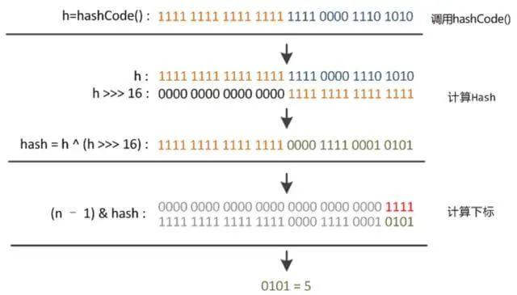
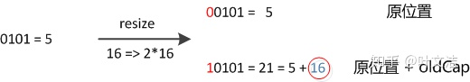

#Arraylist
* 底层数组，默认大小为10，支持随机查询，时间复杂度o(1),增删o（n-i）
* 扩容倍数为1.5倍，扩容方式调用Arrays.copyOf()（System.arraycopy()）
* System.arraycopy()是navie方法，通过复制数组到新数组完成扩容
#HashMap
##hashcode
* Hash是散列的意思：把任意长度的输入，通过散列算法变换成固定长度的输出，该输出就是散列值（hashcode）；
###hashcode的作用
* 用于判断是否为同一个对象，类似对象的身份证
* HashCode是用来在散列存储结构中确定对象的存储地址的，提高查找的快捷性；
    * 如果没有hashcode，则需要遍历查找
* 如果两个对象相同,两个对象的hashCode一定要相同,反之不代表两个对象就相同，只能说明这两个对象在散列存储结构中，存放于同一个位置
* 注意 ：对象相等 ： hashcode相等且equel()相同
###hashcode 生成 算法
#### Object
* 调用navite方法根据一定规则生成
#### String
*  hashcode = 31 * hashcode + 变量
#### HashMap
* hashcode =  h ^ (h >>> 16) 高16位与低16位
####ThreadLocal
* hashcode= hashcode.getAndAdd(0x61c88647);每次累加0x61c88647
    * hashcode mod lenth -1 均匀分布
* 
    ````
    ThreadLocal内存泄漏须要满足以下条件
    线程没有终结
    GC回收掉了弱引用
    没有再次调用ThreadLocal的set、get方法
    没有手工清除数据，即没有调用remove方法
    ````    
#### guava
* Hashing:帮助类，封装各种散列类型HashFunction
* HashFunction：创建Hasher对象或者直接根据输入条件返回HashCode结果
* Hasher：根据加入的数据源得到HashCode。数据源通过提供的putXxx（）方法添加、hash()方法返回计算结果HashCode。
````
HashFunction hf = Hashing.md5();
HashCode hc = hf.newHasher()
    .putString("abc", Charsets.UTF_8)
    .putObject(person, personFunnel)
    .hash();
````
## Hash碰撞冲突
* HashCode()的作用就是保证对象返回唯一hash值，但当两个对象计算值一样时，这就发生了碰撞冲突。
###如何解决
* 开放定址法
    * ThreadLocal 中实现
    * 数据结构为entry[],entry对象包含key和value
    * 遍历entry[i]如果已经存在且key相同则更新值，否则新增entry
* 链地址法（拉链法）
    * HashMap 中实现    
###HashMap数据结构
* 链表长度小于8：数组加链表
* 链表长度大于8且数组大于64：数组加红黑树
###HashMap重hash
* (h = k.hashCode()) ^ (h >>> 16)
* 这样做的好处是，可以将hashcode高位和低位的值进行混合做异或运算，而且混合后，低位的信息中加入了高位的信息，这样高位的信息被变相地保留了下来，增加随机性。
*  
###HashMap计算数组槽位
* (n - 1) & hash（重hash后hashcode），等价于对n取模，也就是h%n，但是&比%具有更高的效率。
* 当n总是2的n次方时，比为奇数哈希后的结果更均匀的。
###HashMap如何判断key相同
* hashcode相同且equel（）后相同
* 重写了equals方法，不重写hashCode方法时，可能会出现equals方法返回为true，而hashCode方法却返回false。这样的一个后果会导致在hashmap、hashSet等类中存储多个一模一样的对象，这与java的思想不符
###HashMap扩容
* threshold = capacity（16） * loadFactor（0.75），当 Size>=threshold的时候，那么就要考虑对数组的扩增了
* 扩容倍数是2的幂
* old数组->新数组，old数组置空
* 无链表:元素重新计算位置((n - 1) & hash)
* 有链表：数组的容量是以2的幂次方扩容的，那么一个Entity在扩容时，新的位置要么在原位置(最高位是0)，要么在原长度+原位置的位置(最高位是1)
*  
##ConcurrentHashMap
###数据结构
* Node 数组 + 链表 / 红黑树
*  
###如何保证线程安全
* ConcurrentHashMap 使用的 Synchronized 锁加 CAS 的机制
* Node：保存key，value及key的hash值的数据结构。其中value和next都用volatile修饰，保证并发的可见性。
* Node：保存key，value及key的hash值的数据结构。其中value和next都用volatile修饰，保证并发的可见性。
* 根据 key 计算出 hashcode 。
*  判断是否需要进行初始化。
*  即为当前 key 定位出的 Node，如果为空表示当前位置可以写入数据，利用 CAS 尝试写入，失败则自旋保证成功。
*  如果当前位置的 hashcode == MOVED == -1,则需要进行扩容。
*  如果都不满足，则利用 synchronized 锁写入数据。
*  如果数量大于 TREEIFY_THRESHOLD 则要执行树化方法，在 treeifyBin 中会首先判断当前数组长度≥64时才会将链表转换为红黑树