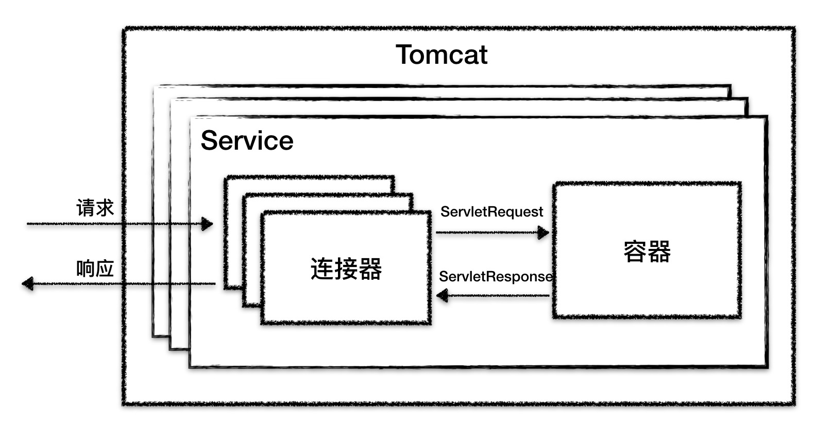

#介绍
* tomcat是http服务器+servlet容器，是一个web容器
#架构
* 
##连接器
* 
* 主要功能
    * 网络通信：endpoint
    * 应用层协议解析：procesor
    * tomcat请求与servlet请求转化：adapter
    * protocolHandler封装IO模型和通信协议的差异
    
##容器
* https://www.cnblogs.com/kismetv/p/7228274.html
* 
* Tomcat 设计了 4 种具有父子关系容器，
   * Engine
   * Host ：虚拟主机，对应了服务器中一个网络名实体(如”www.test.com”，或IP地址”116.25.25.25”)，这个名字应该在DNS服务器上注册。
   * Context ：web应用/war包
   * Wrapper ：servelt（可以多个）
* 
* host1 和host2是两个项目
##NIO请求流程
* https://www.jianshu.com/p/f91f99610b9e
* 
* Acceptor 接收socket线程，这里虽然是基于NIO的connector，但是在接收socket方面还是传统的serverSocket.accept()方式，获得SocketChannel对象，然后封装在一个tomcat的实现类org.apache.tomcat.util.net.NioChannel对象中。然后将NioChannel对象封装在一个PollerEvent对象中，并将PollerEvent对象压入events queue里。这里是个典型的生产者-消费者模式，Acceptor与Poller线程之间通过queue通信，Acceptor是events queue的生产者，Poller是events queue的消费者。
* Poller Poller线程中维护了一个Selector对象，NIO就是基于Selector来完成逻辑的。在connector中并不止一个Selector，在socket的读写数据时，为了控制timeout也有一个Selector，在后面的BlockSelector中介绍。可以先把Poller线程中维护的这个Selector标为主Selector。 Poller是NIO实现的主要线程。首先作为events queue的消费者，从queue中取出PollerEvent对象，然后将此对象中的channel以OP_READ事件注册到主Selector中，然后主Selector执行select操作，遍历出可以读数据的socket，并从Worker线程池中拿到可用的Worker线程，然后将socket传递给Worker。整个过程是典型的NIO实现。
* Worker Worker线程拿到Poller传过来的socket后，将socket封装在SocketProcessor对象中。然后从Http11ConnectionHandler中取出Http11NioProcessor对象，从Http11NioProcessor中调用CoyoteAdapter的逻辑，跟BIO实现一样。在Worker线程中，会完成从socket中读取http request，解析成HttpServletRequest对象，分派到相应的servlet并完成逻辑，然后将response通过socket发回client。在从socket中读数据和往socket中写数据的过程，并没有像典型的非阻塞的NIO的那样，注册OP_READ或OP_WRITE事件到主Selector，而是直接通过socket完成读写，这时是阻塞完成的，但是在timeout控制上，使用了NIO的Selector机制，但是这个Selector并不是Poller线程维护的主Selector，而是BlockPoller线程中维护的Selector，称之为辅Selector。
* NioSelectorPool NioEndpoint对象中维护了一个NioSelecPool对象，这个NioSelectorPool中又维护了一个BlockPoller线程，这个线程就是基于辅Selector进行NIO的逻辑。以执行servlet后，得到response，往socket中写数据为例，最终写的过程调用NioBlockingSelector的write方法。
##nio参数
* acceptCount：连接在被ServerSocketChannel accept之前就暂存在这个队列中，acceptCount就是这个队列的最大长度。ServerSocketChannel accept就是从这个队列中不断取出已经建立连接的的请求。所以当ServerSocketChannel accept取出不及时就有可能造成该队列积压，一旦满了连接就被拒绝了；
* acceptorThreadCount ：使用的Acceptor线程的个数;
* maxConnections :即最大连接数限制。一旦发现当前连接数已经超过了一定的数量（NIO默认是10000），上述的Acceptor线程就被阻塞了,但是它并不阻止新的连接的建立，新的连接的建立过程不是Acceptor控制的。Acceptor仅仅是从队列中获取新建立的连接。所以当连接数已经超过maxConnections后，仍然是可以建立新的连接的，存放在上述acceptCount大小的队列中，这个队列里面的连接没有被Acceptor获取，就处于连接建立了但是不被处理的状态。当连接数低于maxConnections之后，Acceptor线程就不再阻塞，继续调用ServerSocketChannel的accept方法从acceptCount大小的队列中继续获取新的连接，之后就开始处理这些新的连接的IO事件了;
* maxThread ：专门处理IO的Worker数，默认是200；
#Tomcat 为什么要打破双亲委托机制？
* 为了实现服务隔离，优先加载 Web 应用目录下的类，然后再加载其他目录下的类。
* 自定义一个类加载器 WebAppClassLoader， 并且给每个 Web 应用创建一个类加载器实例。 每个 Context 容器负责创建和维护一个 WebAppClassLoader 加载器实例。
* 不同的加载器实例加载的类被认为是不同的类，即使它们的类名相同。这就相当于在 Java 虚拟机内部创建了一个个相互隔离的 Java 类空间，每一个 Web 应用都有自己的类空间，Web 应用之间通过各自的类加载器互相隔离。
* 要打破双亲委托机制，需要继承 ClassLoader 抽象类，并且需要重写它的 loadClass 方法，因为 ClassLoader 的默认实现就是双亲委托。
#如何共享 JRE 的核心类
* 一个类加载器 SharedClassLoader，作为 WebAppClassLoader 的父加载器， WebAppClassLoader 自己没有加载到某个类，就会委托父加载器 SharedClassLoader 去加载这个类，SharedClassLoader 会在指定目录下加载共享类，之后返回给 WebAppClassLoader，这样共享的问题就解决了。

