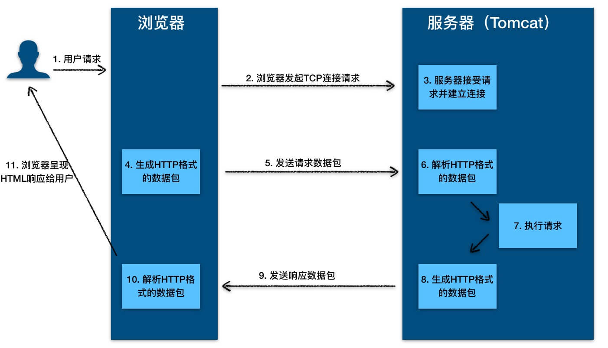

#web容器
* HTTP服务器+Servlet容器 就是web容器
#HTTP服务器
* 
* 通过TCP建立连接，通过http协议数据包进行通信
* java通过sokcet进行TCP连接
##socket流程
````
Socket{
SocketImpl SocksSocketImpl      
}

            SocketImpl
                 |
        abstractPlainSocketImpl
         /                  \
       /                     \
  PlainSocketImpl {           \
    AbstractPlainSocketImpl  DualStackPlainSocketImpl/TwoStacksPlainSocketImpl;
  }     |
        |
  SocksSocketImpl
````
* Socket类是门面类将操作系统相关接口封装好暴露给用户使用，实际调用的方法是SocksSocketImpl类的方法
* PlainSocketImpl类初始化时会根据操作系统选择代理DualStackPlainSocketImpl或TwoStacksPlainSocketImpl实际执行;
* DualStackPlainSocketImpl 封装java 操作系统navicat接口如connect0(),accept0()等。
##redisTemplate 使用socket通信流程
````
redisTemplate{
    Connect connect = connectionFactor.getConnect();
    }
}
RedisConnectionFactory
    |
JedisConnectionFactory{
    //Jedis是对客户端对redis Socket请求的封装
    Jedis jedis = fetchJedisConnector();
  }
Jedis{
    Connection client；
    keys(){
    client.keys()
    }
}
Connection{ 
  //通过Socket关键字获取TCP连接
   Connection connect = new Socket().connect()
   Connection.write（cmd）
  }
}

````
#Servlet容器
* 
* 几乎所有的 Java Web 框架（比如 Spring）都是基于 Servlet 的封装。
* Servlet 指的是任何实现了 Servlet接口的类
````
public interface Servlet {
    void init(ServletConfig var1) throws ServletException;

    ServletConfig getServletConfig();

    void service(ServletRequest var1, ServletResponse var2) throws ServletException, IOException;

    String getServletInfo();

    void destroy();
}
````
* 最重要是service方法，具体业务类在这个方法里实现业务的具体处理逻辑。