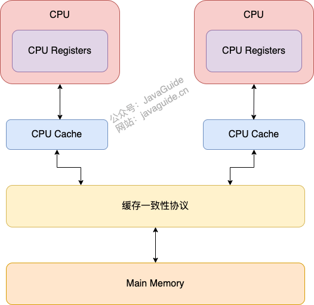
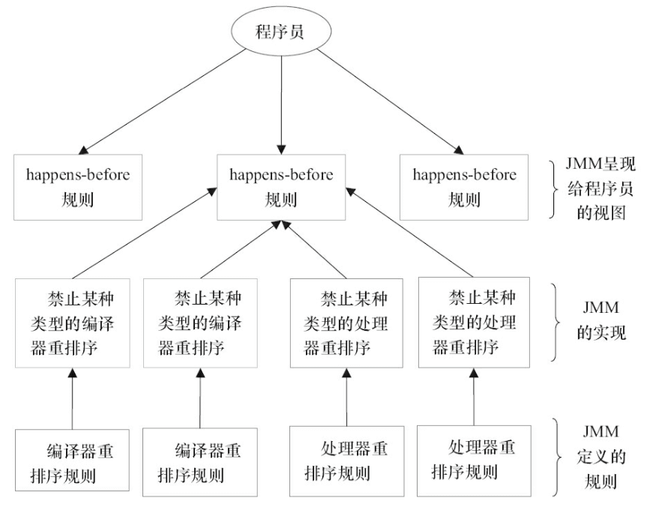

* https://mp.weixin.qq.com/s/XObrrJJKHOYG66r4hMInqQ
* https://www.jianshu.com/p/5d0b35affbe0
* https://www.jianshu.com/p/ec7200a26d8b
* https://mp.weixin.qq.com/s/Ky6zxfd4UsnZ22-HrBQ9JA
#Java 内存模型（JMM）
* https://javaguide.cn/java/concurrent/jmm.html#jmm-%E6%98%AF%E5%A6%82%E4%BD%95%E6%8A%BD%E8%B1%A1%E7%BA%BF%E7%A8%8B%E5%92%8C%E4%B8%BB%E5%86%85%E5%AD%98%E4%B9%8B%E9%97%B4%E7%9A%84%E5%85%B3%E7%B3%BB
##定义
- JMM 是 JVM 中定义的一种并发编程的底层模型机制， 定义了线程和主内存之间的抽象关系：线程之间的共享变量存储在主内存中，每个线程都有一个私有的本地内存，本地内存中存储了该线程以读/写共享变量的副本。
- JMM内存模型会带来可见性问题和重排序问题
-  
##内存可见性
- 内存可见性:一个线程修改了某个变量的值，其它线程总是能知道这个变量变化。也就是说，如果线程 A 修改了共享变量 V 的值，那么线程 B 在使用 V 的值时，能立即读到 V 的最新值。
- JMM 规定可能会导致线程对共享变量的修改没有即时更新到主内存，或者线程没能够即时将共享变量的最新值同步到工作内存中，从而使得线程在使用共享变量的值时，该值并不是最新的。
````
所有的共享变量都存储于主内存。这里所说的变量指的是实例变量和类变量，不包含局部变量，因为局部变量是线程私有的，因此不存在竞争问题。
每一个线程还存在自己的工作内存，线程的工作内存，保留了被线程使用的变量的工作副本。
线程对变量的所有的操作（读，取）都必须在工作内存中完成，而不能直接读写主内存中的变量。
不同线程之间也不能直接访问对方工作内存中的变量，线程间变量的值的传递需要通过主内存中转来完成。
````
- JMM 这样的机制，就出现了可见性问题
##重排序
- 为了提高性能，在遵守 as-if-serial 语义（即不管怎么重排序，单线程下程序的执行结果不能被改变。编译器，runtime 和处理器都必须遵守。）的情况下，编译器和处理器常常会对指令做重排序
###类型
- 编译器优化重排序:编译器在不改变单线程程序语义的前提下，可以重新安排语句的执行顺序。
    ````
    编译得到的汇编代码和我们原本的语言代码不顺序并不一致:提升程序在CPU上的运行性能，减少指令的数量，降低程序执行需要的CPU周期，减少CPU读写主存的时间，多核多线程并行的情况下，这种重排序优化就有可能导致共享变量的可见性问题
    ````
- 指令级并行重排序 。现代处理器采用了指令级并行技术来将多条指令重叠执行。如果不存在数据依赖性，处理器可以改变语句对应机器指令的执行顺序。
    ````
    new MySingleton():对应了这3行字节码
    首先在1行在内存中开辟一块MySingleton对象内存。
    然后在2行调用该对象的构造方法。
    然后在3行将该对象的引用赋值给静态变量INSTANCE。
    以上是我们期望的执行顺序，我们希望每个线程都按照该顺序去执行指令（这就是禁止指令重排序）。
    但是由于计算机为了提高运行效率，会将我们的指令顺序进行优化重排（比如上面的顺序可能会优化重排为：1、3、2）
    ````
- 内存系统重排序 。由于处理器使用缓存和读 / 写缓冲区，这使得加载和存储操作看上去可能是在乱序执行。
    ````
    - 处理器使用写缓冲区临时保存向内存写入的数据(异步写入)，通过以批处理的方式刷新写缓冲区，以及合并写缓冲区中对同一内存地址的多次写，减少对内存总线的占用；
    - 这个特性会对内存操作的执行顺序产生重要的影响：处理器对内存的读/写操作的执行顺序，不一定与内存实际发生的读/写操作顺序一致！
    ````
##JMM解决方案规则
* https://blog.csdn.net/lz710117239/article/details/123457011
* https://www.cnblogs.com/zhanggaofeng/p/15202435.html
###happens-before 规则
*    
- happens-before关系保证前一个操作的结果对于后一个操作是可见的，无论这两个操作是否在同一个线程里
    - 一个线程中，按照程序顺序，前面的操作 Happens-Before 于后续的任意操作
    - 对一个锁的解锁，happens-before于随后对这个锁的加锁(解锁数据对加锁时更新数据可见)
    - 对一个volatile域的写，happens-before于任意后续对这个volatile域的读
    - 如果A happens-before B，且B happens-before C，那么A happens-before C。
        ````
        线程1:x=42 Happens-Before 写变量 “v=true” ，这是规则 1 的内容；
        线程2：读变量 “v=true”:写变量“v=true” Happens-Before 读变量 “v=true”，这是规则 3 的内容 。
        再根据这个传递性规则，我们得到结果：“x=42” Happens-Before 读变量“v=true”，线程 B 能看到 “x == 42”,1.5 版本的并发工具包（java.util.concurrent）就是靠 volatile 语义来搞定可见性的。
        ````
    - 它是指主线程 A 启动子线程 B 后，子线程 B 能够看到主线程在启动子线程 B 前的操作。
    - 线程A执行操作ThreadB.join()并成功返回，那么线程B中的任意操作happens-before于线程A从ThreadB.join()操作成功返回。
*    (规则是呈现给程序员便于理解，具体实现由JMM实现)
###内存屏障
####MESI缓存一致性协议
* https://blog.csdn.net/m0_38017860/article/details/122988861
* https://www.cnblogs.com/wwy-gongqr/p/15516378.html
* 为什么要缓存一致性协议
    * 在现在CPU多为多核的情况下，每个核心有自己单独的缓存区，当多个核心一起操作多个线程对同一个数据进行操作时，如果在核心B在核心A把修改完之后的数据刷新回内存中去之前，进行了数据的操作，就会导致数据的不确定性。
    总线加锁可以解决这种情况，但是在加锁的时候，在一个核心操作该数据完成前，其他核心也无法修改其他数据，这会导致CPU的性能严重下降。
    缓存一致性协议只会对单个的缓存行进行类似加锁的操作，来进可能的保证数据的一致性
####内存屏障作用
* 阻止屏障两侧的指令重排序；
* 强制把写缓冲区/高速缓存中的脏数据等写回主内存，让缓存中相应的数据失效。
  * 对于Load Barrier来说，在指令前插入Load Barrier，可以让高速缓存中的数据失效，强制从新从主内存加载数据；
  * 对于Store Barrier来说，在指令后插入Store Barrier，能让写入缓存中的最新数据更新写入主内存
####为什么有内存屏障
* 如果CPU0更新了数据，要通知CPU1置为失效，cpu0要一直等待到cpu1等待Invalid Ack的返回，才能执行赋值操作，此时MESI缓存一致性协议的效率就非常低了
* cpu为了优化指令的执行效率，引入了store buffer（forwarding）提升了MESI的性能，数据先写入Store Buffer，等到收到AcKnowledgement的时候，再把数据刷入缓存。
* 写屏障：CPU0更新数据的结果等到收到cpu1返回Invalid Ack通知，并将Store Buffer写入cache后才继续后续操作
  * store buffer会导致读写乱序，通过写屏障，来保证写的顺序 
  *    
* 读屏障：在Invalid Queue中Invalid Ack处理掉，然后再进行读取。
    * Store Buffer因为要等待Invalid Ack会有性能瓶颈，通过引入Invalid Queue解决Invalid Ack带来的性能瓶颈
    但Invalid Queue会带来的失效问题，引入读屏障，解决失效问题      
####java内存屏障
- java的内存屏障通常所谓的四种即LoadLoad,StoreStore,LoadStore,StoreLoad实际上也是上述两种的组合，完成一系列的屏障和数据同步功能。    
- java编译器在生成指令序列的适当位置会插入内存屏障指令来 保证特定操作的执行顺序 和 影响某些数据（或者是某条指令的执行结果）的内存可见性。
####LoadLoad Barriers
- 作用在两个读（Load）操作之间内存屏障。
- 该屏障可以确保在该屏障之后的第一个读操作（load2）之前，一定能先加载load1对应的数据。
- 禁止下面的普通读操作和上面的volatile读重排序

####LoadStore Barriers
- 作用在 Load 操作和Store 操作之间的内存屏障。
- 该屏障可以确保 Store2 写出的数据对其他处理器可见之前，Load1 读取的数据一定先读入缓存。
- 禁止下面的普通写操作和上面的volatile读重排序
####StoreStore Barriers
- 作用在两个Store 操作之间的内存屏障。
- 该屏障可以确保在该屏障之后的第一个写操作（store2）之前，store1操作对其他处理器可见（刷新到内存）。
- 禁止上面的普通写操作和下面的volatile写重排序
####StoreLoad Barriers
- 语义:可以把所有的写操作刷新到公共内存中去，并且使得其他缓存中的这个变量的缓存失效，所以下次在此读取时，就会重新从主存中load
- 作用在 Store 操作和 Load 操作之间的内存屏障。
- 屏障可以确保store1操作对其他处理器可见（刷新到内存）之后才能读取 Load2 的数据到缓存。
- 禁止下面的volatile读写操作和上面的volatile写重排序
###JMM重排序条件
- https://blog.csdn.net/riemann_/article/details/96390511
- as-if-serial：不管怎么重排序（编译器和处理器为了提高并行度），（单线程）程序的执行结果不能被改变。
- 单线程下,存在数据依赖性和控制依赖的数据不会重排序
- 多线程下，内存屏障指令来禁止特定类型的处理器重排序(final,volient基于内存屏障禁止某种重排序)
- 加锁下临界区内的代码可以重排序，虽然线程A在临界区内做了重排序，但由于监视器互斥执行的特性，这里的线程B根本无法“观察”到线程A在临界区内的重排序。这种重排序既提高了执行效率，又没有改变程序的执行结果。
- final域重排序
  - 写final域重排序规则
    ````
    1、JMM禁止编译器把final域的写重排序到构造函数之外：
    2、编译器会在final域写之后，构造函数return之前，插入一个storestore屏障。这个屏障可以禁止处理器把final域的写重排序到构造函数之外
    ````
  - 写final域重排序规则（final域是引用类型）：一个final域的引用对象的成员域写入不能与随后将这个被构造出来的对象赋给引用变量重排序
  - 写final域的重排序规则可以确保：在对象引用为任意线程可见之前，对象的final域已经被正确初始化过了，而普通域就不具有这个保障
  - 读final域重排序规则：读对象的引用和读该对象的final域禁止重排序（as-if-serial存在依赖），在读一个对象的final域之前，一定会先读这个包含这个final域的对象的引用。
     
- happens-before:  as-if-serial语义保证单线程内程序的执行结果不被改变
##解决方案实现
###解决方案实现-volatile
- volatile 添加内存屏障
    ````
    - volatile 写操作的前面插入一个 StoreStore 屏障
    - volatile 写操作的后面插入一个 StoreLoad 屏障
    - volatile 读操作的后面插入一个 LoadLoad 屏障
    - volatile 读操作的后面插入一个 LoadStore 屏障
    ````
- volatile 提供了可见性，任何一个线程对其的修改将立马对其他线程可见。volatile 属性不会被线程缓存，始终从主存中读取。
- volatile 提供了 happens-before 保证，对 volatile 变量 V 的写入 happens-before 所有其他线程后续对 V 的读操作。
- volatile 只能作用于属性，其中有一个线程修改了此属性，其他线程可以立即得到修改后的值；或者作为状态变量，如 flag = ture，实现轻量级同步。
- volatile 属性的读写操作都是无锁的，但它没有提供原子性和互斥性。因为无锁，不需要花费时间在获取锁和释放锁上，所以说它是低成本的
    ````
    i++（i被volatile修饰） 在多线程运行，结果可能不准，因为i++非原子操作，线程1和2初始读到都是0，自增2次最后值仍是1而非2
    ````
- cas可以提供volatile原子性操作
    ````
    缺点:
    1.CPU开销过大 
    2.CAS机制所确保的是一个变量的原子性操作，而不能保证整个代码块的原子性，比如需要保证3个变量共同进行原子性的更新，就不得不使用synchronized或者lock了。
    3.ABA问题:添加版本号解决ABA问题
    ````
###final解决方式
- final重排序规则保证在对象引用为任意线程可见之前，对象的final域已经被正确初始化过了，解决安全发布问题
###synchronizer解决方式
- 加锁后就保证了变量的内存可见性，有序性和互斥性（串行执行），不禁止指令重排序
````
程进入 synchronizer 代码块后，线程获取到锁，会清空本地内存，然后从主内存中拷贝共享变量的最新值到本地内存作为副本，执行代码，又将修改后的副本值刷新到主内存中，最后线程释放锁
````
###AQS解决方式
- 基于happens-before 规则3和4保证内存可见性
- 基于内存屏障解决重排序问题，但临界区代码依旧可以指令重排序
##一个线程对字段的更改对其他线程可见条件
* 写入线程释放同步锁，读取线程随后获取相同的同步锁。释放锁的时候会强制从线程使用的工作内存中刷新所有写入，并且在获取锁的时候会强制重新加载可访问字段的值。
* 如果一个字段被声明为volatile，则写入线程会立即将修改后的值同步到主内存。读取线程必须在每次访问时重新加载volatile字段的值。
* 线程第一次访问一个对象的某个字段时，它会看到字段的初始值或来自某个其他线程写入的值。
* 当一个线程终止时，所有写入的变量都被刷新到主内存。例如:现有线程A，B，在B线程中调用A.join()，那么在B中可以保证看到A线程产生的影响。
