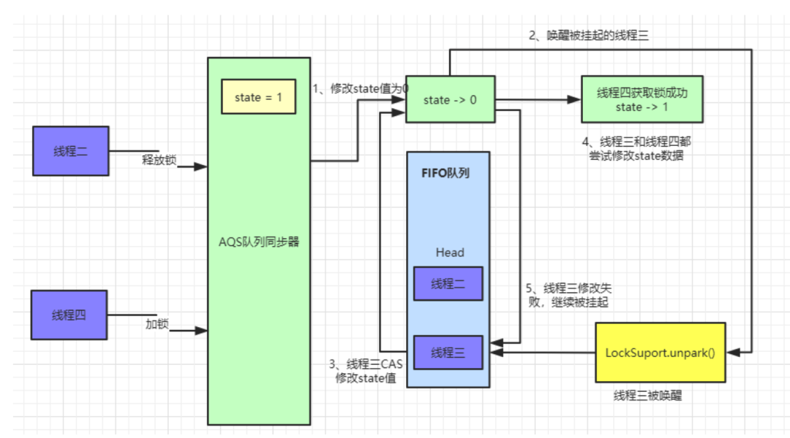
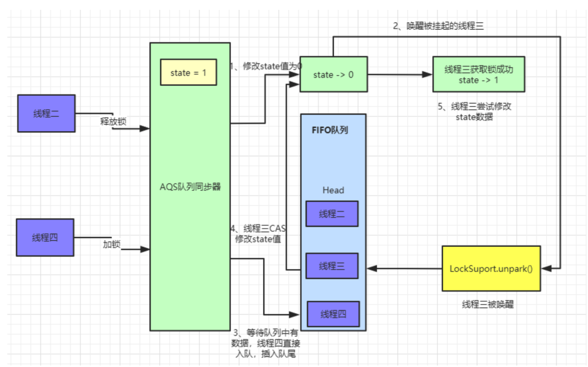
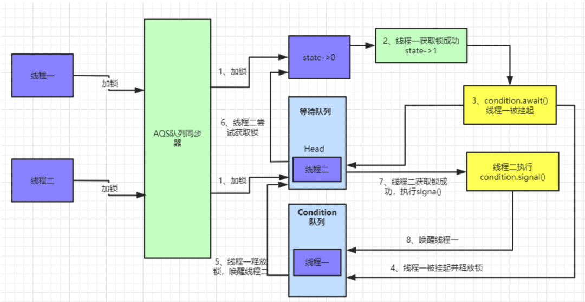

#线程
* https://mp.weixin.qq.com/s/2zDW1abkTUMKs6RuRyrPpw
#AQS简介
* AQS 的全称为（AbstractQueuedSynchronizer）
* AQS 是一个用来构建锁和同步器的框架。使用 AQS 能简单且高效地构造出大量应用广泛的同步器，比如我们提到的 ReentrantLock，Semaphore，ReentrantReadWriteLock，SynchronousQueue，FutureTask 等等皆是基于 AQS 的
* AQS 核心思想是，如果被请求的共享资源（volatile int state）空闲，则将当前请求资源的线程设置为有效的工作线程，并且将共享资源设置为锁定状态。如果被请求的共享资源被占用，那么就需要一套线程阻塞等待以及被唤醒时锁分配的机制，这个机制 AQS 是用 CLH 队列锁实现的，即将暂时获取不到锁的线程加入到队列中。
* AQS 底层使用了模板方法模式
* AQS 定义两种资源共享方式：
    * Exclusive（公平锁，非公平锁）：只有一个线程能执行，如 ReentrantLock
    * 公平锁和非公平锁只有两处不同：
      * 非公平锁在调用 lock 后，首先就会调用 CAS 进行一次抢锁，如果这个时候恰巧锁没有被占用，那么直接就获取到锁返回了。
      * 非公平锁在 CAS 失败后，和公平锁一样都会进入到 tryAcquire 方法，在 tryAcquire 方法中，如果发现锁这个时候被释放了（state == 0），非公平锁会直接 CAS 抢锁，但是公平锁会判断等待队列是否有线程处于等待状态，如果有则不去抢锁，乖乖排到后面。
      *  
      *  
    * Share（共享）：多个线程可同时执行，如 Semaphore/CountDownLatch
#Condition
* Condition是在java 1.5中才出现的，它用来替代传统的Object的wait()、notify()实现线程间的协作，相比使用Object的wait()、notify()，使用Condition中的await()、signal()这种方式实现线程间协作更加安全和高效。因此通常来说比较推荐使用Condition
* AbstractQueueSynchronizer中实现了Condition中的方法，主要对外提供awaite(Object.wait())和signal(Object.notify())调用。
*  
    

