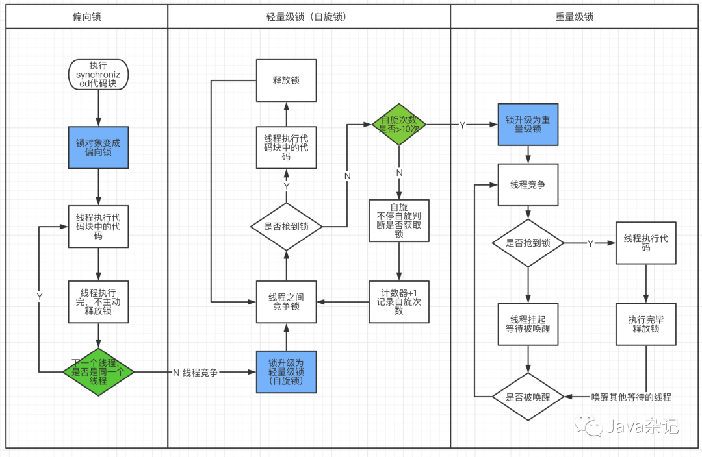

#线程
* https://mp.weixin.qq.com/s/yaJ2vJdVBQwXp873xo2fcA
* https://blog.csdn.net/qq_32273417/article/details/109148693
#synchronized如何保证线程安全
##原子性
* 被synchronized修饰的类或对象的所有操作都是原子的，因为在执行操作之前必须先获得类或对象的锁，直到执行完才能释放。
##可见性
* 一个线程如果要访问该类或对象必须先获得它的锁，而这个锁的状态对于其他任何线程都是可见的，并且在释放锁之前会将对变量的修改刷新到共享内存当中，保证资源变量的可见性。
##有序性
* 指令重排并不会影响单线程的顺序，它影响的是多线程并发执行的顺序性。synchronized保证了每个时刻都只有一个线程访问同步代码块，也就确定了线程执行同步代码块是分先后顺序的，保证了有序性。
#synchronized底层原理
* 数据同步需要依赖锁，那锁的同步又依赖谁？synchronized给出的答案是在软件层面依赖JVM的Monito对象
* synchronized 同步语句块的实现使用的是 monit锁升级.png...  bbnbbnbn=/orenter 和 monitorexit 指令，其中 monitorenter 指令指向同步代码块的开始位置， monitorexit 指令则指明同步代码块的结束位置。
* 在执行monitorenter时，会尝试获取对象的锁，如果锁的计数器为 0 则表示锁可以被获取，获取后将锁计数器设为 1 也就是加 1。
* 在执行 monitorexit 指令后，将锁计数器设为 0，表明锁被释放。如果获取对象锁失败，那当前线程就要阻塞等待，直到锁被另外一个线程释放为止。
* Monitor可以把它理解为 一个同步工具，也可以描述为 一种同步机制，它通常被 描述为一个对象，常说Synchronized的对象锁，MarkWord锁标识位为10，其中指针指向的是Monitor对象的起始地址。在Java虚拟机（HotSpot）中，Monitor是由ObjectMonitor实现的
- 
#synchronized的优化
* synchronized锁的级别不再是单一的重量级锁了，而是有无锁、偏向锁、轻量级锁和重量级锁四种状态
##锁升级
- 
* 偏向锁：我认为偏向锁的关键就是“偏”，偏向于第一个访问的线程。也就是说在无竞争的环境下，有一个线程访问的同步代码块，那么这个锁就会偏向这个线程，下次有线程访问的时候就会判断是不是之前访问过的线程访问，这样就会少一次cas的开销。因为第一次有线程访问同步代码块的时候会用cas把线程id写入mark word中。偏向锁会有一个延迟，程序刚启动的5s内不会出现偏向锁，这点在博主前面jol测试对象头中证明了这点，计算过hashcode值的对象不会加偏向锁，因为对象头没有空间放线程id了。
  
* 轻量级锁：轻量级锁体现轻量的点就在于自旋，如果线程访问轻量级锁的同步代码块，会cas判断线程id是否一致，不一致会自旋一定的时间一致cas，如果cas成功就还是轻量级锁。但一般都是失败的，然后轻量级锁就会升级为重量级锁。
  
* 重量级锁：jvm层面的两个标识，加锁解锁都会阻塞其他线程。
##锁消除
* 利用逃逸分析技术判断锁对象是否只被一个线程访问，如果是的话就取消上锁的过程
##锁粗化
* 循环环整个过程都在频繁加锁和释放锁，非常耗费性能，因此JIT将会把加锁的过程优化到for循环外面，如下面的代码所示，这就是锁粗化的过程。