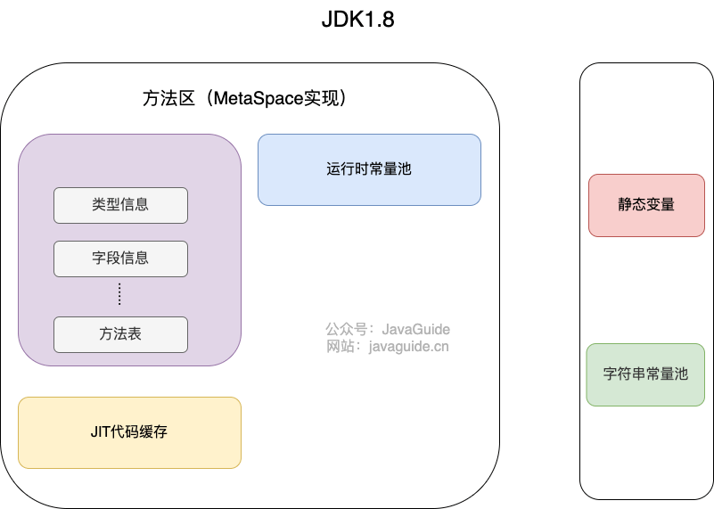
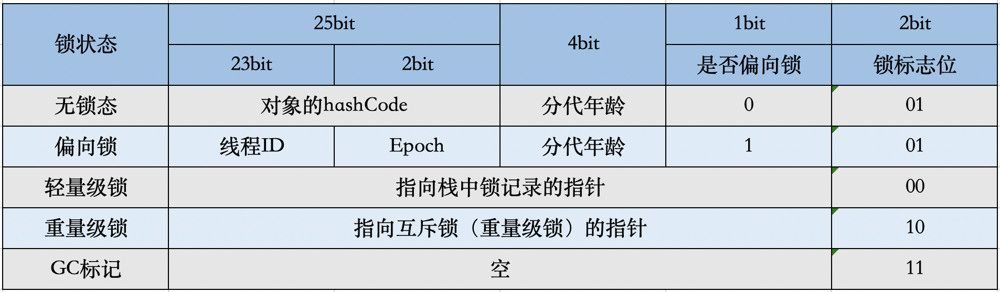

* https://blog.51cto.com/phyger/5201337
* https://mp.weixin.qq.com/s/uL_cDTbSmUfbIvABzP9fpA
#程序计数器
- 线程私有，生命周期与线程相同。
- 作用：**程序所执行的字节码的 行号指示器
#本地方法栈
-线程私有，生命周期与线程相同。
-作用： 与虚拟机栈作用相似，不过描述的是Native方法执行的内存模型
#虚拟机栈
- 线程私有，生命周期与线程相同。
- 存放数据：局部变量表（基本数据类型（int等基本类型）、对象引用类型），操作数栈、动态链接、方法出口 等信息
- 调优参数:

    ````
    1. Xss512k：设置栈空间参数的,线程分配的空间用完的时候(递归)，就会抛出栈溢出异常(StackOverflowError)
    ````
#Java堆
- 所有线程共享的一块内存区域，
- 存放数据：所有的对象实例以及数组
- 栈上分配：JVM通过逃逸分析确定该对象不会被外部访问。如果不会逃逸可以将该对象在栈上分配内存，这样该对象所占用的内存空间就可以随栈帧出栈而销毁，就减轻了垃圾回收的压力
- gc主要对象java堆
- 默认垃圾回收器：（年轻代与老年代）：1.8（Parallel）。1.9(G1)
  - 调优参数:
      ````
      1.-Xms2G：初始化内存，默认为物理内存的“1/64”
      2.-Xmx2G：最大内存，默认为物理内存的“1/4”。此值可以设置与-Xmx相同，以避免每次垃圾回收完成后JVM重新分配内存
      3. -Xms3550m：设置JVM初始堆内存为3550M。此值可以设置与-Xmx相同，以避免每次垃圾回收完成后JVM重新分配内存。
      4.-Xmn2g：设置年轻代大小为2G。在整个堆内存大小确定的情况下，增大年轻代将会减小年老代，反之亦然。此值关系到JVM垃圾回收，对系统性能影响较大，官方推荐配置为整个堆大小的3/8。
     ```
## 新生代
* 年轻代用来存放新近创建的对象,产生大量的死亡对象,并且要是产生连续可用的空间, 所以使用复制清除算法和并行收集器进行垃圾回收.对年轻代的垃圾回收称作初级回收 (minor gc)。
* 分为Eden空间、幸存者1区、幸存者2区
* 我们进行垃圾回收的时候，清除正在使用的区域，将其中的存货对象，放入到另一个survivor区域，并进行整理，保证空间的连续。如果对象长时间存活，则将对象移动到老年区。存活下来的对象，他的年龄会增长1。
* YGC触发时机：edn空间不足
* 分代升级时机：
````
1.YGC时，To Survivor区不足以存放存活的对象，对象会直接进入到老年代。
2.经过多次YGC后，如果存活对象的年龄达到了设定阈值，则会晋升到老年代中。
3.动态年龄判定规则，To Survivor区中相同年龄的对象，如果其大小之和占到了 To Survivor区一半以上的空间，那么大于此年龄的对象会直接进入老年代，而不需要达到默认的分代年龄。
4.大对象：由-XX:PretenureSizeThreshold启动参数控制，若对象大小大于此值，就会绕过新生代, 直接在老年代中分配。
````
* 调优参数：
````
-Xmn2g：设置年轻代大小为2G。整个堆大小=年轻代大小 + 年老代大小 + 持久代大小
-XX:NewRatio=4:设置年轻代（包括Eden和两个Survivor区）与年老代的比值（除去持久代）。设置为4，则年轻代与年老代所占比值为1：4，年轻代占整个堆栈的1/5
-XX:SurvivorRatio=4：设置年轻代中Eden区与Survivor区的大小比值。设置为4，则两个Survivor区与一个Eden区的比值为2:4，一个Survivor区占整个年轻代的1/6
-XX:-UseAdaptiveSizePolicy  自适应策略会自动的进行Eden区与Survivor区的分配。
-XX:MaxTenuringThreshold=0：设置垃圾最大年龄。如果设置为0的话，则年轻代对象不经过Survivor区，直接进入年老代。
-XX:PretenureSizeThreshold=3145728 表示对象大于3145728（3M）时直接进入老年代分配，这里只能以字节作为单位
-XX:TargetSurvivorRatio 目标存活率，默认为50%，动态年龄判定规则
-XX:-UseAdaptiveSizePolicy
````
## 老年代
* Full GC 是发生在老年代的垃圾收集动作，Full GC的同时一般都会带着Minor GC，因为Full GC是为了Minor GC后存活的对象能够进入老年代
* 老年代空间分配担保机制：如果新生代有大量对象存活，同时Survivor区也放不下了，那么这些对象必须要放到老年代中，但是如果此时老年代中剩余空间也不足以放下这些对象触发
* full GC触发条件：
````
第一：是老年代可用内存小于新生代全部对象的大小，如果没开启空间担保参数，会直接触发Full GC，所以一般空间担保参数都会打开；注：jDK1.8之后已经取消了-XX:-HandlePromotionFailure机制
第二：是老年代可用内存小于历次新生代GC后进入老年代的平均对象大小，此时会提前Full GC；
第三：是新生代Minor GC后的存活对象大于Survivor，那么就会进入老年代，此时老年代内存不足。
第四如果老年代可用内存大于历次新生代GC后进入老年代的对象平均大小，但是老年代已经使用的内存空间超过了这个参数指定的比例，也会自动触发Full GC。默认92%
第五：如果fullgc后内存还是不够分配则会报oom。
````
## 元空间
- 元数据区也是一块线程共享的内存区域，方法区在元数据区，
- 保存被虚拟机加载的类信息、常量、静态变量以及即时编译器编译后的代码等数据
- 元空间存在于本地内存，意味着只要本地内存足够，它不会出现像永久代中“java.lang.OutOfMemoryError: PermGen space”这种错误。看上图中的方法区，是不是“膨胀”了。默认情况下元空间是可以无限使用本地内存的，但为了不让它如此膨胀，JVM同样提供了参数来限制它使用的使用。
- 类型信息、字段、方法、常量保存在本地内存的元空间中，但字符串、静态变量保存在堆中。
```
-XX:MetaspaceSize=64M	　	设置元数据空间初始大小（取代-XX:PermSize）
-XX:MaxMetaspaceSize=128M	　	设置元数据空间最大值（取代之前-XX:MaxPermSize）
````
###为什么取消永久代
````
1.Java7及以前版本的Hotspot中方法区位于永久代中。同时，永久代和堆是相互隔离的，但它们使用的物理内存是连续的。永久代的垃圾收集是和老年代捆绑在一起的，因此无论谁满了，都会触发永久代和老年代的垃圾收集。
2.Java8中，元空间(Metaspace)登上舞台，方法区存在于元空间(Metaspace)。同时，元空间不再与堆连续，而且是存在于本地内存（Native memory）,避免OOM异常
````
###方法区，堆，静态，运行时常量池，字符串常量池，封装类常量池
- 方法区是规范，元空间和永久代是不同的实现方式
- 每个class文件被编译后悔形成静态常量池，存放编译生成的字面量和符合引用
````
Class 文件中除了有类的版本、字段、方法、接口等描述信息外，还有用于存放编译期生成的各种字面量（Literal）和符号引用（Symbolic Reference）的 常量池表(Constant Pool Table) 。
字面量是源代码中的固定值的表示法，即通过字面我们就能知道其值的含义。字面量包括整数、浮点数和字符串字面量，符号引用包括类符号引用、字段符号引用、方法符号引用和接口方法符号引用。
````
-  
-  
````
string a = "abc" abc就是字面量，String类名就是符合引用
````
- 运行时常量池是静态常量池在jvm运行时的表现形式，他是全局共享，不同类公用一个运行时常量池
- 元空间的常量池存的都是引用
````
运行时常量池将class文件静态常量池在类解析时将符号引用准换位直接引用（堆内存地址），class文件数据悔加载到运行时常量池
````
- 字符串常量池：专门针对String类型设计的常量池，保存在堆中
- 字符串常量池中存的是字符串对象，以及字符串常量值。
- https://javaguide.cn/java/basis/java-basic-questions-02.html#string
````
-string的不变性是字符串常量实现的前提，字符串维护常量池提高性能开销，因为string太常用了
-常量池本身是一个hash表，哈市表固定的bucket是60013且不可以扩容
-字面量在编译期存放于class文件静态常量池，类加载字面量存放于运行时常量池，在首次使用某个字面量时字面量以真正的对象存放于字符串常量池
—通过+进行符号引用字符串拼接，相当于用stringbuilder进行append操作，会生成一个新的stringbuilder对象
````
- 封装类常量池：java 的基本类型封装类自己实现常量池（不是JVM层面），浮点数没有常量池
````
封装类常量池在各内部类实现的，常量池有范围，如整型-128-127寸，char未0-127
````
##基本数据类型的值存放在哪里
````
-类变量：随着类加载的初始化，把值（a=1中的1）存放在堆中，该类所有对象共用
类加载分为加载、验证、准备、解析、初始化五个阶段，准备时，在堆中分配内存，解析时，把a对应的符号引用转换成直接引用（堆中的内存地址），初始化时，把值1存到该地址中
-成员变量：随着对象的创建，也是把值（b=2中的2）存放在堆中，每个对象私有
-局部变量：运行时，随着方法的入栈，而创建在栈中，随着方法的出栈而消亡
````
#对象内存布局
##查看内存布局
- openjdk 给我们提供了一个工具包，可以用来获取对象的信息和虚拟机的信息，我们只需引入 jol-core 依赖
- ClassLayout.parseInstance(object).toPrintable()：查看对象内部信息.
- GraphLayout.parseInstance(object).toPrintable()：查看对象外部信息，包括引用的对象.
- GraphLayout.parseInstance(object).totalSize()：查看对象总大小.
##对象头（Header）
- https://jishuin.proginn.com/p/763bfbd7033f
- 在 32 位的虚拟机中对象在内存中的布局分为三块区域 MarkWord ，Klass Pointer 和数组长度,分别占用 32 位，也就是 4 字节。
- 
###MarkWord
- 用于存储对象自身的运行时数据，如哈希码（HashCode）、GC分代年龄、锁状态标志、线程持有的锁、偏向线程ID、偏向时间戳等等。
###Klass Pointer
- 即类型指针，是对象指向它的类元数据的指针，虚拟机通过这个指针来确定这个对象是哪个类的实例。

### 数组的长度

##实例数据（Instance Data）
- 如果对象有属性字段，则这里会有数据信息。如果对象无属性字段，则这里就不会有数据。根据字段类型的不同占不同的字节，例如boolean类型占1个字节，int类型占4个字节等等
##对齐填充（Padding）
  - 所有的对象分配的字节总SIZE需要是8的倍数，如果前面的对象头和实例数据占用的总SIZE不满足要求，则通过对齐数据来填满。
  - 字段内存对齐的其中一个原因，是让字段只出现在同一CPU的缓存行中。如果字段不是对齐的，那么就有可能出现跨缓存行的字段。也就是说，该字段的读取可能需要替换两个缓存行，而该字段的存储也会同时污染两个缓存行。这两种情况对程序的执行效率而言都是不利的。其实对其填充的最终目的是为了计算机高效寻址。
  - ###伪共享问题：
    - CPU加载数据在缓存中是以缓存行形式加载，缓存行大小是64字节，Java的long类型是8字节，一个缓存行中可以存8个long类型的变量。
    - 当多线程修改相互独立的变量时，如果这些变量在同一个缓存行，就会无意中影响彼此的性能，这个就是伪共享，
    - ###解决伪共享的方法
    - 在变量的后背凑齐64个字节的变量
      ````
      class Pointer {
       //在一个缓存行中，先会存储a
       volatile long a;  //需要volatile，保证线程间可见并避免重排序
       //    放开下面这行，解决伪共享的问题，提高了性能
       long p1, p2, p3, p4, p5, p6, p7;
       volatile long b;   //需要volatile，保证线程间可见并避免重排序
      }
      ````
    - 使用消除了伪共享结构的类(自定义符合的类，使用该类)
    - 使用@sun.misc.Contended 注解（java8）
      ````
      @sun.misc.Contended
      class MyLong {
         volatile long value;
      }
      ````