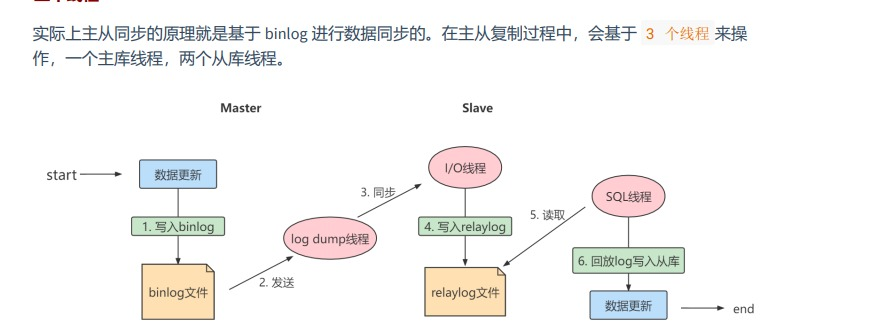
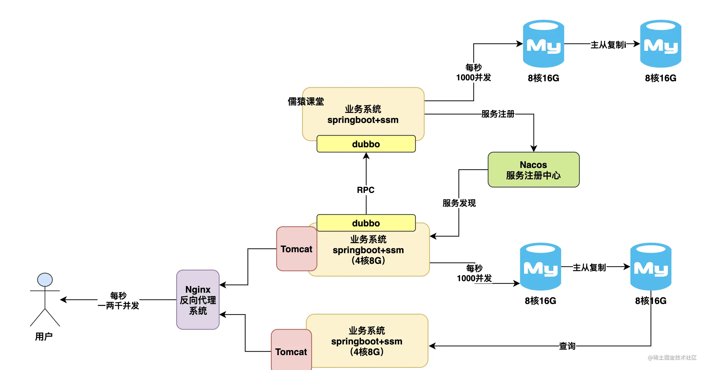
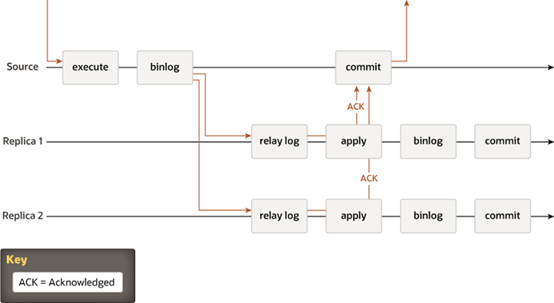
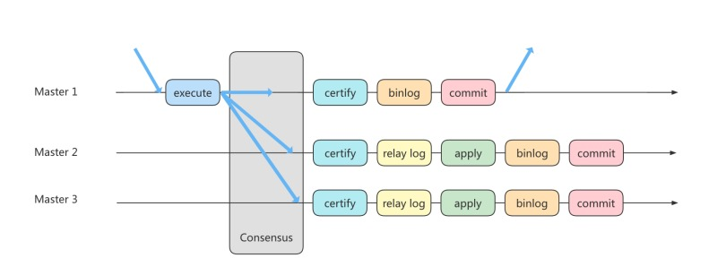
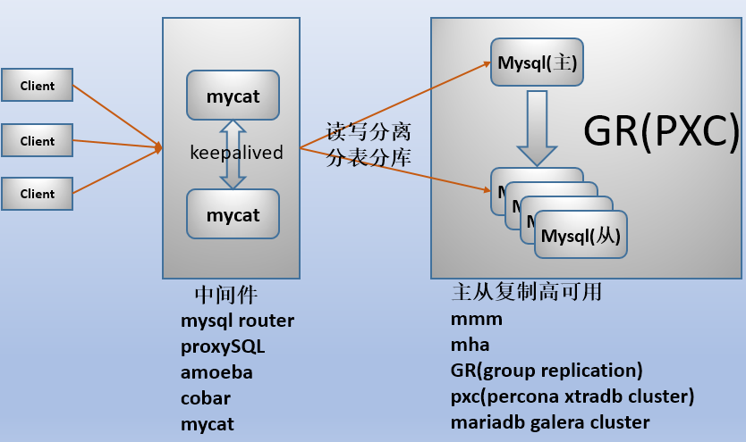

#为什么要主从复制
* 如果我们的目的在于提升数据库高并发访问的效率，那么首先考虑的是如何 优化SQL和索引 ，这种方式
  简单有效；其次才是采用 缓存的策略 ，比如使用 Redis将热点数据保存在内存数据库中，提升读取的效
  率；最后才是对数据库采用 主从架构 ，进行读写分离。
#主从复制的原理
* 
* 
#主从复制的缺点
* 主从延迟问题：用户在从库上读取的数据不是最新的数据，是主从同步中的 数据不一致性 问题。
    * 网络延迟：尽量采用 短的链路，增加带宽
    * 从库消费中继日志（relay log）的速度，比主库生产binlog的速度要慢
        * 从库性能差：增加配置
        * 大表DDL：优化SQL，避免慢SQL， 减少批量操作 ，建议写脚本以update-sleep这样的形式完成
        * 大事事务执行：降低多线程大事务并发的概率，优化业务逻辑
        * 一次性插入过多数据：优化SQL，避免慢SQL， 减少批量操作 ，建议写脚本以update-sleep这样的形式完成
* 数据一致性问题

* 实时性要求的业务读强制走主库，从库只做灾备，备份。
# 半同步复制
* 异步复制存在一定的数据丢失风险，MySQL又在5.6版本中推出半同步复制，在同步数据协议中添加了一个同步操作，这样意味主节点在commit操作，需要确认最少一个从节点确认接收到并且返回ACK，只有这样主节点才能正确提交数据。
* 
##缺点
* 耗时
#组复制
* https://mp.weixin.qq.com/s/AC9CwpSUTW6fXA-5mHxPGQ
* https://www.cnblogs.com/cyh00001/p/16660634.html
* https://www.cnblogs.com/f-ck-need-u/p/9216828.html
* https://segmentfault.com/a/1190000040598136
* 组复制技术，简称 MGR（MySQL Group Replication）。这种复制技术是基于 Paxos 协议的状态机复制，解决最终一致性
* 首先我们将多个节点共同组成一个复制组，在 执行读写（RW）事务 的时候，需要通过一致性协议层（Consensus 层）的同意，这样才可以进行提交
* 而针对 只读（RO）事务 则不需要经过组内同意，直接 COMMIT 即可。
*  
##mysql组复制要求
* https://www.cnblogs.com/f-ck-need-u/p/9197442.html
#优点
* 分组内所有节点都能写入，实例间不在是主从关系
* 基于Paxos一致性 协议，实现最终一致性，可以认为大部分数据都是新的，并没有完全解决延迟
* 高可用，系统故障会故障转移
##mysql组复制局限
* https://www.cnblogs.com/f-ck-need-u/p/9197442.html
#mysql集群
* 