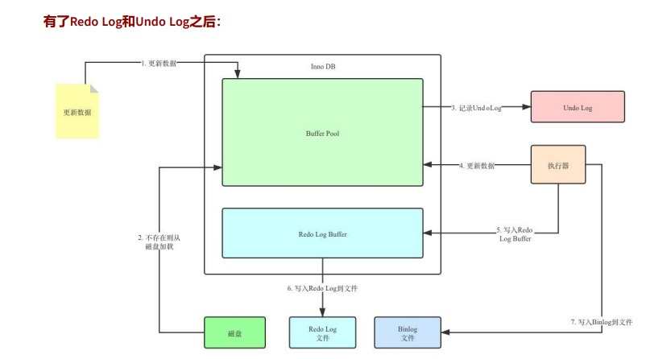
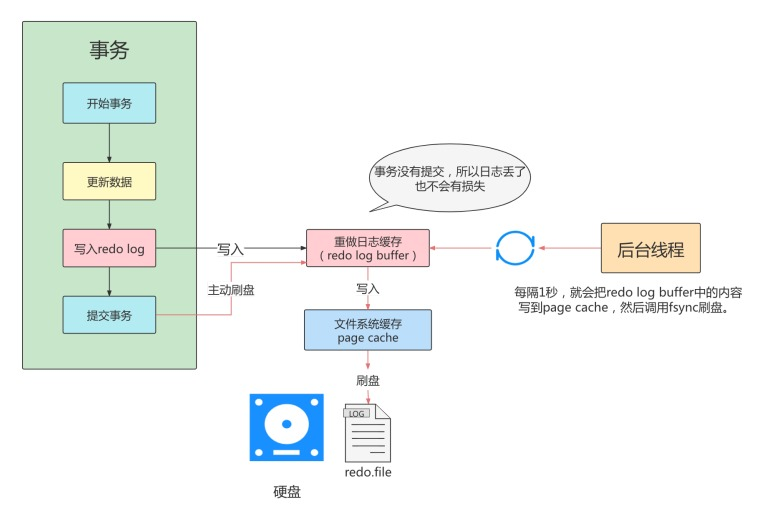
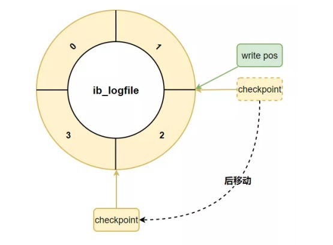
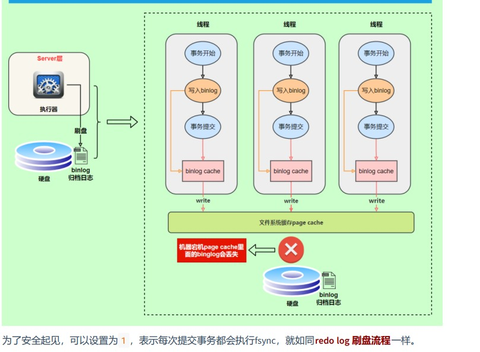
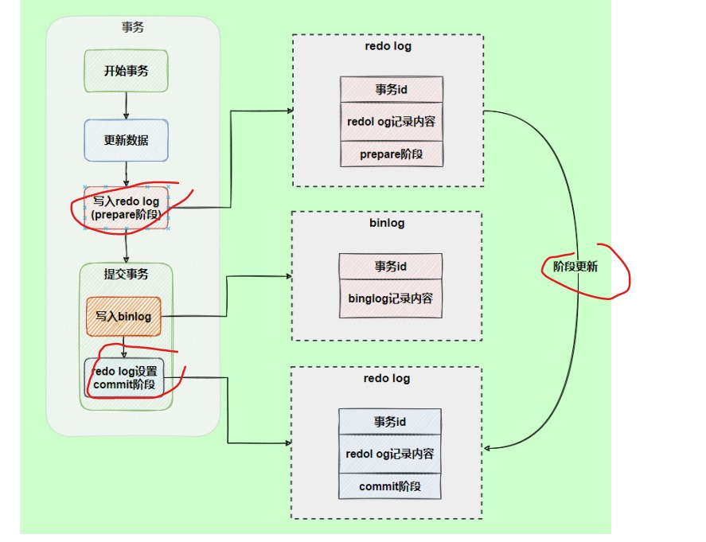

# 参考文档
* https://www.cnblogs.com/mikevictor07/p/12013507.html
* https://www.cnblogs.com/reecelin/p/13504084.html
* https://juejin.cn/book/6844733769996304392/section/6844733770063429646
* https://mp.weixin.qq.com/s/ODbju9fjB5QFEN8IIYp__A
#日志
* 事务的隔离性由 锁机制 实现。
* 而事务的原子性、一致性和持久性由事务的 redo 日志和undo 日志来保证。
* REDO LOG 称为 重做日志 ，提供再写入操作，恢复提交事务修改的页操作，用来保证事务的持久性。
* UNDO LOG 称为 回滚日志 ，回滚行记录到某个特定版本，用来保证事务的原子性、一致性。
* 
* binlog即binary log，二进制日志文件，也叫作变更日志（update log）:它记录了数据库所有执行的
  DDL 和 DML 等数据库更新事件的语句，但是不包含没有修改任何数据的语句（如数据查询语句select、
  show等）。
* 慢查询日志(slow query log)
##undo log与redo log是可逆过程吗
* undo log是逻辑日志，对事务回滚时，只是将数据库逻辑地恢复到原来的样子。
  redo log是物理日志，记录的是数据页的物理变化，undo log不是redo log的逆过程
##redolog机制  
* 
* InnoDB将重做日志首先刷入缓冲区中,
* 刷新缓冲区到磁盘的重做日志文件中时机
    * Master thread定时任务刷新。
    * 每个事务提交。
    * 缓冲区空间小于1/2（如果缓冲区过小则导致频繁的磁盘刷新，降低性能）
     
* checkpoint 机制
    * 用循环使用的方式向redo日志文件组里写数据的话，会导致后写入的redo日志覆盖掉前边写的redo日志.InnoDB的设计者提出了checkpoint的概念。
    * 
    * write pos 追上 checkpoint ，表示日志文件组满了，这时候不能再写入新的 redo log记录，MySQL 得
      停下来，清空一些记录，把 checkpoint 推进
##undolog机制  
* Undo日志的作用：作用1：回滚数据 ，作用2：MVCC
*
* undo log的删除:
````
针对于insert undo log:
因为insert操作的记录，只对事务本身可见，对其他事务不可见。故该undo log可以在事务提交后直接删
除，不需要进行purge操作。
针对于update undo log:
该undo log可能需要提供MVCC机制，因此不能在事务提交时就进行删除。提交时放入undo log链表，等
待purge线程进行最后的删除。
````
#binlog机制
* binlog主要应用场景：一是用于 数据恢复，二是用于 数据复制（主从复制）
* 
##binlog与redolog对比
* redo log 它是 物理日志 ，记录内容是“在某个数据页上做了什么修改”，属于 InnoDB 存储引擎层产生的。
* 而 binlog 是 逻辑日志 ，记录内容是语句的原始逻辑，类似于“给 ID=2 这一行的 c 字段加 1”，属于MySQL Server 层。
* redo log在事务执行过程中可以不断写入，而binlog只有在提交事务时才写入，所以redo log与binlog的 写入时机 不一样。
##binlog与redolog逻辑不一致
* redolog采用两阶段提交解决逻辑不一致情况（如binlog写入异常redolog正常）
* 
#sql语句在mysql执行过程
##更新语句
* update tb_student A set A.age='19' where A.name=' 张三 ';
* 先查询到张三这一条数据，如果有缓存，也是会用到缓存。
* 然后拿到查询的语句，把 age 改为 19，然后调用引擎 API 接口，写入这一行数据，InnoDB 引擎把数据保存在内存中，同时记录 redo log，此时 redo log 进入 prepare 状态，然后告诉执行器，执行完成了，随时可以提交。
* 执行器收到通知后记录 binlog，然后调用引擎接口，提交 redo log 为提交状态。
* 更新完成。
