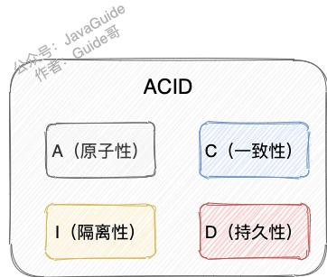

##参考文档
* https://notes.diguage.com/mysql/#schema-speed-up-alter

## 数据库组件结构
````
1.连接池组建
2. 管理服务和工具组建
3. SQL接口组件（SQL Interface）
4. 查询分析器（Parser）
5. 优化器组件（OpTImizer）
6. 缓冲组件（Cache & Buffer）
7. 插件式存储引擎（Pluggable Storage Engines）
8. 物理文件 （File Sysgtem & Logs）
````
````
1.数据库是文件集合，数据库实例是程序，两者通过插件式的存储引擎交互，而对开发人员通过数据库实例来操作数据库
````
## 数据库需要解决的问题
* 读-读情况：即并发事务相继 读取相同的记录，允许这种情况的发生。
* 读-写情况：即一个事务进行读取操作，另一个进行改动操作数据库，产生的脏读、幻读、不可重复读等问题。
    * innodb通过MVVC解决，读写不冲突
* 写-写情况：并发事务相继对相同的记录做出改动。
    * 在这种情况下会发生 脏写 的问题，任何一种隔离级别都不允许这种问题的发生。
    * 在多个未提交事务相继对一条记录做改动时，需要让它们 排队执行 ，这个排队的过程其实是通过 锁 来实现的。 
* 而数据库事务的隔离性是通过锁机制和mvcc来实现的
## 以下分析基于innodb存储引擎   
##ACID 
* 
* ：只有保证了事务的持久性、原子性、隔离性之后，一致性才能得到保障。也就是说 A、I、D 是手段，C 是目的！
##数据库事务问题
* 脏读（Dirty read）: 当一个事务正在访问数据并且对数据进行了修改，而这种修改还没有提交到数据库中，这时另外一个事务也访问了这个数据，然后使用了这个数据。因为这个数据是还没有提交的数据，那么另外一个事务读到的这个数据是“脏数据”，依据“脏数据”所做的操作可能是不正确的。
* 丢失修改（Lost to modify）: 指在一个事务读取一个数据时，另外一个事务也访问了该数据，那么在第一个事务中修改了这个数据后，第二个事务也修改了这个数据。这样第一个事务内的修改结果就被丢失，因此称为丢失修改。 例如：事务 1 读取某表中的数据 A=20，事务 2 也读取 A=20，事务 1 修改 A=A-1，事务 2 也修改 A=A-1，最终结果 A=19，事务 1 的修改被丢失。
* 不可重复读（Unrepeatable read）: 指在一个事务内多次读同一数据。在这个事务还没有结束时，另一个事务也访问该数据。那么，在第一个事务中的两次读数据之间，由于第二个事务的修改导致第一个事务两次读取的数据可能不太一样。这就发生了在一个事务内两次读到的数据是不一样的情况，因此称为不可重复读。
* 幻读（Phantom read）: 幻读与不可重复读类似。它发生在一个事务（T1）读取了几行数据，接着另一个并发事务（T2）插入了一些数据时。在随后的查询中，第一个事务（T1）就会发现多了一些原本不存在的记录，就好像发生了幻觉一样，所以称为幻读。
* 幻读与不可用重复读的区别：幻读是因为insert导致的，不可以重复读是因为更新导致;
##事务隔离级别
  * Read Uncommitted(未提交读)
    * 事务可以读取其他事务未提交的数据
    * 出现脏读(Dirty Read)
  * Read Committed(提交读)
    * 一个事务从开始直到提交之前，所做的任何修改对其他事务都是不可见的。
    * 解决脏读
    * 导致幻读，不可重复
  * Repeatable Read(可重复读)
    * 在同一个事务内的查询都是事务开始时刻一致的
    * 解决不可重复读，仍存在幻读
    * mysql数据库可重复读隔离级别解决了幻读问题。
  * Serializable(可串行化)
    * Serializable 是最高的隔离级别。它通过强制事务串行执行，避免了前面说的幻读问题。简单来说，Serializable 会在读取的每一行数据上都加锁，所以导致大量的超时和锁争用的问题。实际中，极少使用。
  * Repeatable Read(可重复读) 是 MySQL 默认事务隔离级别。
##MySQL隔离级别原理与实现
* MySQL 的隔离级别基于锁和 MVCC 机制共同实现的。
##MVVC
###什么是MVVC
* MVCC 是通过数据行的多个版本管理来实现数据库的 并发控制，你可以把它当成基于多版本号的一种乐观锁
* 查询一些正在被另一个事务更新的行，并且可以看到它们被更新之前的值，这样在做查询的时候就不用等待另一个事务释放锁。
* MVCC解决的问题是读写不冲突，但写写问题没有解决需要锁来解决
* MVCC本质是串联的undo日志链（）
* 
###MVCC的实现机制
* MVCC 的实现依赖于：隐藏字段、Undo Log、Read View
####ReadView
* 使用 READ COMMITTED 和 REPEATABLE READ 隔离级别的事务，都必须保证读到 已经提交了的 事务修改
  过的记录。假如另一个事务已经修改了记录但是尚未提交，是不能直接读取最新版本的记录的，核心问
  题就是需要判断一下版本链中的哪个版本是当前事务可见的，这是ReadView要解决的主要问题。
* ReadView判断版本可见配置视图信息，根据ReadView和ReadView的规则可以判断某个版本是否可见
####Read CommittedMVCC整体操作流程
* 首先获取事务自己的版本号，也就是事务 ID；
* 一个事务中的每一次 SELECT 查询都会重新获取一次Read View。
* 查询得到的数据(数据行的隐藏属性事务id)与 ReadView 中的事务版本号进行比较；
* 如果不符合 ReadView 规则，就需要从 Undo Log 中获取历史快照；
````
如果两次 Read View 不同，就可能产生不可重复读或者幻读的情况。
````
####可重复读 MVCC整体操作流程
* 一个事务只在第一次 SELECT 的时候会获取一次 Read View，而后面所有的 SELECT 都会复用这个 Read View
####可重复读如何解决幻读
* 
* 开始查询之前，MySQL 会为事务 A 产生一个 ReadView，此时 ReadView 的内容如下： trx_ids=
  [20,30] ， up_limit_id=20 ， low_limit_id=31 ， creator_trx_id=20 。
* 然后是 id=2 的数据，它的 trx_id=30，此时事务 A 发现，这个值处于 up_limit_id 和 low_limit_id 之
  间，因此还需要再判断 30 是否处于 trx_ids 数组内。由于事务 A 的 trx_ids=[20,30]，因此在数组内，这表
  示 id=2 的这条数据是与事务 A 在同一时刻启动的其他事务提交的，所以这条数据不能让事务 A 看到。
* 在 MySQL 的可重复读隔离级别下，可解决幻读问题。  
* 事务A UPDATE或者DELETE语句来对改动这个id=2的记录（因为事务30已经提交，改动该记录并不会造成阻塞），id=2的数据trx_id变为事务A的，
  此时事务A select id= 2的数据便能看到这条数据
* 在 MySQL 的可重复读隔离级别下，InnoDB中的MVCC并不能完完全全的禁止幻读。
###快照读
* 不加锁的简单的 SELECT 都属于快照读，即使有读写冲突时，也能做到 不加锁 ， 非阻塞并发读；
* 快照读可能读到的并不一定是数据的最新版本，而有可能是之前的历史版本。  
* 快照读的前提是隔离级别不是串行级别，串行级别下的快照读会退化成当前读 
###当前读
* 当前读：读取的是记录的最新版本，对读取的记录进行加锁保证其他并发事务不能修改当前记录
* 增删改均是快照读
* SELECT * FROM student LOCK IN SHARE MODE; # 共享锁
* SELECT * FROM student FOR UPDATE; # 排他锁
##mysql的锁机制
* 主要解决并发写-写产生的问题
* 普通select无锁的，增伤改或者当前读才会加锁，根据不同情况加不同类型行锁
### 表锁
* 表锁由 MySQL Server 实现，行锁则是存储引擎实现。
* 开销小，加锁快；不会出现死锁；锁定粒度大，发生锁冲突的概率最高，并发度最低。
* 意向锁
    * 意向锁是表级别锁
    * 当事务要在记录上加上读锁或写锁时，要首先在表上加上意向锁。
    * 分为读意向锁（IS 锁）和写意向锁（IX 锁）。
    * 作用：有了意向锁之后，如事务A在申请行锁（写锁）之前，数据库会自动先给事务A申请表的意向排他锁。当事务B去申请表的写锁时就会失败，因为表上有意向排他锁之后事务B申请表的写锁时会被阻塞
    * 意向锁是 InnoDB 自动加的， 不需用户干预。
* 加表锁情况
  * DDL 语句时会对整个表进行加锁(CREATE、ALTER、DROP);
  * 在用 LOCK TABLES 对 InnoDB 表加锁时要注意，要将 AUTOCOMMIT 设为 0，否则MySQL 不会给表加锁；
  * 事务结束前，不要用 UNLOCK TABLES 释放表锁，因为 UNLOCK TABLES会隐含地提交事务 
  * 索引失效全表扫描 

## 行锁
* 参考文档
    * https://blog.csdn.net/hekeyer/article/details/104562946
    * https://blog.csdn.net/qq4165498/article/details/76855139
* innodb的行级锁是依赖于索引实现的
    * 如果走索引实现的增删改会加锁
    * 不走索引可能加表锁    
* InnoDB在事务执行过程中，使用两阶段锁协议：行锁是在需要的时候才加上的，但并不是不需要了就立刻释放，而是要等到事务结束时才释放。这个就是两阶段锁协议。
    ````
    2PL,两阶段加锁协议:主要用于单机事务中的一致性与隔离性。
    2PC,两阶段提交协议:主要用于分布式事务
    ````
* 读锁
     * 对于普通 SELECT 语句，InnoDB 不会加任何锁
     * 共享锁（Share locks，简称 S 锁），加了读锁的记录，所有的事务都可以读取，但是不能修改，并且可同时有多个事务对记录加读锁。
     * 排他锁（X)：可以查询该记录，但是不能对该记录加共享锁或排他锁，而是等待获得锁
     * 
     ````
     共享锁（S)：SELECT * FROM table_name WHERE ... LOCK IN SHARE MODE。 其他 session 仍然可以查询记录，并也可以对该记录加 share mode 的共享锁。但是如果当前事务需要对该记录进行更新操作，则很有可能造成死锁。
     排他锁（X)：SELECT * FROM table_name WHERE ... FOR UPDATE。
     ````
* 写锁
     * 只有排他锁。对记录加了排他锁之后，只有拥有该锁的事务可以读取和修改，其他事务都不可以读取和修改，并且同一时间只能有一个事务加写锁。
     * 对于 UPDATE、 DELETE 和 INSERT 语句， InnoDB会自动给涉及数据集加排他锁（X)；
* 当我们用范围条件而不是相等条件检索数据，并请求共享或排他锁时，InnoDB会给符合条件的已有数据记录的索引项加锁；对于键值在条件范围内但并不存在的记录，叫做“间隙（GAP)”，InnoDB也会对这个“间隙”加锁，这种锁机制就是所谓的间隙锁（Next-Key锁）
* 记录锁 Record Locks
    * 请求共享或排他锁时，我们用相等条件检索数据加锁，叫记录锁；
    * 
* 间隙锁 Gap Locks
    * 请求共享或排他锁时，锁住数据不存在的区间（左开右开），加“间隙（GAP)”；
    * 间隙锁是为解决幻读提供的
    *     
* 临键锁 Next-key locks
    * 请求共享或排他锁时，锁住记录+区间（左开右闭） 当sql执行按照索引进行数据的检索时,查询条件为范围查找（between and、<、>等）并有数 据命中则此时SQL语句加上的锁为Next-key locks，加“间隙（GAP)”；
    *       

##页面锁
* 开销和加锁时间界于表锁和行锁之间；会出现死锁；锁定粒度界于表锁和行锁之间，并发度一般
* 当我们用范围条件而不是相等条件检索数据，并请求共享或排他锁时，InnoDB会给符合条件的已有数据记录的索引项加锁；对于键值在条件范围内但并不存在的记录，叫做“间隙（GAP)”，InnoDB也会对这个“间隙”加锁，这种锁机制就是所谓的间隙锁（Next-Key锁）。
##死锁及死锁检测
* 死锁：互相持有写锁不释放
````
事务A不提交：update t set k = 2 where id =1;                                 update t set k = 2 where id =2;
事务B不提交：                                 update t set k = 2 where id =2;                                update t set k = 2 where id =1;  
````
* InnoDB目前处理死锁的方法
    * 死锁自动检测
    * 将持有最少行级排他锁的事务进行回滚
    * 外部锁的死锁检测（表锁等），innodb可能检测不出，设置锁等待超时参数 innodb_lock_wait_timeout 来解决
    * 设置锁等待超时参数 innodb_lock_wait_timeout 来解决
* 解决方式
    * 除非必须，查询时不要显示加锁。 MySQL的MVCC可以实现事务中的查询不用加锁，优化事务性能；MVCC只在COMMITTED READ（读提交）和REPEATABLE READ（可重复读）两种隔离级别下工作
    * 给记录集显示加锁时，最好一次性请求足够级别的锁。比如要修改数据的话，最好直接申请排他锁，而不是先申请共享锁，修改时再请求排他锁，这样容易产生死锁
    * 不同的程序访问一组表时，应尽量约定以相同的顺序访问各表，对一个表而言，尽可能以固定的顺序存取表中的行。这样可以大大减少死锁的机会