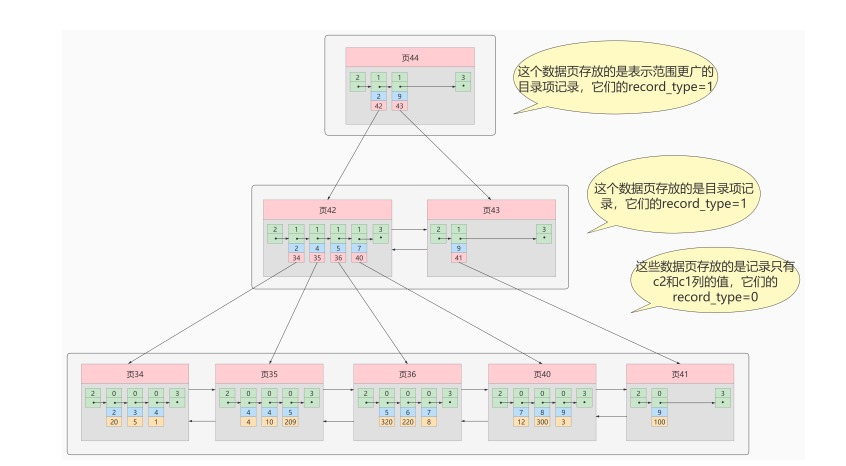

#参考文档
* https://notes.diguage.com/mysql/#schema-speed-up-alter

## 索引需要解决什么问题？
* 硬件来讲：读取速度CPU缓存>内存>硬盘，其中IO的次数和效率是关键。 
* 硬盘的数据读取到内存：硬盘加载的速度取决寻道时间，连续数据的加载可以减少寻道时间
* 硬盘到内存采用局部预读到内存：即使只需要一个字节，磁盘也会从这个位置开始，顺序向后读取一定长度的数据放入内存。可以减少磁盘 I/O。由于磁盘顺序读取的效率很高（不需要寻道时间，只需很少的旋转时间），因此对于具有局部性的程序来说，预读可以提高 I/O 效率。磁盘往往也不是严格按需读取，。这样做的理论依据是计算机科学中著名的局部性原理：
* 数据读取到内存排序算法的选择：
    * 哈希表会得到 O(1) 复杂度：缺点是不支持排序
    * 归并排序：
        * 可以更改算法，以便于同时使用磁盘空间和少量内存而避免巨量磁盘 I/O。
        * 方法是只向内存中加载当前处理的部分。在仅仅100MB的内存缓冲区内排序一个几个GB的表时，这是个很重要的技巧。
    可以更改算法，以便于在多处理器/多线程/多服务器上运行。 分布式归并排序时 Hadoop 的关键组件之一。
    * 二叉查找树：极端情况仍需要O(n)
    * 平衡二叉树：每个节点只有一个索引，导致树的高度过高且不固定，IO次数不可接受
    * B-Tree：
        * 优点：每个节点会有多个索引，减少树的高度，减少IO次数
        * 缺点：每个节点包含索引，下个节点的指针以及行数据。每次都要把索引数据和无关的业务数据全部查出来。本来一次就可以把所有索引数据加载进来，现在却要多次才能加载完。
    * B+Tree：
        * 非叶子节点data 域存放的是索引及下个节点指针，叶子节点data 域存放的是索引及数据（可以是真是数据也可以是指针）。
        * 由于非叶子节点data域不存实际数据，一个page所能加载的索引更多，减少了IO次数。
        * 数据存放的数据是有序，查找数据更快
#索引的实现
##加载方式
* 数据从硬盘 按页 加载到内存，一页默认大小为16K。
## MyISAM
* MyISAM 引擎使用 B+Tree 作为索引结构,
* MyISAM的索引方式叫做“非聚集索引”：辅助索引及主键的叶节点的 data 域存放的是数据记录的地址,换句话说索引文件仅保存数据记录的地址，索引文件与数据文件是分开的。 
## InnoDB      
* InnoDB 引擎使用 B+Tree 作为索引结构。
* InnoDB 的数据文件本身就是索引文件。
* InnoDB的索引方式也叫做“聚集索引”：InnoDB一定要有主键索引以及对应的主键索引表。主键索引表叶子节点存放的是实际数据，
* InnoDB的辅助索引：会生成的的辅助索引索引表，辅助索的索引表 叶子节点data 域存放的存放主键Id而非数据本身。
* 根据主键索引查找只需查一次表，根据辅助索引需要查两次表（第一次查出主键ID后再根据id查主键索引表）
* 覆盖索引：查询的值在二级索引里包含，不需要回表既可以得到，所以要查询的值都见覆盖索引
* 
* 联合索引:我们也可以同时以多个列的大小作为排序规则，也就是同时为多个列建立索引，建立 联合索引 只会建立如上图一样的1棵B+树
## 读myisam要比innodb要快（唯一优势）
````
myisam直接从磁盘里拿数据，而innodb要分两步，innodb要从内存里首先获取数据，如果没有再到磁盘里拿。而且一开始innodb要有个加热的过程，也就是说，内存里的数据不是一下子就缓存，而是一点一点的缓存那些热数据。如果你的内存小，数据库里的数据量要大于buffer_pool_size设置的值，并发较低，性能就下降。   
这也就解释了在这个场景里，读myisam要比innodb要快。
innodb玩的是内存，内存越大，它的优势才能发挥出来。
myisam玩的是硬盘IO，转速越快，它的优势才能发挥出来
````
##三星索引设计
````
SELECT
  cust_id,
  first_name
FROM cust
WHERE last_name = 'CHOATE'
      AND city_id = 499
ORDER BY first_name;
````
* 第一颗星：它最小化了必须扫描的索引片的宽度：与一个查询相关的索引行是相邻的，或者至少相距足够靠近
    * 做法：取出谓词的列（WHERE COL=），把这些列作为索引最开头的列，任意顺序都可以。
    * 针对（Where col=…​） ，把这些列作为索引最开头的列 。可选的索引字段为：(last_name, city_id) 或 (city_id, last_name)。这样可以将索引片宽度缩减到最窄。
* 第二颗星：排除了排序操作：如果索引行的顺序与查询语句需求一致
    * 做法：将ORDER BY列加入到索引中。不要改变这些列的顺序，但忽略那些在第一步已经加入索引的列。
    * 针对order by查询,可选索引字段变为：(last_name, city_id, first_name) 或 (city_id, last_name, first_name)。
* 第三颗星：避免表访问：如果索引行包含查询所需所有列
    * 做法：将查询语句（不是WHERE谓词）中剩余的列加到索引中取，列在索引中的添加顺序对查询语句的性能更没有影响，但将易变的列放在最后能够降低更新的成本。
    * 整个查询中，只剩下 cust_id，加入索引字段，(last_name, city_id, first_name, cust_id) 或 (city_id, last_name, first_name, cust_id)。
    * 将选择性最高的列放到索引最前列，故选择(city_id, last_name, first_name, cust_id)(city_id, last_name, first_name, cust_id)作为索引。
## 三星索引公式化
* 通常第一颗比第二颗更重要，但不总是这样。
* 公式化：
    * 当存在范围谓词时，就无法实现三星索引，需要降级。（也许）不得不牺牲第二颗星来满足一个更窄的索引片（第一颗星），这样最佳索引就只拥有两颗星。
    * 设计一个索引片尽可能窄（第一）的宽索引（第三）。
    * 如果查询使用这个索引不需要排序（第二），则这个索引就是三星索引。否则只能是一个二星索引。看情况是牺牲第一颗，还是牺牲第二颗。
* 候选A算法（牺牲第二颗，需要排序）
````
取出对优化器来说不过分复杂的等值谓词列，将这些列作为索引的前导列---顺序任意。
将选择性最好的范围谓词作为索引的下一个列，如果存在的话。最好的选择性是指对于最差的输入值有最低的过滤 因子。只考虑对优化器来说不过分复杂的谓词即可。
以正确的顺序添加ORDER BY列（如果ORDER BY有DESC，加上DESC）。忽略前面已经加的索引列。
以任意顺序将SELECT中其余列添加到索引中（以不易变的列开始）
````
* 候选B算法（牺牲第一颗，不需要排序）
````
取出对优化器来说不过分复杂的等值谓词列，将这些列作为索引的前导列---顺序任意。
以正确的顺序添加ORDER BY列（如果ORDER BY有DESC，加上DESC）。忽略前面已经加的索引列。
以任意顺序将SELECT中其余列添加到索引中（以不易变的列开始）。  
````  
* 总结
````
1.不要过度机械设计为每一个查询每一个最佳索引。
2.实际中更常见的情况是，只对那些由于不合适的索引或无所索引而导致速度太慢的查询进行索引设计。
````