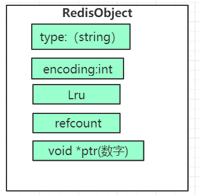
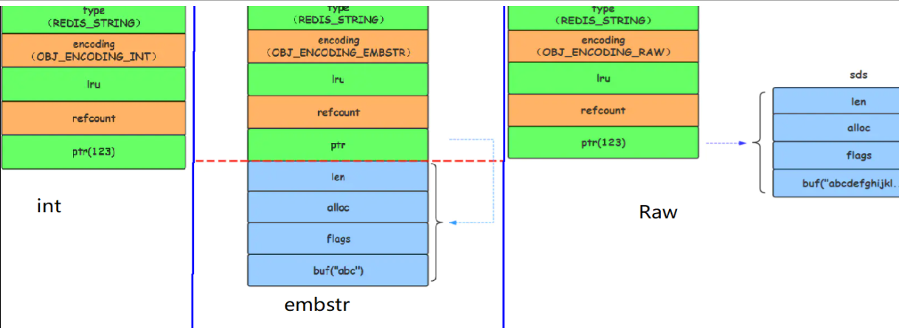
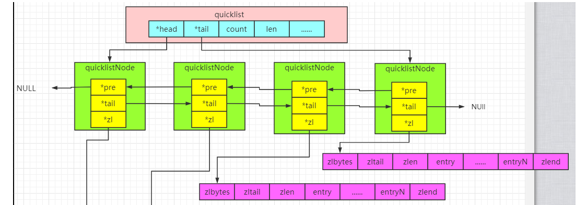
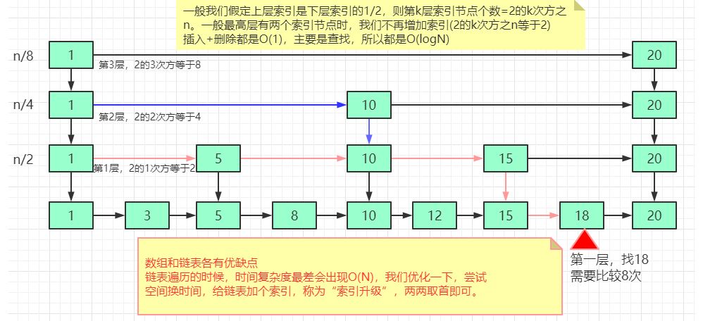

#数据结构
* 源码：http://daoluan.net/redis-source-notes/
* 查看文档：https://www.cnblogs.com/sgh1023/p/10123767.html
##API
###String
* get(key) 获取值
* set(key,value) 放入值
* incr(key)	key自增1，如果key不存在，自增后get(key)=1
    * 文章无限点赞
* decr(key)	key自减1，如果key不存在，自减后get(key)=-1
* setnx(key, value)	key不存在，才设置
    * 分布式锁
###hash
* hset
* hget
* hdel
###String还是hash存储？
* 绝大部分用String
* String更省内存，存储有多层嵌入对象方便
* String存放的是整个对象，hash是对象的每个属性单独存储，如果某些字段常变动那么hash更合适
###List
* lpush(key,value)    将元素推入列表的左端
    * 公众号订阅消息
    * 商品评价列表
* lpop(key)    将元素从列表左端弹出   
* blpop(key) 在没有消息的时候，它会阻塞住直到消息到来  
* lrange(key，start，end)     获取列表在给定范围的所有元素
    * 查阅订阅消息
###Set
* sadd(key,value)  向集合key添加element（如果element已经存在，添加失败）  
    * 朋友圈点赞
* srem(key)       将集合key中的element移除   
* sismember(key,value)  检查元素value是否存在于集合key中
* smembers(key)     返回集合包含的所有元素
* srandommember(key,2) 随机返回2个元素
    * 微信小程序抽奖
* 集合运算：差集sdiff A[B]交集，差集
    * 共同关注的人，可能认识的人
###ZSet
* zadd(key,score,value)    将一个带有给定分值的成员添加到有序集合里面
* zrange(key,begin,end)    根元素排名
    * 排行榜
* zrangebyscore(key,beginscore,endscore)    获取有序集合在给定分值范围内的所有元素
* zrem(key,value)   如果给定成员存在于有序集合中，那么移除这个成员
* zincreby key 10 增加key分数
    * 排行榜
###Pub/Sub
* publish(channel,value) 发布消息
* subsribe(channel) 订阅消息
* unsubsribe(channel)  取消订阅
###bitmap
* bitmap 8位一组，超过8位再继续扩容
* setbit key 10 1 用来设置或者清除某一位上的值
* BITCOUNT key [start end] 统计指定位区间上，值为 1 的个数
* bitop [operations] [result] [key1] [keyn…] BitMap间的运算 operations（and ornot）
        * 统计活跃用户：bitop and result 20201009 20201010 bitcount result
###BloomFilter
###bitmap与布隆过滤器区别
*（关键）位图bitmap在数据量过大情况下导致了内存浪费，处理数字很方便，但是处理字符就稍微有点困难了（
* 布隆过滤器 主要是为了解决空间浪费问题,并不能完全解决hash冲突;
* BitMap:把数值转化为数组的下标，下标对应的值只存放一个bit 0或1 ，0不存在 1存在。判断时 根据数值当做下标找到对应的 bit 值，1存在，0不存在
* BloomFilter:把内容通过多个hash算法，转换成多个数组下标，下标对应的值只存放一个bit 0或1 ，0不存在 1存在。判断过滤时 多个下标对应的值都为1，则可能存在，只要有一个值为0，则一定不存在
###HyperLogLog
* 极小空间完成独立数量去重的统计，牺牲准确率换取空间
* pfdadd（key,value）添加数据
* pfcount(key) 统计数量
* pfmerge(key1,key2) 合并
###Geo
* 存储经纬度，计算两地距离，范围计算等
* geoadd（key，经度，纬度，cityName） 添加坐标 
* geopos（key，cityName）   获取地理位置
* geodist（key，cityName1，cityName2，km）两地间的距离
* georadius（key，精度，纬度，10）返回距离中心不超过10km的元素
    * 美团地图附近酒店推送
###redisModule
* redis 4.0后支持module功能之后，可以以插件的形式给redis扩展一些新的功能，比如本篇说到的rediSQL，rebloom。
* https://www.cnblogs.com/huangxincheng/p/10292303.html

#源码
* https://redisbook.readthedocs.io/en/latest/compress-datastruct/intset.html#id2
* http://daoluan.net/redis-source-notes/
##通用
* redis 的 key一般为字符串，value 为  redisObject结构
* redisObjec定义了type和encoding字段对不同的数据类型加以区别，redisObject就是string、hash、list、set、zset的父类，
* 
* redis会自适应的根据不同的value选择不同编码方式。
##String
###编码方式
* int：保存8字节整型数据，redis预先创建0-9999的redisobject共享变量，次键值对不占空间
* emstr：保存长度小于44的字符串，采用sds数据结构
* raw：保存长度大于44的字符串，采用sds数据结构,sds与redisObject内存不连续
* 
###sds
* sds可以实现复杂度为 θ(1) 的长度计算操作：int len字段
* sdshdr 可以高效地执行追加操作,且所需的内存重分配次数大大减少：free字段
* sds数据和redisObject对象分配在同一个连续的内存中
* 数据结构
````
struct sdshdr {

    // buf 已占用长度
    int len;

    // buf 剩余可用长度
    int free;

    // 实际保存字符串数据的地方
    char buf[];
};
````
##hash
* hash存储的键值对小于512
###编码方式
* ziplist：键和值都小于64字节，采用此编码,采用ziplist数据结构
* hashtable：键和值其一大于于64字节，采用此编码，采用数组加链表数据结构
###ziplist
* 是一种特殊的没有维护指针双向链表，通过entry长度推算下一个节点，获得高效存储空间
* ziplist在内存中连续的
* 保存了长度，获取长度不需遍历整个链表，时间复杂度为o(1)
*   
* 
````
area        |<---- ziplist header ---->|<----------- entries ------------->|<-end->|

size          4 bytes  4 bytes  2 bytes    ?        ?        ?        ?     1 byte
            +---------+--------+-------+--------+--------+--------+--------+-------+
component   | zlbytes | zltail | zllen | entry1 | entry2 |  ...   | entryN | zlend |
            +---------+--------+-------+--------+--------+--------+--------+-------+
                                       ^                          ^        ^
address                                |                          |        |
                                ZIPLIST_ENTRY_HEAD                |   ZIPLIST_ENTRY_END
                                                                  |
                                                         ZIPLIST_ENTRY_TAIL
area        |<------------------- entry -------------------->|

            +------------------+----------+--------+---------+
component   | pre_entry_length | encoding | length | content |
            +------------------+----------+--------+---------+                                                         
````
###hashtable(字典)
* 数据结构
````
 struct dict {
    // 特定于类型的处理函数
    dictType *type;
    // 类型处理函数的私有数据
    void *privdata;
    // 哈希表（2 个）
    dictht ht[2];
    // 记录 rehash 进度的标志，值为 -1 表示 rehash 未进行
    int rehashidx;
    // 当前正在运作的安全迭代器数量
    int iterators;
} dict;
typedef struct dictht {

    // 哈希表节点指针数组（俗称桶，bucket）
    dictEntry **table;
    // 指针数组的大小
    unsigned long size;
    // 指针数组的长度掩码，用于计算索引值
    unsigned long sizemask;
    // 哈希表现有的节点数量
    unsigned long used;

} dictht
````
* 流程：是否存在->是否碰撞->是否rehash
* 扩容渐进式rehash
    * 通过将 rehash 分散到多个步骤中进行， 从而避免了集中式的计算
    * 每次执行一次添加、查找、删除操作， ， ht[0]->table 哈希表第一个不为空的索引上的所有节点就会全部迁移到 ht[1]->table
    * 当 Redis 的服务器常规任务执行时 在规定的时间内， 尽可能地对数据库字典中那些需要 rehash 的字典进行 rehash ， 从而加速数据库字典的 rehash 进程（progress）。
    * rehash 时，字典会同时使用两个哈希表，所以在这期间的所有查找、删除等操作，除了在 ht[0] 上进行，还需要在 ht[1] 上进行。
    * 在执行添加操作时，新的节点会直接添加到 ht[1] 而不是 ht[0] ，这样保证 ht[0] 的节点数量在整个 rehash 过程中都只减不增
##list
###编码方式
* 低版本 Redis 默认使用ZIPLIST 编码， 当条件满足时变为linkList
* 高版本使用quickList编码，节点也是ziplist，是ziplist和linklist的结合,
###quicklist
* 
##set
###编码方式
* intset
* hashtable：集合将元素保存到字典的键里面， 而字典的值则统一设为 NULL 。
* intset 保存的整数值个数超过 server.set_max_intset_entries （默认值为 512 ）以及
  试图往集合里添加一个新元素，并且这个元素不能被表示为 long long 类型（也即是，它不是一个整数）
  intset变为hashtable
### intset
* 数据结构
````
typedef struct intset {
    // 保存元素所使用的类型的长度:16位和32位
    uint32_t encoding;   
    // 元素个数
    uint32_t length;
    // 保存元素的数组：元素是从小到大排列的
    int8_t contents[]; 
} intset
````  
##zset
###编码方式
* ziplist
* skiplist
* ziplist 所保存的元素数量超过服务器属性 server.zset_max_ziplist_entries 的值（默认值为 128 ）
  新添加元素的 member 的长度大于服务器属性 server.zset_max_ziplist_value 的值（默认值为 64 ）
  是ziplist变为skiplist
###skiplist
* https://www.cnblogs.com/hunternet/p/11248192.html
* https://www.jianshu.com/p/c2841d65df4c
* 数据结构
````
typedef struct zset {
    /*
     * Redis 会将跳跃表中所有的元素和分值组成 
     * key-value 的形式保存在字典中
     * todo：注意：该字典并不是 Redis DB 中的字典，只属于有序集合
     */
    dict *dict;
    /*
     * 底层指向的跳跃表的指针
     */
    zskiplist *zsl;
} zset;
````    
* 什么是跳跃表
   * 跳表是实现二分查找的链表
   * 
##其他
* bitmapStr和hyperLoglog底层实质是String  ， GEO实质是 ZSET。
#redis数据类型
* redisObject 是 Redis 类型系统的核心， 数据库中的每个键、值，以及 Redis 本身处理的参数， 都表示为这种数据类型。
* 数据结构
    ````
    /*
     * Redis 对象
     */
    typedef struct redisObject {
        // 类型
        unsigned type:4;
        // 对齐位
        unsigned notused:2;
        // 编码方式
        unsigned encoding:4;
        // LRU 时间（相对于 server.lruclock）
        unsigned lru:22;
        // 引用计数
        int refcount;
        // 指向对象的值
        void *ptr;
    } robj;
    ````
* 使用数据结构由 type 属性和 encoding 属性决定 ，ptr指定存储数据结构
    * [如何决定使用何种数据结构存储数据](https://redisbook.readthedocs.io/en/latest/_images/graphviz-243b3a1747269b8e966a9bdd9db2129d983f2b23.svg)
* BLPOP 、 BRPOP 和 BRPOPLPUSH 这个几个阻塞命令的实现原理上
    * 若阻塞则生成blockkey（字典）：key为阻塞键，value为客户端
    * 若有新数据，则生成readyKey（list）,查找阻塞的客户端并通知
        ````
        typedef struct readyList {
            redisDb *db;
            robj *key;
        } readyList;
       ````
* 事务的实现
* https://redisbook.readthedocs.io/en/latest/feature/transaction.html#id2    
* 开启事务时，除了 EXEC 、 DISCARD 、 MULTI 和 WATCH命令，会将其他命令全部放进一个事务队列（数组）而不是立即执行
* 当EXEC 命令执行时，服务器根据客户端所保存的事务队列， 以先进先出（FIFO）的方式执行事务队列中的命令
* 使用watched，会保存在 watched_keys （字典）：key为键，value为客户端

# redis数据库的结果
* 数据结构
````
typedef struct redisDb {

    // 保存着数据库以整数表示的号码
    int id;
    // 保存着数据库中的所有键值对数据
    // 这个属性也被称为键空间（key space）
    dict *dict;
    // 保存着键的过期信息(字典：key为键，value为过期时间)
    dict *expires;
    // 实现列表阻塞原语，如 BLPOP
    // 在列表类型一章有详细的讨论
    dict *blocking_keys;
    dict *ready_keys;
    // 用于实现 WATCH 命令
    // 在事务章节有详细的讨论
    dict *watched_keys;

} redisDb;
````
* 过期键的清除
    * 定时删除：在设置键的过期时间时，创建一个定时事件，当过期时间到达时，由事件处理器自动执行键的删除操作。
        * 很耗费性能，redis不采用，采用以下方式
    * 惰性删除：放任键过期不管，但是在每次从 dict 字典中取出键值时，要检查键是否过期，如果过期的话，就删除它，并返回空；如果没过期，就返回键值。
    * 定期删除：每隔一段时间，对 expires 字典进行检查，删除里面的过期键
        * 规定的时间限制内， 尽可能地遍历各个数据库的 expires 字典， 随机地检查一部分键的过期时间， 并删除其中的过期键。
* 过期键对 AOF 、RDB 和复制的影响
    * 在创建新的 RDB 文件时，程序会对键进行检查，过期的键不会被写入到更新后的 RDB 文件中。因此，过期键对更新后的 RDB 文件没有影响。        
    * 更新AOf文件时， 键已经过期，但是还没有被惰性删除或者定期删除之前，这个键不会产生任何影响，AOF 文件也不会因为这个键而被修改。当过期键被惰性删除、或者定期删除之后，程序会向 AOF 文件追加一条 DEL 命令，来显式地记录该键已被删除。 
    * 和 RDB 文件类似， 当进行 AOF 重写时， 程序会对键进行检查， 过期的键不会被保存到重写后的 AOF 文件。
    * 当服务器带有附属节点时， 过期键的删除由主节点统一控制
        ````
        如果服务器是主节点，那么它在删除一个过期键之后，会显式地向所有附属节点发送一个 DEL 命令。
        如果服务器是附属节点，那么当它碰到一个过期键的时候，它会向程序返回键已过期的回复，但并不真正的删除过期键。因为程序只根据键是否已经过期、而不是键是否已经被删除来决定执行流程，所以这种处理并不影响命令的正确执行结果。当接到从主节点发来的 DEL 命令之后，附属节点才会真正的将过期键删除掉。
        附属节点不自主对键进行删除是为了和主节点的数据保持绝对一致， 因为这个原因， 当一个过期键还存在于主节点时，这个键在所有附属节点的副本也不会被删除。
        这种处理机制对那些使用大量附属节点，并且带有大量过期键的应用来说，可能会造成一部分内存不能立即被释放，但是，因为过期键通常很快会被主节点发现并删除，所以这实际上也算不上什么大问题。
       ````     
# RDB
* RDB 将数据库的快照（snapshot）以二进制的方式保存到磁盘中。
* rdbSave 会将数据库数据保存到 RDB 文件，并在保存完成之前阻塞调用者。
* SAVE 命令直接调用 rdbSave ，阻塞 Redis 主进程； BGSAVE 用子进程调用 rdbSave ，主进程仍可继续处理命令请求。
* SAVE 执行期间， AOF 写入可以在后台线程进行， BGREWRITEAOF 可以在子进程进行，所以这三种操作可以同时进行。
* 为了避免产生竞争条件， BGSAVE 执行时， SAVE 命令不能执行。
* 为了避免性能问题， BGSAVE 和 BGREWRITEAOF 不能同时执行。
* 调用 rdbLoad 函数载入 RDB 文件时，不能进行任何和数据库相关的操作，不过订阅与发布方面的命令可以正常执行，因为它们和数据库不相关联。
* RDB文件结构
    ````
    +-------+-------------+-----------+-----------------+-----+-----------+
    | REDIS | RDB-VERSION | SELECT-DB | KEY-VALUE-PAIRS | EOF | CHECK-SUM |
    +-------+-------------+-----------+-----------------+-----+-----------+
                          |<-------- DB-DATA ---------->|
              +----------------------+---------------+-----+-------+
              | OPTIONAL-EXPIRE-TIME | TYPE-OF-VALUE | KEY | VALUE |
              +----------------------+---------------+-----+-------+
                |<-------- KEY-VALUE-PAIRS ---------->|
    ````    
    * TYPE-OF-VALUE 对应以上7中数据结构，表示value的格式