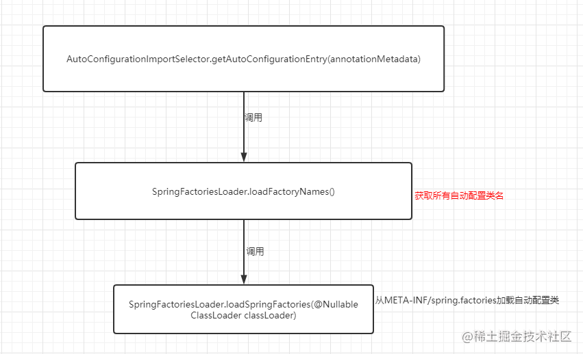
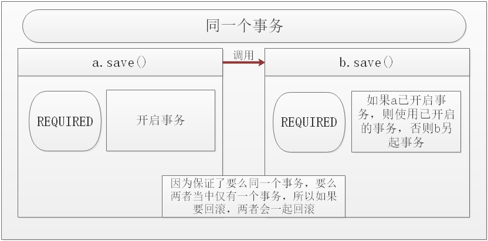
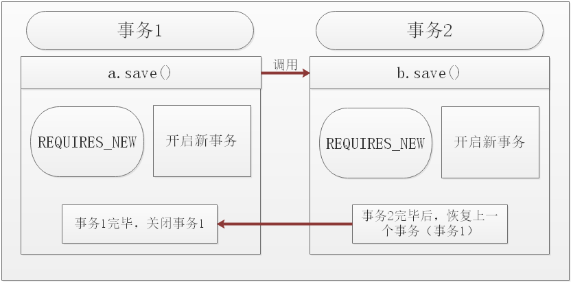
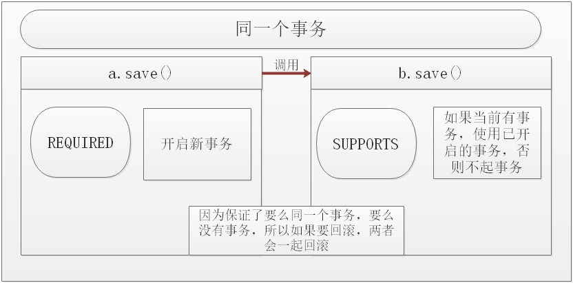

#Spring AOP概念
* Aspect : 切面由切入点和通知组成
* JoinPoint :切入点
* PointCut ：简单来说，连接点就是被拦截到的程序执行点，因为Spring只支持方法类型的连接点，所以在Spring中连接点就是被拦截到的方法。
* advice ：通知是指拦截到连接点之后要执行的代码，包括了“around”、“before”和“after”等不同类型的通知
* advisor :Advisor由切入点和Advice组成。
#Spring AOP通知顺序
##单个切面
* 正常情况：环绕前置=====@Before=====目标方法执行=====@AfterReturning=====@After=====环绕返回=====环绕最终
* 异常情况：环绕前置=====@Before=====目标方法执行=====@AfterThrowing=====@After=====环绕异常=====环绕最终
````
@Around(value = "myPointCut()")
    public Object myAround(ProceedingJoinPoint proceedingJoinPoint)
    {
        Object[] args = proceedingJoinPoint.getArgs();
        Object result=null;
        try {
            //前置通知@Before
            System.out.println("环绕前置通知");
            //目标方法执行
            result = proceedingJoinPoint.proceed(args);
            //环绕返回通知@AfterReturning
            System.out.println("环绕返回通知");
        } catch (Throwable throwable) {
            //环绕异常通知@AfterThrowing
            System.out.println("环绕异常通知");
            throw new RuntimeException(throwable);
        } finally {
            //最终通知@After
            System.out.println("环绕最终通知");
        }
        return result;
    }
````
##多个切面
* 正常情况：切面1环绕前置===切面1@Before===切面2环绕前置===切面2@Before===目标方法执行===切面2@AfterReturning===切面2@After===切面2环绕返回===切面2环绕最终===切面1@AfterReturning===切面1@After===切面1环绕返回===切面1环绕最终
* 异常情况：切面1环绕前置===切面1@Before===切面2环绕前置===切面2@Before===目标方法执行===切面2@AfterThrowing===切面2@After===切面2环绕异常===切面2环绕最终===切面1@AfterThrowing===切面1@After===切面1环绕异常===切面1环绕最终
````
@Order(value = 1)
@Aspect
@Component
public class BookServiceProxy {}
 
@Order(value = 0)
@Aspect
@Component
public class BookServiceProxy2 {}
 
切面二：环绕前置通知
切面二：@Before
切面一：环绕前置通知
切面一：@Before
目标方法执行
切面一：@AfterReturning
切面一：@After
切面一：环绕返回通知
切面一：环绕最终通知
切面二：@AfterReturning
切面二：@After
切面二：环绕返回通知
切面二：环绕最终通知
````
##spring aop实现
* https://blog.csdn.net/litianxiang_kaola/article/details/85335700
* 见代码
#spring-boot自动装配流程
* 
* 所有 Spring Boot Starter 下的META-INF/spring.factories都会被读取到。
* spring.factories配置不会都加载，根据@condition按需加载
# 事务传播机制
* https://blog.csdn.net/trigl/article/details/50968079
* https://fgu123.github.io/2019/03/19/Spring-Transaction-Propagation/
* PROPAGATION_REQUIRED
    * Spring默认的传播机制，能满足绝大部分业务需求，如果外层有事务，则当前事务加入到外层事务，一块提交，一块回滚。如果外层没有事务，新建一个事务执行
    * 
* PROPAGATION_REQUES_NEW
    * 该事务传播机制是每次都会新开启一个事务，同时把外层事务挂起，当当前事务执行完毕，恢复上层事务的执行。如果外层没有事务，执行当前新开启的事务即可
    * 
* PROPAGATION_SUPPORT
    * 如果外层有事务，则加入外层事务，如果外层没有事务，则直接使用非事务方式执行。完全依赖外层的事务
    * 
* PROPAGATION_NOT_SUPPORT
    * 该传播机制不支持事务，如果外层存在事务则挂起，执行完当前代码，则恢复外层事务，无论是否异常都不会回滚当前的代码
* PROPAGATION_NEVER
    * 该传播机制不支持外层事务，即如果外层有事务就抛出异常
* PROPAGATION_MANDATORY
    * 与NEVER相反，如果外层没有事务，则抛出异常
* PROPAGATION_NESTED
    * 该传播机制的特点是可以保存状态保存点，当前事务回滚到某一个点，从而避免所有的嵌套事务都回滚，即各自回滚各自的，如果子事务没有把异常吃掉，基本还是会引起全部回滚的。
#事务隔离级别
* DEFAULT：默认级别，其中mysql默认隔离级别是REPEATABLE_READ
* READ_UNCOMMITTED 
* READ_COMMITTED 
* REPEATABLE_READ
* SERIALIZABLE
#事务失效
* 在默认设置下，事务只在出现运行时异常（runtime exception）时回滚，而在出现受检查异常（checked exception）时不回滚
    * error是一定会回滚的
*  如果异常被try｛｝catch｛｝了，事务就不回滚了，如果想让事务回滚必须再往外抛try｛｝catch｛throw Exception｝
*  在类A里面有方法a 和方法b， 然后方法b上面用 @Transactional加了方法级别的事务，在方法a里面 调用了方法b， 方法b里面的事务不会生效。原因是在同一个类之中，方法互相调用，切面无效 ，而不仅仅是事务。这里事务之所以无效，是因为spring的事务是通过aop实现的。  

#Spring IOC
##三级缓存
* singletonObjects, singletonFactories ,earlySingletonObjects
    * DefaultSingletonBeanRegistry中
    * 普通bean创建完成实例会放入singletonObjects
    * singletonFactories：为了解决setter循环依赖，当实例化bean之后，会将实例化（但未初始化）bean放入其中
    * earlySingletonObjects ：我们可以在其升级为earlySingletonObjects的时候去设置一些属性或者做一些其他事情,我们只需要在 beanA 的类中实现 SmartInstantiationAwareBeanPostProcessor 接口即可
* factoryBeanObjectCache
    * FactoryBeanRegistrySupport
    * 存放FactoryBean生成的实例
* beanDefinitionMap
    * DefaultListableBeanFactory
    * 容器通过registerBeanDefinition()注册到容器    
## 存放FactoryBean与BeanFactory   
* FactoryBean 是一种特殊bean，BeanFactory 就是IOC容器
## Bean的生命周期
* https://blog.csdn.net/qq_39188150/article/details/111364024
* https://blog.csdn.net/chinaleesunnyboy/article/details/107673054
* 启动spring容器，创建applicationcontext
* 加载配置
    * 加载之后,spring容器会将这些配置信息(java bean的信息),封装成BeanDefinition对象
    * AbstractApplicationContext->refresh()
        * 创建AbstractBeanFactory
        * 利用BeanFactoryPostProcessor接口这个扩展点，去对BeanDefinition对象进行一些属性修改
        * 国际化等初始化
* BeanDefinition类加载（createBean）
    * jvm类加载：resolveBeanClass(mbd, beanName)->Class.forName(name, false, clToUse);
    * 将实例化未初始化的classBean放入BeanDefinition            
* 循环BeanDefinition去实例化
    * springBean的实例化也就是执行bean的构造方法(单例的Bean放入单例池中,但是此刻还未初始化)(native Object newInstance0(Constructor<?> var0, Object[] var1) )
    * 在执行实例化的前后,可以通过InstantiationAwareBeanPostProcessor扩展点作用于所有bean)进行一些修改。
    * 执行 @PostConstruct 的方法
* 注入属性
    * 注入autowire注解的属性
* 初始化
    * 对各项属性赋初始化值
    ````  
        (0) 继承Aware接口的执行
        (1) BeanPostProcessor.postProcessBeforeInitialization()
        (2) InitializingBean.afterPropertiesSet()
        (3) 配置文件中指定的 init-method 方法
        (5) BeanPostProcessor.postProcessAfterInitialization()     	   
    ````
* SmartLifecycle start():当对象初始化完成将显示调用start()
    
* 销毁
    * 容器销毁,springbean也会销毁,销毁前后也有一系列的扩展点
    * 销毁bean之前,执行@PreDestroy 的方法
    * 实现DisposableBean方法 
    * 销毁时,执行配置文件或注解中指定的 destroy-method 方法
    
#Spring 如何解决循环依赖的问题
* https://www.jianshu.com/p/8bb67ca11831
* https://blog.csdn.net/wangxuelei036/article/details/104960558
* spring为了解决单例的循环依赖问题，使用了三级缓存，依次从1，2，3缓存获取，
* 对象第一次实例化成功放入3级缓存，在3级缓存获对象成功将缓存放入2级缓存并删除3级缓存，初始化完成放入1级缓存
* A首先完成了初始化的第一步，并且将自己提前曝光到三级缓存中，此时进行初始化的第二步，发现自己依赖对象B，此时就尝试去get(B)，发现B还没有被create，所以走create流程，B在初始化第一步的时候发现自己依赖了对象A，于是尝试get(A)，尝试一级缓存(肯定没有，因为A还没初始化完全)，尝试二级缓存（也没有），尝试三级缓存，由于A通过3级缓存将自己提前曝光了，所以B能够通过3级缓存拿到A对象(虽然A还没有初始化完全，但是总比没有好呀)，B拿到A对象后顺利完成了初始化阶段1、2、3，完全初始化之后将自己放入到一级缓存中。此时返回A中，A此时能拿到B的对象顺利完成自己的初始化阶段2、3，最终A也完成了初始化，进去了一级缓存singletonObjects中，而且更加幸运的是，由于B拿到了A的对象引用，所以B现在hold住的A对象完成了初始化。
* 简单来说,就是spring创造了一个 循环依赖的结束点标识
    ## 现象总结：
    * 同样对于循环依赖的场景，构造器注入和prototype类型的属性注入都会初始化Bean失败。
    * 因为@Service默认是单例的，所以单例的属性注入是可以成功的。    
##java对象在JVM的生命周期
* https://www.jianshu.com/p/825cca41d962
* https://blog.csdn.net/qq_15037231/article/details/102081075
* java对象的生命周期
    ````
    创建阶段(Created)
    应用阶段(In Use)
    不可见阶段(Invisible)
    不可达阶段(Unreachable)
    收集阶段(Collected)
    终结阶段(Finalized)
    对象空间重分配阶段(De-allocated)
    ````
* GCroot:强引用
    * 虚拟机栈中引用的对象
    * 方法区中类静态属性引用的对象:我们在类中使用的static声明的引用类型字段
    * 方法区中常量引用的对象:方法区中常量引用的对象
    * 程序中native本地方法引用的对象
