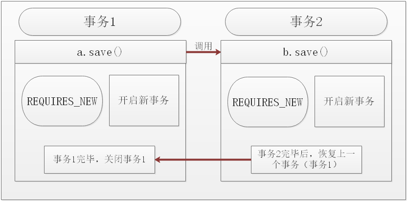
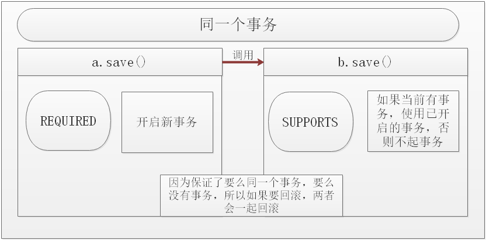

# 事务传播机制
* https://blog.csdn.net/trigl/article/details/50968079
* https://fgu123.github.io/2019/03/19/Spring-Transaction-Propagation/
* PROPAGATION_REQUIRED
    * Spring默认的传播机制，能满足绝大部分业务需求，如果外层有事务，则当前事务加入到外层事务，一块提交，一块回滚。如果外层没有事务，新建一个事务执行
    * 
* PROPAGATION_REQUES_NEW
    * 该事务传播机制是每次都会新开启一个事务，同时把外层事务挂起，当当前事务执行完毕，恢复上层事务的执行。如果外层没有事务，执行当前新开启的事务即可
    * 
* PROPAGATION_SUPPORT
    * 如果外层有事务，则加入外层事务，如果外层没有事务，则直接使用非事务方式执行。完全依赖外层的事务
    * 
* PROPAGATION_NOT_SUPPORT
    * 该传播机制不支持事务，如果外层存在事务则挂起，执行完当前代码，则恢复外层事务，无论是否异常都不会回滚当前的代码
* PROPAGATION_NEVER
    * 该传播机制不支持外层事务，即如果外层有事务就抛出异常
* PROPAGATION_MANDATORY
    * 与NEVER相反，如果外层没有事务，则抛出异常
* PROPAGATION_NESTED
    * 该传播机制的特点是可以保存状态保存点，当前事务回滚到某一个点，从而避免所有的嵌套事务都回滚，即各自回滚各自的，如果子事务没有把异常吃掉，基本还是会引起全部回滚的。
#事务隔离级别
* DEFAULT：默认级别，其中mysql默认隔离级别是REPEATABLE_READ
* READ_UNCOMMITTED 
* READ_COMMITTED 
* REPEATABLE_READ
* SERIALIZABLE
#事务失效
* 在默认设置下，事务只在出现运行时异常（runtime exception）时回滚，而在出现受检查异常（checked exception）时不回滚
    * error是一定会回滚的
*  如果异常被try｛｝catch｛｝了，事务就不回滚了，如果想让事务回滚必须再往外抛try｛｝catch｛throw Exception｝
*  在类A里面有方法a 和方法b， 然后方法b上面用 @Transactional加了方法级别的事务，在方法a里面 调用了方法b， 方法b里面的事务不会生效。原因是在同一个类之中，方法互相调用，切面无效 ，而不仅仅是事务。这里事务之所以无效，是因为spring的事务是通过aop实现的。  
