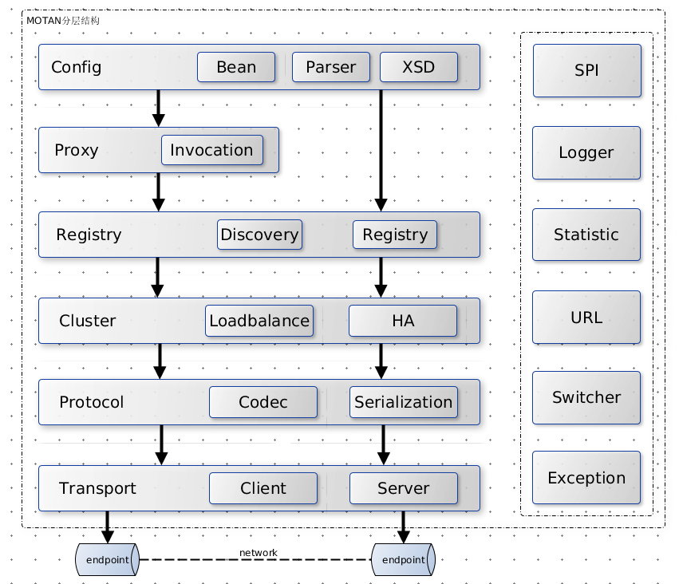

#什么是RPC
* RPC即远程过程调用，为了让你调用远程方法像调用本地方法一样简单。
#http与RPC的区别
* 纯裸 TCP 是能收发数据，但它是个无边界的数据流，上层需要定义消息格式用于定义 消息边界 。
    * 于是就有了HTTP 和各类 RPC 协议就是在 TCP 之上定义的应用层协议。
* RPC 本质上不算是协议，而是一种调用方式。而像 gRPC 和 Thrift 这样的具体实现，才是协议，它们是实现了 RPC 调用的协议。目的是希望程序员能像调用本地方法那样去调用远端的服务方法。
* 同时 RPC 有很多种实现方式，不一定非得基于 TCP 协议。
* 从发展历史来说，HTTP 主要用于 B/S 架构，而 RPC 更多用于 C/S 架构。但现在其实已经没分那么清了，B/S 和 C/S 在慢慢融合。 很多软件同时支持多端，所以对外一般用 HTTP 协议，而内部集群的微服务之间则采用 RPC 协议进行通讯。
* RPC 比目前主流的 HTTP1.1 性能要更好，所以大部分公司内部都还在使用 RPC。
    * RPC定制化程度更高，
    * 可以采用体积更小的 Protobuf 或其他序列化协议去保存结构体数据，同时也不需要像 HTTP 那样考虑各种浏览器行为
* HTTP2.0 在 HTTP1.1 的基础上做了优化，性能可能比很多 RPC 协议都要好，但由于是这几年才出来的，所以也不太可能取代掉 RPC。
#RPC框架
##dubbo
##spring-cloud
* spring cloud 中 feign 的远程调用 和rpc调用非常契合， 整体本质是微服务框架
#实现一个RPC
* 服务器.http://kriszhang.com/motan-rpc-impl/
##整体架构
* 
* 先来说公共组件部分：
````
SPI：Service Provider Interface，主要通过ExtensionLoader提供扩展点功能，用来动态装载接口具体实现，以提供客户端扩展能力。
Logger：使用slf4j，提供整个框架统一的日志记录工具。
Statistic：使用定时回调方式，收集和记录框架监控信息。
URL：非Jdk里的URL。他对协议，路径，参数的统一抽象，系统也是使用URL来保存和读取配置信息的。
Switcher：提供开关控制服务，能够控制框架关键路径的升级和降级。
Exception：统一异常处理，分为业务异常，框架异常，服务异常等。
````
* 再来说每一个层的作用：
````
Config层：主要提供了配置读取，解析，实体生成。同时他也是整个框架的入口，
Proxy层：服务端无proxy，客户端具有代理功能，他通过InvocationHandler来拦截方法调用。目前只使用了jdk原生动态代理工具。
Registry层：用来进行服务发现和注册，server端进行服务的注册，client进行服务发现。zk,consul，还有对directUrl（就是p2p，不借助中心）的特殊处理。
Cluster层：集群功能，他提供了集群的服务暴露、服务引用、负载均衡，HA等。
Protocol层：协议层，主要就是提供给下层协议编码和解析
Transport层：主要处理网络连接，他主要抽象了Client和Server接口。使用netty框架
````