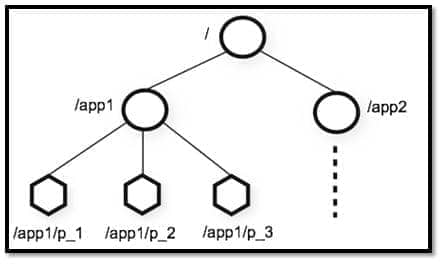

# 什么zookeeper
* ZooKeeper 是一个开源的分布式协调服务。ZooKeeper 为我们提供了高可用、高性能、稳定的分布式数据一致性解决方案
# 为什么要用zookeeper
* 解决分布式带来的一系列问题，比如各个分布式组件如何协调起来，如何减少各个系统之间的耦合度，分布式事务的处理，如何去配置整个分布式系统等等
* ZooKeeper 主要是用来协调服务的，而不是用来存储业务数据的，ZooKeeper 给出的上限是每个结点的数据最大不超过1M
#组件
##Data model（数据模型）
* 层次化的多叉树形结构，每个节点还可以拥有 N 个子节点，每个数据节点在 ZooKeeper 中被称为 znode
* 每个节点上都可以存储数据，据可以是数字、字符串或者是二级制序列
* 
##znode（数据节点）
* 它是 ZooKeeper 中数据的最小单元,每个节点最大1M
###类型
* 持久节点
* 临时节点
* 持久顺序节点
* 临时顺序节点
###数据结构
* stat（状态信息） ：
````
node 状态信息	解释
cZxid	create ZXID，即该数据节点被创建时的事务 id
ctime	create time，即该节点的创建时间
mZxid	modified ZXID，即该节点最终一次更新时的事务 id
mtime	modified time，即该节点最后一次的更新时间
pZxid	该节点的子节点列表最后一次修改时的事务 id，只有子节点列表变更才会更新 pZxid，子节点内容变更不会更新
cversion	子节点版本号，当前节点的子节点每次变化时值增加 1
dataVersion	数据节点内容版本号，节点创建时为 0，每更新一次节点内容(不管内容有无变化)该版本号的值增加 1
aclVersion	节点的 ACL 版本号，表示该节点 ACL 信息变更次数
ephemeralOwner	创建该临时节点的会话的 sessionId；如果当前节点为持久节点，则 ephemeralOwner=0
dataLength	数据节点内容长度
numChildren	当前节点的子节点个数
#3.3. 版本（version）
````
##ACL权限控制