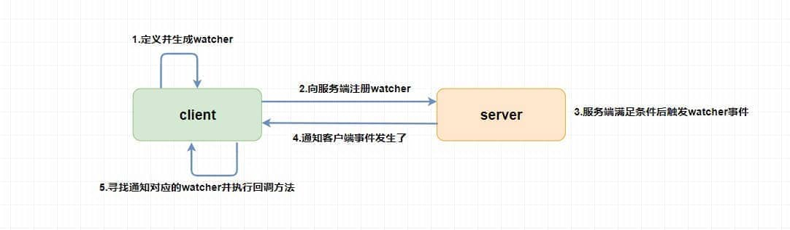
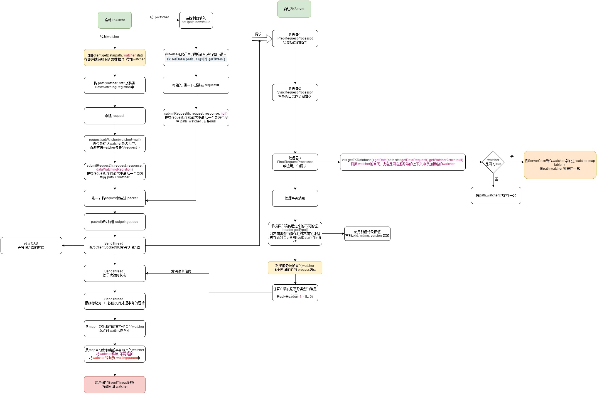
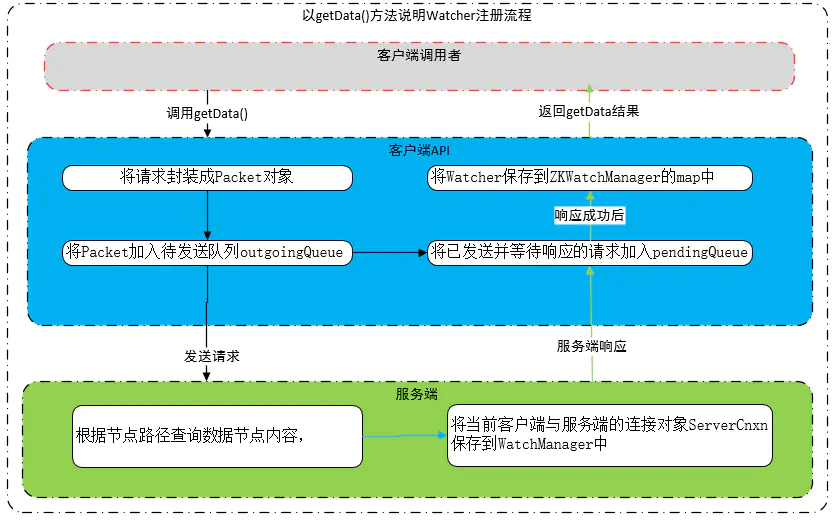
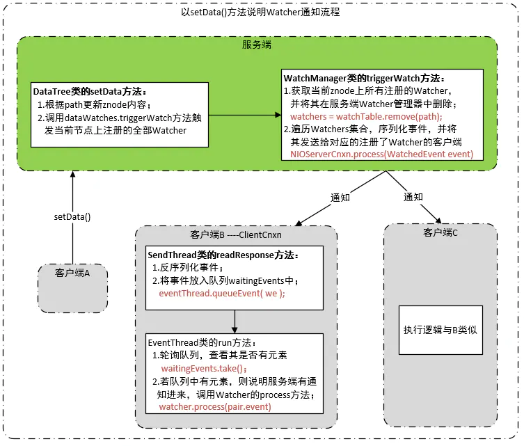

# 什么zookeeper
* https://blog.csdn.net/weixin_44096133/article/details/123695087
* ZooKeeper 是一个开源的分布式协调服务。ZooKeeper 为我们提供了高可用、高性能、稳定的分布式数据一致性解决方案
# 为什么要用zookeeper
* 解决分布式带来的一系列问题，比如各个分布式组件如何协调起来，如何减少各个系统之间的耦合度，分布式事务的处理，如何去配置整个分布式系统等等
* ZooKeeper 主要是用来协调服务的，而不是用来存储业务数据的，ZooKeeper 给出的上限是每个结点的数据最大不超过1M
#组件
##Data model（数据模型）
* 层次化的多叉树形结构，最外层我们可以想象成一个大的文件夹，里面都是一些小的文件夹
* 每个节点上都可以存储数据，据可以是数字、字符串或者是二级制序列
* 
##znode（数据节点）
* 它是 ZooKeeper 中数据的最小单元,每个节点最大1M
###类型
* 持久节点
* 临时节点
* 持久顺序节点
* 临时顺序节点
###数据结构
* stat（状态信息） ：
````
node 状态信息	解释
cZxid	create ZXID，即该数据节点被创建时的事务 id
ctime	create time，即该节点的创建时间
mZxid	modified ZXID，即该节点最终一次更新时的事务 id
mtime	modified time，即该节点最后一次的更新时间
pZxid	该节点的子节点列表最后一次修改时的事务 id，只有子节点列表变更才会更新 pZxid，子节点内容变更不会更新
cversion	子节点版本号，当前节点的子节点每次变化时值增加 1
dataVersion	数据节点内容版本号，节点创建时为 0，每更新一次节点内容(不管内容有无变化)该版本号的值增加 1
aclVersion	节点的 ACL 版本号，表示该节点 ACL 信息变更次数
ephemeralOwner	创建该临时节点的会话的 sessionId；如果当前节点为持久节点，则 ephemeralOwner=0
dataLength	数据节点内容长度
numChildren	当前节点的子节点个数
#3.3. 版本（version）
````
##ACL权限控制
* ACL权限针对节点的，权限不能被子节点继承，比如可以操作子节点但可能不能操作子节点
* ACL权限控制使用 schema：id：permission来标识
* schema：身份认证
    * world ： 默认方式，所有用户都可无条件访问。
        * world：anyone：rwdua
    * auth :不使用任何 id，代表任何已认证的用户。
        *  addauth digest username:password    #增加授权用户,明文用户名和密码
        *  auth：username：rwdua
    * digest :用户名:密码认证方式： username:password 。
        * digest：base64(SHA1(username:password.getByte*()))：rwdua
    * ip : 对指定 ip 进行限制
          * ip：127.0.0.1：rwdua
* id:向谁授权
* permission：什么权限
    * CREATE : 能创建子节点
    * READ ：能获取节点数据和列出其子节点
    * WRITE : 能设置/更新节点数据
    * DELETE : 能删除子节点
    * ADMIN : 能设置节点 ACL 的权限
    * 其中尤其需要注意的是，CREATE 和 DELETE 这两种权限都是针对 子节点 的权限控制。       
##Watcher（事件监听器）
* https://www.cnblogs.com/ZhuChangwu/p/11593642.html
* https://www.cnblogs.com/yewy/p/13111829.html#c__1043
* ZooKeeper 允许用户在指定节点上注册一些 Watcher，并且在一些特定事件触发的时候，ZooKeeper 服务端会将事件通知到感兴趣的客户端上去，该机制是 ZooKeeper 实现分布式协调服务的重要特性。   
*  
###特点
* 一次性：一旦触发就会移除
* 顺序回调：客户端watcher回调过程是串行同步过程
* 轻量：只通知时间不通知具体内容
###流程
* 
###原理
* 注册：
* 通知: 
#可靠性分析
##持久化
* ZK 会持久化到磁盘的文件有两种：log 和 snapshot
* log 负责记录每一个写请求
* snapshot 负责对当前整个内存数据进行快照
* 恢复数据的时候，会先读取最新的 snapshot 文件
* 然后在根据 snapshot 最大的 zxid 去搜索符合条件的 log 文件，再通过逐条读取写请求来恢复剩余的数据A

#可用性
##集群
###架构
* 
* leader提供写服务又能提供读服务。
* Follower提供读服务, Leader 的选举过程，参与写操作的“过半写成功”策略。
* observer 都只能提供读服务。
###选举流程
* ZooKeeper 选举的过半机制防止脑裂
* 使用 ZAB 协议作为其保证数据一致性的核心算法
###数据同步
####同步条件
* 事务性的会话请求会被同步，而像数据节点的查询等非事务性请求则不在数据同步的操作范围内
####同步类型
* DIFF，如果 Follower 的记录和 Leader 的记录相差的不多，使用增量同步的方式将一个一个写请求发送给 Follower
* TRUNC，这个情况的出现代表 Follower 的 zxid 是领先于当前的 Leader 的（可能是以前的 Leader），需要 Follower 自行把多余的部分给截断，降级到和 Leader 一致
* SNAP，如果 Follower 的记录和当前 Leader 相差太多，Leader 直接将自己的整个内存数据发送给 Follower
####ZAB数据一致性协议
* https://dbaplus.cn/news-141-1875-1.html
* 消息广播阶段
    * Leader 节点接受事务提交，并且将新的 Proposal 请求广播给 Follower 节点，收集各个节点的反馈，决定是否进行 Commit，在这个过程中，也会使用上一课时提到的 Quorum 选举机制。
    * 写Leader：
        ````
          客户端向Leader发起写请求
          Leader将写请求以Proposal的形式发给所有Follower并等待ACK
          Follower收到Leader的Proposal后返回ACK
          Leader得到过半数的ACK（Leader对自己默认有一个ACK）后向所有的Follower和Observer发送Commmit
          Leader将处理结果返回给客户端
        ````
    * 写Leader：
        ````
        Follower/Observer均可接受写请求，但不能直接处理，而需要将写请求转发给Leader处理
        除了多了一步请求转发，其它流程与直接写Leader无任何区别
    ```` 
* 崩溃恢复阶段
    * 如果在同步过程中出现 Leader 节点宕机，会进入崩溃恢复阶段，重新进行 Leader 选举，崩溃恢复阶段还包含数据同步操作，同步集群中最新的数据，保持集群的数据一致性。
###缺点
* zk不保证强一致性，follower数据可能为旧，强一致性的数据可以从leader那里拿 
#应用
* 命名服务：通过使用命名服务，客户端应用能够根据指定名字来获取资源或服务的地址，提供者等信息。通过创建全局唯一的path作为一个名字。
* 分布式锁：独占锁，获取数据之前要求所有的应用去zk集群的指定目录去创建一个临时非序列化的节点。谁创建成功谁就能获得锁，操作完成后断开节点。其它应用如果需要操作这个文件就可去监听这个目录是否存在。
* 控制时序：通过创建一个临时序列化节点来控制时序性。
* 心跳检测：让不同的进程都在ZK的一个指定节点下创建临时子节点，不同的进程直接可以根据这个临时子节点来判断对应的进程是否存活。大大减少了系统耦合。
* master选举：每个客户端请求创建同一个临时节点，那么最终一定只有一个客户端请求能够创建成功。利用这个特性，就能很容易地在分布式环境中进行 Master 选举了。成功创建该节点的客户端所在的机器就成为了Master。同时，其他没有成功创建该节点的客户端，都会在该节点上注册一个子节点变更的 Watcher，用于监控当前 Master 机器是否存活，一旦发现当前的Master挂了，那么其他客户端将会重新进行 Master 选举。 


