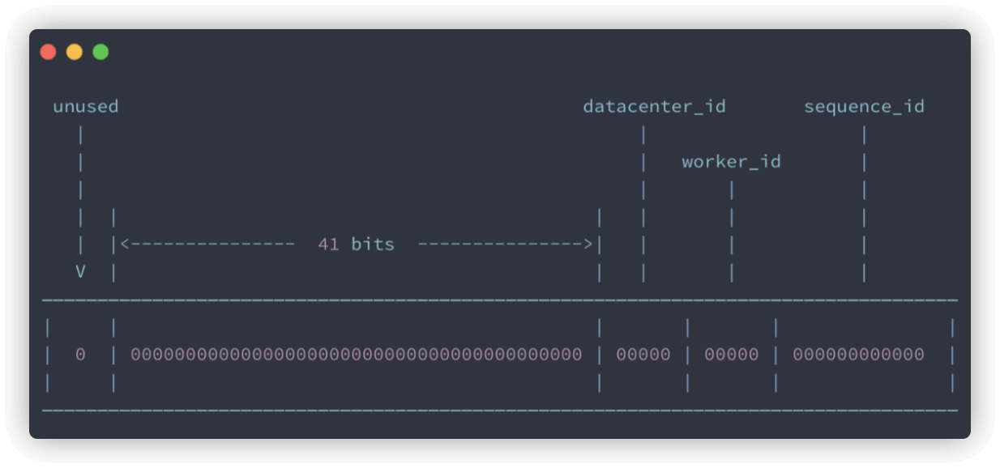

* https://javaguide.cn/distributed-system/distributed-id.html#%E6%95%B0%E6%8D%AE%E5%BA%93
#为什么要用分布式ID
* 在分库之后数据遍布在不同服务器上的数据库，数据库的自增主键已经没办法满足生成的主键唯一了，需要生成分布式 ID表示唯一主键
#分布式ID要求
* ID 中不包含敏感信息。
* 顺序递增
* 有具体的业务含义
* 独立部署
#不做分布式ID
* 分表ID自增+步长（+1....+32）
#数据库/redis自增
* 规模较小可以用
* 优点 ：实现起来比较简单、ID 有序递增、存储消耗空间小
* 缺点 ： 支持的并发量不大、存在数据库单点问题（可以使用数据库集群解决，不过增加了复杂度）、ID 没有具体业务含义、安全问题（比如根据订单 ID 的递增规律就能推算出每天的订单量，商业机密啊！ ）、每次获取 ID 都要访问一次数据库（增加了对数据库的压力，获取速度也慢
#数据库号段模式
* 我们可以批量获取，然后存在在内存里面，需要用到的时候，直接从内存里面拿就舒服了！这也就是我们说的 基于数据库的号段模式来生成分布式 ID，也是主流的获取方式之一。
* 优点 ：ID 有序递增、存储消耗空间小
* 缺点 ：存在数据库单点问题（可以使用数据库集群解决，不过增加了复杂度）、ID 没有具体业务含义、安全问题（比如根据订单 ID 的递增规律就能推算出每天的订单量，商业机密啊！ 
* 中间件：Tinyid
#Snowflake(雪花算法)
* https://www.cnblogs.com/fanshuyao/p/14777644.html
* Snowflake 是 Twitter 开源的分布式 ID 生成算法。
* 优点 ：生成速度比较快、生成的 ID 有序递增、比较灵活（可以对 Snowflake 算法进行简单的改造比如加入业务 ID）
* 缺点 ： 需要解决重复 ID 问题（依赖时间，当机器时间不对的情况下，可能导致会产生重复 ID）。
* 开源框架：UidGenerat：Leaf、 UidGenerator
* 