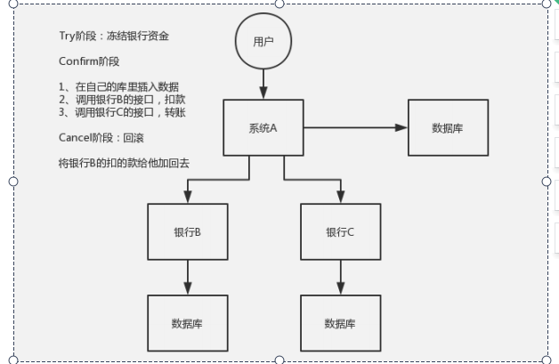

##参考文档
* jta 
    https://blog.51cto.com/u_14299052/3114583**** 
    https://cloud.tencent.com/developer/article/1032282
* Seata
    * 服务器.http://blog.itpub.net/69926045/viewspace-2673611/
    * https://mp.weixin.qq.com/s?__biz=MzUzNzYxNjAzMg==&mid=2247498350&idx=1&sn=8fd6a7a0c306c566c790f9851310d7df&chksm=fae6f1a1cd9178b74be60eb4ecb1d0d56801129296a183a9be6bd6990bfebff3c19363d65165&scene=132#wechat_redirect
    * https://www.cnblogs.com/zpKang/p/14197727.html
 * ShardingSphere
* 分布式ID
    * https://segmentfault.com/a/1190000022717820
## 分布式事务为了解决什么问题
* 分布式环境 是为了解决分布式系统下数据库一致性问题的
* 现在有A，B，C 3个服务，其中A开启本地事务更新数据库，通过rpc接口调用B，C服务更新数据库，
* 对于数据库来讲A，B，C各开启了一个会话，出错只能各自回滚事务
* 对于业务来讲，A，B，C服务要么都成功，要么都失败，此时便出现了分布式事务的问题
## 分布式事务相关概念
* 本地事务：当事务由资源管理器本地管理时被称作本地事务
* 全局事务：一批本地事务组成的整体，统一驱动全局提交或回滚
* 全局事务协调器（简称TC）
* DTP 模型
    * 应用程序(Application Program ，简称AP)：用于定义事务边界(即定义事务的开始和结束)，并且在事务边界内对资源进行操作，可以简单理解为我们的应用程序。
    * 资源管理器(Resource Manager，简称RM)：如数据库、文件系统等，并提供访问资源的方式。
    * 事务管理器(Transaction Manager ，简称TM)：负责分配事务唯一标识，监控事务的执行进度，并负责事务的提交、回滚等。
    * 通信资源管理器(Communication Resource Manager，简称CRM)：控制一个TM域(TM domain)内或者跨TM域的分布式应用之间的通信。
    * 通信协议(Communication Protocol，简称CP)：提供CRM提供的分布式应用节点之间的底层通信服务
    * TX协议：AP与TM的接口
    * XA协议
        * TM与RM的接口。全局事务管理器一般使用XA二阶段协议与数据库进行交互。
        * MySQL 从5.0.3开始支持XA分布式事务，且只有InnoDB存储引擎支持                                             
* BASE理论
    * BA指的是基本业务可用性，支持分区失败，
    * S表示柔性状态，也就是允许短时间内不同步，
    * E表示最终一致性，数据最终是一致的，但是实时是不一致的。
    * 原子性和持久性必须从根本上保障，为了可用性、性能和服务降级的需要，只有降低一致性和隔离性的要求。
* CAP定理
    * 最多只能同时拥有CAP其中的两个
    * C表示一致性，也就是所有用户看到的数据是一样的。
    * A表示可用性，是指总能找到一个可用的数据副本。
    * P表示分区容错性，能够容忍网络中断等故障。
# 分布式事务设计方案
##两阶段提交协议
* 转载：https://www.imooc.com/article/303856/
* XA用于在全局事务中协调多个资源的机制。TM和RM之间采取两阶段提交的方案来解决一致性问题。
###流程
* 通过 Start 启动一个 XA 事务，并且被置为 Active 状态，
* 处在 active 状态的事务可以执行 SQL 语句，
* 通过 END 方法将 XA 事务置为 IDLE 状态。
* 处于 IDLE 状态可以执行 PREPARE 操作或者 COMMIT…ONE PHASE 操作，也就是二阶段提交中的第一阶段PREPARED 状态
* PREPARED 状态的 XA事务的时候就可以 Commit 或者 RollBack，也就是二阶段提交的第二阶段。
###特点
* 比较适合单应用跨多个库的分布式事务，不支持跨服务，
* 为严重依赖于数据库层面来搞定复杂的事务，效率很低，不适合高并发的场景
* 不适合微服务约定，微服务不允许访问其他模块的数据库
###中间件
* https://xie.infoq.cn/article/bb452190e896053c735fd7126
* atomiko

##三阶段提交
* 引入超时机制。同时在协调者和参与者中都引入超时机制。
* 在第一阶段和第二阶段中插入一个准备阶段。保证了在最后提交阶段之前各参与节点的状态是一致的。
* 3PC把2PC的准备阶段再次一分为二，这样三阶段提交就有CanCommit、PreCommit、DoCommit三个阶段
##TCC事务模式
* 转载：https://www.cnblogs.com/duanxz/p/5226316.html
###流程
* https://cloud.tencent.com/developer/article/1547147
* 
* 1.Try：
  - 尝试执行业务。
  - 完成所有业务检查(一致性)
  - 预留必须业务资源(准隔离性)
* 2、Confirm：确认执行业务。 
  - 真正执行业务
  - 不做任何业务检查
  - 只使用Try阶段预留的业务资源
* 3、Cancel：取消执行业务
  - 释放Try阶段预留的业务资源
###特点
* 严重依赖业务层代码，维护复杂
* 可以保证强一致性
###Hmily框架
* https://cloud.tencent.com/developer/article/1547147
##消息一致性分布式事务
* A 系统先发送一个 prepared 消息到 MQ，如果这个 prepared 消息发送失败那么就直接取消操作别执行了；
* 如果这个消息发送成功过了，那么接着执行本地事务，如果成功就告诉 MQ 发送确认消息，如果失败就告诉 MQ 回滚消息；
* 如果发送了确认消息，那么此时 B 系统会接收到确认消息，然后执行本地的事务；
* mq 会自动定时轮询所有 prepared 消息回调你的接口，问你，这个消息是不是本地事务处理失败了，所有没发送确认的消息，是继续重试还是回滚？一般来说这里你就可以查下数据库看之前本地事务是否执行，如果回滚了，那么这里也回滚吧。这个就是避免可能本地事务执行成功了，而确认消息却发送失败了。
* 这个方案里，要是系统 B 的事务失败了咋办？重试咯，自动不断重试直到成功，如果实在是不行，要么就是针对重要的资金类业务进行回滚，比如 B 系统本地回滚后，想办法通知系统 A 也回滚；或者是发送报警由人工来手工回滚和补偿。
###缺点
* 只有rocketmq支持
###替代方式
* 将消息发送到mysql中，定时任务
##AT模式
* https://www.cnblogs.com/zpKang/p/14197704.html
* AT 模式就是自动补偿式事务
* 第一阶段： 执行各分支事务
    * TC生成全局事务xid，各个事务分支共享
    * 解析sql并查询得到前镜像保存在undo日志，为了回滚事务
    * 执行业务 sql。
    * 查询执行后的数据作为后镜像保存在undo日志  
* 第二阶段： 控制全局事务最终提交或回滚
    * 根据undo日志回滚或删除事务表
##优点
* 无侵入：TC单独服务器
* 非阻塞：事务都是本地提交，后续根据TM再回滚    
###缺点
* rollback中脏回滚难以避免,必须要人工介入处理，无法保证数据一致性
````
全局事务g1对数据行A1进行修改 v1 -> v2
另一个服务将对数据行A1进行修改 v2 -> v3
全局事务g1回滚，发现数据行A1的当前数据为v3，不等于AfterImage中的v2，回滚失败
````
* 需要把所有对这个表的写访问，都加上特殊处理（在Seata的Java客户端中，需要加上GlobalLock注解）。这种约束对于一个上了一定规模的复杂系统，是非常难以保证的。


     

