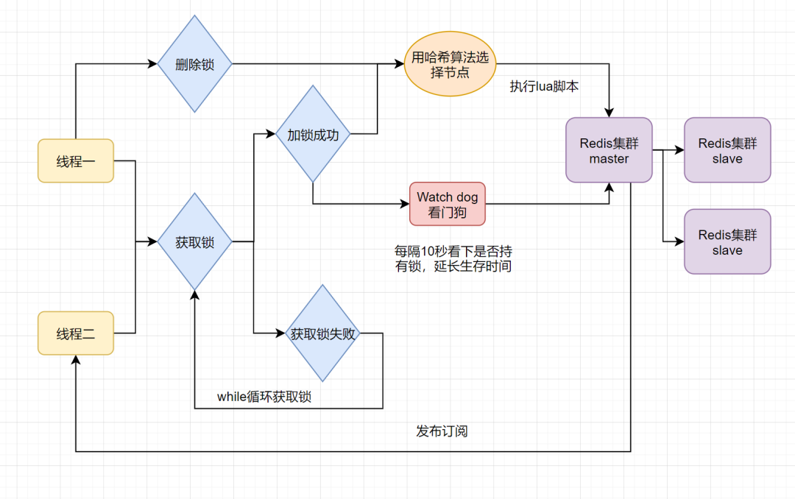

# 什么是分布式锁
* 分布式锁其实就是，控制分布式系统不同进程共同访问共享资源的一种锁的实现，保证一致性。
#redis分布式锁
##随机值+nx
* 加锁：set(key_resource_id, uni_request_id, "NX", "EX", 100s)
* 解锁（保证原子性）：if redis.call('get',KEYS[1]) == ARGV[1] then 
              return redis.call('del',KEYS[1]) 
           else
              return 0
           end;）
* 问题1：单机情况下，master节点故障导致slave还未同步分布式锁数据，导致分布式锁失效
* 问题2：业务未执行完锁已经失效
##Redisson框架    
* 
* 只要线程加锁成功，就会启动一个watch dog看门狗，它是一个后台线程，会每隔10秒检查一下，如果线程1还持有锁，那么就会不断的延长锁key的生存时间。因此，Redisson就是使用Redisson解决了「锁过期释放，业务没执行完」问题
* 加锁/解锁：Redisson集成springboot
* 缺点：问题1未解决
##多机实现的分布式锁Redlock+Redisson
* https://blog.csdn.net/qq_33620771/article/details/106836099
* 什么是红锁？，就是采用多个个独立的redis节点，同时setnx，如果多数节点成功，就拿到了锁，这样就可以允许少数节点挂掉了。整个取锁、释放锁的操作和单节点类似
* 流程：
    * 按顺序向5个master节点请求加锁
    * 根据设置的超时时间来判断，是不是要跳过该master节点。
    * 如果大于等于3个节点加锁成功，并且使用的时间小于锁的有效期，即可认定加锁成功啦。
    * 如果获取锁失败，解锁！