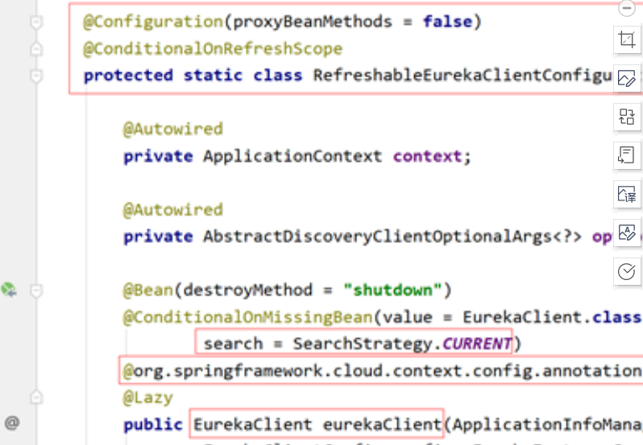
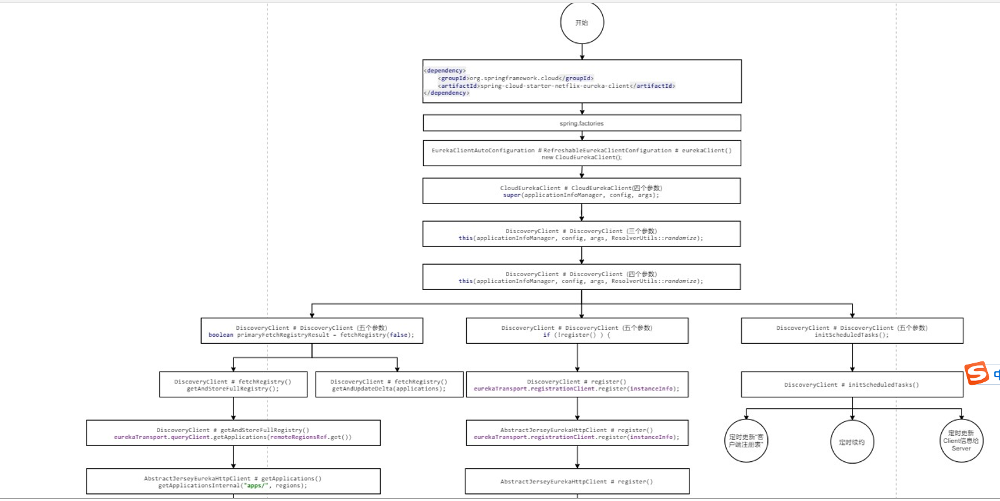
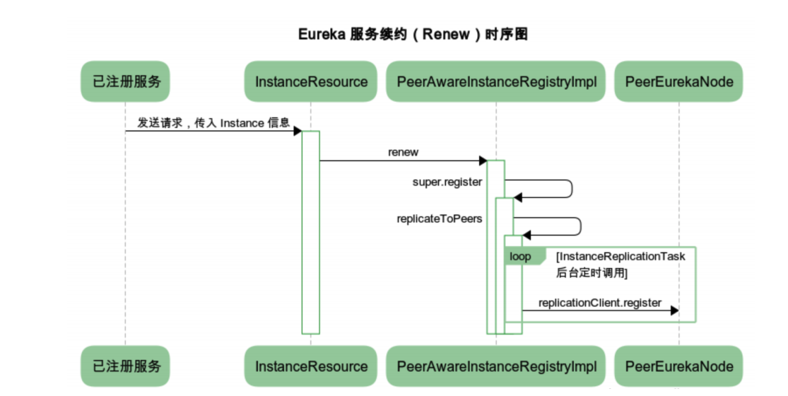

#服务发现
##client
###概念
* InstanceInfo ：一个该类实例就代表了一个微服务主机。该主机注册到Eureka Server就是将其InstanceInfo写入到了Eureka注册表
* Application：存着当前name所指定的微服务名称的所有InstanceInfo
* Applications：该类封装了来自于EurekaServer的所有注册信息。我们可以称其为“客户端注册表”。
````
key为微服务名称，value为Application
Map<String,Application> appNameApplicationMap;
````
* Jersey框架:restfull框架，和mvc类似单更轻量。EurekaClient与EurekaServer的通信，及EurekaServer间的通信均采用的是Jersey框架。
###配置类
* EurekaClientAutoConguration：添加client需要的bean 到spring容器
* EurekaClientCongBean及EurekaInstanceCongBean：yml属性配置类
###EurekaClien类
* 
* 增加@refreshScope注解，创建的EurekaClient本身可以实现动态更新，即配置文件中相关的配置信息发生了变更EurekaClient也更新。
###流程
* 
* 通过Jersey框架交流信息。
* 服务注册：
    * 在应用启动时就可以直接进行register()，不过，需要提前在配置文件中配置
    * 在renew时，如果server端返回的是NOT_FOUND，则提交register()
    * 当Client的配置信息发生了变更，则Client提交register()
* 服务续约：定时任务更新
* server信息更新：定时任务更新
* 更新Applications：定时任务
##EurekaServer
###注册/更新流程
* 
* 注册/更新，异步同步数据。
###下线流程
* 服务剔除是注册中心 Eureka Server 在启动时就启动一个守护线程 evictionTimer 来定期默认为 60 秒）执行检测服务的，判断标准就是超过一定时间没有进行 Renew 的服务，默
  认的失效时间是 90 秒。
  
#网关gateway  
##概念