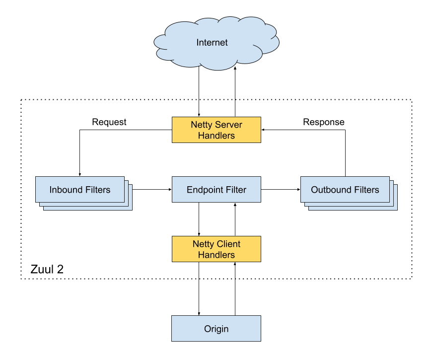

#什么是网关
* 微服务背景下，一个系统被拆分为多个服务，但是像安全认证，流量控制，日志，监控等功能是每个服务都需要的，
* 使用网关来统一管理这些功能
* 网关本质就是过滤器

#Spring Cloud Gateway
* SpringCloud Gateway 属于 Spring Cloud 生态系统中的API网关。
* 为了提升网关的性能，SpringCloud Gateway 基于 Spring WebFlux 。Spring WebFlux 使用 Reactor 库来实现响应式编程模型，底层基于 Netty 实现异步 IO。
* Spring Cloud Gateway 的目标，不仅提供统一的路由方式，并且基于 Filter 链的方式提供了网关基本的功能，例如：安全，监控/指标，和限流。
* 
#Kong 
* 是一款基于 OpenResty 的高性能、云原生、可扩展的网关系统。
* OpenResty 是一个基于 Nginx 与 Lua 的高性能 Web 平台，其内部集成了大量精良的 Lua 库、第三方模块以及大多数的依赖项。用于方便地搭建能够处理超高并发、扩展性极高的动态 Web 应用、Web 服务和动态网关。
* Kong 提供了插件机制来扩展其功能。比如、在服务上启用 Zipkin 插件
#APISIX
* APISIX 是一款基于 Nginx 和 etcd 的高性能、云原生、可扩展的网关系统。
* etcd是使用 Go 语言开发的一个开源的、高可用的分布式 key-value 存储系统，使用 Raft 协议做分布式共识。
* 与传统 API 网关相比，APISIX 具有动态路由和插件热加载，特别适合微服务系统下的 API 管理。并且，APISIX 与 SkyWalking（分布式链路追踪系统）、Zipkin（分布式链路追踪系统）、Prometheus（监控系统） 等 DevOps 生态工具对接都十分方便。
* 目前已经有很多知名企业（比如金山、有赞、爱奇艺、腾讯、贝壳）使用 APISIX 处理核心的业务流量。
* * 