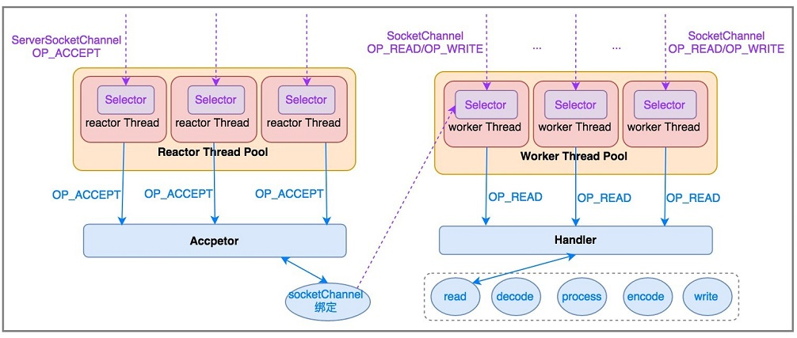

#模型
* 
* boss接受accept状态的连接（完成3次握手）
* accpter将boss获取的连接（socketChannel）绑定到workgroup线程池中其中一个线程（eventLoop）
* eventLoop完成剩余读写请求
* eventLoop内部通过责任链模式（pineple）完成消息各类处理（handler）
#源码
* bossgroup默认线程为1
* workGroup线程为cpu*2