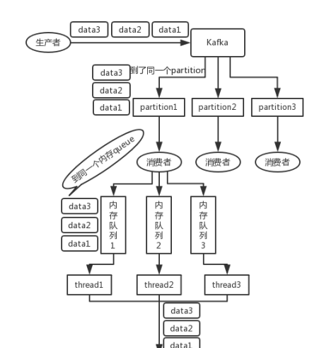

#kafka
#简介
````
Kafka是一种分布式的，基于发布/订阅的消息系统。
主要特点： 
1.以时间复杂度为O(1)的方式提供消息持久化能力，并保证即使对TB级以上数 据也能保证常数时间的访问性能
2.高吞吐率。即使在非常廉价的商用机器上也能做到单机支持每秒100K条消息 的传输  
3.支持Kafka Server间的消息分区，及分布式消息消费，同时保证每个partition 内的消息顺序传输  
4.同时支持离线数据处理和实时数据处理  
5.高并发：支持数千个客户端同时读写
````
#组件
* 由多个 broker 组成，每个 broker 是一个节点；topic 可以划分为多个 partition，每个 partition 可以存在于不同的 broker 上，每个partition 就放一部分数据。
* 一个 topic 的数据，是分散放在多个机器上的，每个 机器就放一部分数据。
* Producers
    * Producers直接发送消息到broker
    * 通过指定Topic，key或partition 机制来判断将这条消息发送到哪个parition
    * Topic在逻辑上可以被认为是一个在的queue，每条消费都必须指定它的topic。
    * 在物理上把topic分成一个或多个partition，每个partition在物理上对应一 个文件夹，该文件夹下存储这个partition的所有消息和索引文件。
    * 每个partition 在物理上分为不同segment(段)，每个segment由索引文件和数据文件组成。
    * 消息是顺序添加到partition 并且 发送完消息不会删除，记录偏移量指针表名发到第几个消息
* broker
    * 服务器节点
    * 选举策略
* consumer-group
    * partition中的每个message只能被组（Consumer group ） 中的一个consumer（consumer 线程 ）消费，
    * 如果一个message可以被多个consumer（consumer 线程 ） 消费的话，那么这些consumer必须在不同的组。
    * kafka会保证一个paritition 只能被一个消费者进行消费。所以建议在配置的时候分区数量和消费者数量相等最好。
    * 默认情况下，Kafka 会自动提交 Offset，Kafka 认为 Consumer 已经处理消息了，但是 Consumer 可能在处理消息的过程中挂掉了。重启系统后，Consumer 会根据提交的 Offset 进行消费，也就丢失了一部分数据。  
````
       broker-0                       produce
            ↖                        ↓topic= topic0 key =n 
            ----------------      -----------------        ------------------
          | topic0-0         |   |  topic0-1        |    |  topic0-2         |
          |topic0-3-follower |   |topic0-0-follower |    |  topic0-1-follower|
         ↙ --------------        ----------------          -----------------
     partion-0                         ↑
                              ----------------
                             |consumer-group-0|  .......   
                              ---------------- 
   
   ==================================================================
                           paritition
                              ↖ 
                                  ------------------  
                                 |    ---     ---     |
                                 |   |   |   |   |    |
                                 |    ---     ---     |
                                 |    ↓              |
                                 |    segment(段)     |    
                                  -------------------

````
#Producers消息发送流程
   * 参考：https://blog.csdn.net/qq_32727095/article/details/108032582?utm_medium=distribute.pc_aggpage_search_result.none-task-blog-2~aggregatepage~first_rank_v2~rank_aggregation-2-108032582.pc_agg_rank_aggregation&utm_term=kafka%20%E5%90%8C%E6%AD%A5%E6%8F%90%E4%BA%A4%20%E5%BC%82%E6%AD%A5%E6%8F%90%E4%BA%A4%20%E6%89%8B%E5%8A%A8&spm=1000.2123.3001.4430
   * 相关参数
   ````
   atch.size：只有数据积累到batch.size之后，sender才会发送数据。
   linger.ms：如果数据迟迟未达到batch.size，sender等待linger.time之后就会发送数据。
   acks:发送成功标志
   ````
   * 流程：
        * Kafka的Producer发送消息采用的是异步发送的方式。在消息发送的过程中，涉及到了两个线程main线程和Sender线程，以及一个线程共享变量RecordAccumulator。
        * main线程将消息发送给RecordAccumulator
        * Sender线程不断从RecordAccumulator中拉取消息发送到Kafka broker
   * 同步发送
        * 同步发送的意思就是，一条消息发送之后，会阻塞当前线程，直至返回ack。
        * 由于send方法返回的是一个Future对象，根据Futrue对象的特点，也可以实现同步发送的效果，只需在调用Future对象的get方发即可。
   * 异步发送
        * 异步发送的意思就是，批量发送消息，等到的发送时间再发送。
   * 发送成功的判断
        ````
        1. acks=0 意味着produce能把消息发送出去，已经发送成功写入Kafka, 一定会丢失一些数据
        2. acks=1 意味着leade在收到消息并把它写到分区数据问津是会返回确认或者错误响应，还是可能会丢数据
        3. acks=all 意味着会等待leader和所有同步follower都收到消息返回成功                
       ````
#高可用
* topic 的数据，是分散放在多个机器上的，每个机器就放一部分数据 
* replica（复制品） 副本机制：每个 partition 的数据都会同步到其它机器上形成自己的多个 replica 副本，只有leader可以读写
* 如果这个宕机的 broker 上面有某个 partition 的 leader，那么此时会从 follower 中重新选举一个新的 leader 出来，大家继续读写那个新的 leader 即可。这
  就有所谓的高可用性了
#可靠性
##消息一致性
* Producer 丢失数据
    * 如果 Producer 端设置了 acks=all，leader 在所有的 Follower 都同步到了消息之后，才认为本次写成功则不会丢失数据。                  ````   
* Kafka 丢失数据
    * 比较常见的一个场景：Kafka 某个 Broker 宕机，然后重新选举新的 Leader ，但此时其他的 Follower 部分数据尚未同步，结果此时 Leader 挂了，然后选举某个 Follower 成 Leader ,丢失一部分数据。   
    ````
    所以此时一般设置如下 4 个参数：
    Topic 设置 replication.factor 参数：参数值必须大于 1，要去每个 Partition 必须有至少 2 个副本。
    Kafka 服务端设置 min.insync.replicas 参数：数值必须大于 1，要去每个 Partiton 必须有至少 2 个副本。
    Producer 设置 acks=all：要求每条数据，必须是写入所有副本，才认为写成功。  
    Producer 端设置 retries=MAX：MAX 即是一个超级大的数字，表示无限次重试。retries=MAX要求一旦写入数据失败，就无限重试。
    ````  
* 消费端丢失数据
    * 默认情况下，Kafka 会自动提交 Offset，Kafka 认为 Consumer 已经处理消息了，但是 Consumer 可能在处理消息的过程中挂掉了。重启系统后，Consumer 会根据提交的 Offset 进行消费，也就丢失了一部分数据。
    * 关闭自动提交 Offset，在处理业务完成之后自己手动提交 Offset，就可以保证数据不会丢失。但可能会存在消息重复消费问题
        * 消费者自动提交offset
        ````
        enable.auto.commit：是否开启自动提交 offset 功能
        auto.commit.interval.ms：自动提交 offset 的时间间隔
        auto.offset.rest = earliest | latest | none | 重置offset
        ````
        * 消费者手动提交offset
            * 手动提交offset的方法有两种：分别是commitSync（同步提交）和commitAsync（异步提交）
                * 相同点：都会将本次poll的一批数据最高的偏移量提交；
                * 不同点：commitSync阻塞当前线程，一直到提交成功，并且会自动失败重试（由不可控因素导致，也会出现提交失败）；而commitAsync则没有失败重试机制，故有可能提交失败
                * 虽然同步提交offset更可靠一些，但是由于其会阻塞当前线程，直到提交成功。因此吞吐量会收到很大的影响。因此更多的情况下，会选用异步提交offset的方式       
                 ````
                 先提交offset，后消费，有可能造成数据的漏消费；
                 先消费，后提交offset，有可能会造成数据的重复消费  
                 `````
##消息幂等
* Producer 到broker 消息发送一次
    * 消息队列资金保证
* consumer 消费一次
    * 利用数据库的唯一约束实现幂等不光是可以使用关系型数据库，只要是支持类似“INSERT IF NOT EXIST”语义的存储类系统都可以用于实现幂等，比如Redis 的 SETNX 命令来替代数据库中的唯一约束，来实现幂等消费。
    * 为更新的数据设置前置条件：如给你的数据增加一个版本号属性，每次更数据前，比较当前数据库的版本号是否和消息中的版本号一致，如果不一致就拒绝更新数据，更新数据的同时将版本号 +1，一样可以实现幂等更新
    * 记录并检查操作：在执行数据更新操作之前，先检查一下是否执行过这个更新操作
##消息顺序 
* kafka只能支持单消费者单线程顺序顺序消费
* Producer发送消息顺序性
    * 设置max.in.flight.requests.per.connection =1,把它设为 1 可以保证消息是按照发送的顺序写入服务器的，即使发生了重试
    ````
     该参数指定了Producer在收到服务器响应之前可以发送多少个消息。它的值越高，就会占用越多的内存，不过也会提升吞吐量。。   
    ```` 
    * 设置max.in.flight.requests.per.connection >1 且 设置enable.idempotence=true，开启Producer的幂等生产
    * 指定partition.class，将需要保证顺序性的消息发送到同一个partition里面，Kafka保证同一个partition内消息是有序的
* consumer消费保证顺序性
   * 写 N 个内存 queue，具有相同 key 的数据都到同一个内存 queue；然后对于 N 个线程，每个线程分别消费一个内存 queue 即可，这样就能保证顺序性。
*   
#消息积压处理
* 先修复 consumer 的问题，确保其恢复消费速度，然后将现有 consumer 都停掉。
* 新建一个 topic，partition 是原来的 10 倍，临时建立好原先 10 倍的 queue 数量。
* 写一个临时的分发数据的 consumer 程序，这个程序部署上去消费积压的数据，消费之 后不做耗时的处理，直接均匀轮询写入临时建立好的 10 倍数量的 queue。
* 临时征用 10 倍的机器来部署 consumer，每一批 consumer 消费一个临时 queue 的数据。
* 相当于是临时将 queue 资源和 consumer 资源扩大 10 倍，以正常的 10 倍速度来消费数据。
* 等快速消费完积压数据之后，得恢复原先部署的架构，重新用原先的 consumer 机器来消费消息。  
#mq都写满了
* 消息积压处理处理太慢，只能临时程序消费一个丢弃一个，后期补数据。
#kafka topic创建最好由kafka服务器创建
   