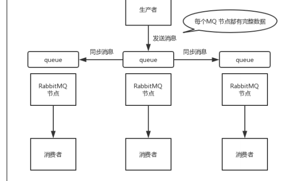

#参考文档
* https://zhuanlan.zhihu.com/p/48779080
#组件
* 
##producer： 
* producer 是一个发送消息的应用
##exchange：
* producer 并不会直接将消息发送到 queue 上，而是将消息发送给 exchange，由 exchange 按照一定规则转发给指定queue
* Fanout Exchange：忽略key对比，发送Message到Exchange下游绑定的所有Queue
* Direct Exchange：比较Message的routing key和Queue的binding key，完全匹配时，Message才会发送到该Queue
* Topic Exchange：比较Message的routing key和Queue的binding key，按规则匹配成功时，Message才会发送到该Queue
* 默认Exchange：比较Message的routing key和Queue的名字，完全匹配时，Message才会发送到该Queue
##queue： 
* queue 用来存储 producer 发送的消息
## consumer： 
* consumer是接收并处理消息的应用
##Producers消息发送流程
   * 参考：https://blog.csdn.net/qq_32727095/article/details/108032582?utm_medium=distribute.pc_aggpage_search_result.none-task-blog-2~aggregatepage~first_rank_v2~rank_aggregation-2-108032582.pc_agg_rank_aggregation&utm_term=kafka%20%E5%90%8C%E6%AD%A5%E6%8F%90%E4%BA%A4%20%E5%BC%82%E6%AD%A5%E6%8F%90%E4%BA%A4%20%E6%89%8B%E5%8A%A8&spm=1000.2123.3001.4430
   * 流程：
       * 多个Queue的场景中，消息会被Exchange按一定的路由规则分发到指定的Queue中去：
       * 生产者指定Message的routing key，并指定Message发送到哪个Exchange
       * Queue会通过binding key绑定到指定的Exchange
       * Exchange根据对比Message的routing key和Queue的binding key，然后按一定的分发路由规则，决定Message发送到哪个Queue
#高可用性
##镜像集群模式（高可用性）
* 每个 RabbitMQ 节点都有这个 queue 的一个完整镜像，包含 queue 的全部数据的意思。然后每
  次你写消息到 queue 的时候，都会自动把消息同步到多个实例的 queue 上。
* 
##解决的问题
* 任何一个机器宕机了，其它机器（节点）还包含了这个queue 的完整数据，别的 consumer 都可以到其它节点上去消费数据。
##产生问题
* 消息需要同步到所有机器上，导致网络带宽压力和消耗很重
* 不是分布式的，没有扩展性可言了，没有办法线性扩展你的 queue
#可靠性
##消息一致性
* 发送消息可靠性
    * confirm确认机制。当消息达到指定的队列后，mq将会主动回传一个ack，代表消息入队成功。
    * 每次写的消息都会分配一个唯一的 id，写入了 RabbitMQ 中，RabbitMQ 会给你回传一个 ack 消息，告诉你说这个消息 ok 了。
    * 如果RabbitMQ 没能处理这个消息，会回调你的一个 nack 接口，告诉你这个消息接收失败。
    * 可以结合这个机制自己在内存里维护每个消息 id 的状态，如果超过一定时间还没接收到这个消息的回调，那么你可以重发
* mq存储消息可靠性
    * 开启mq的持久化
    * 创建 queue 的时候将其设置为持久化
    * 发送消息的时候将消息的 deliveryMode 设置为 2
    * 和confirm结合，只有消息持久化磁盘才可以发送ack。（配置？）
*     
* 消费消息可靠性
    * 消费消息手动ack机制。
##幂等消息
* 略    
##顺序消息
* 顺序会错乱的场景：RabbitMQ：一个 queue，多个 consumer，这不明显乱了；
* 解决：   