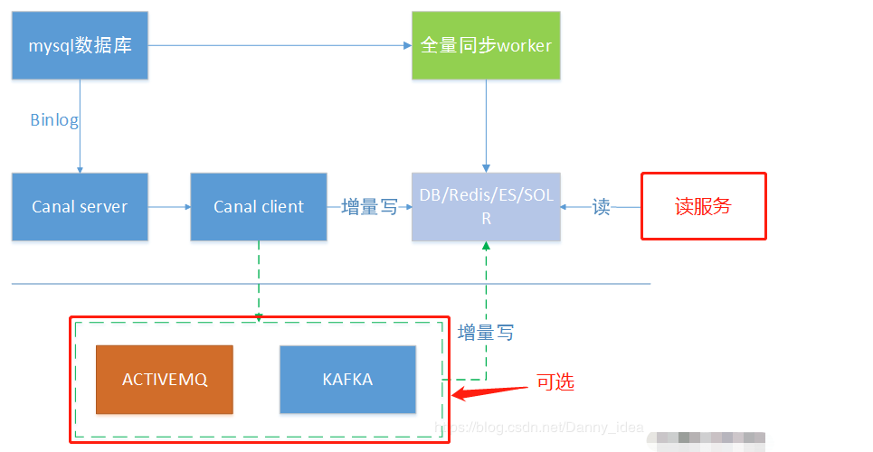

#为什么使用canal
* 数据库镜像
* 数据库实时备份
* 索引构建和实时维护
* 业务cache(缓存)刷新
* 带业务逻辑的增量数据处理
#介绍
* 是基于 MySQL 数据库增量日志解析，提供增量数据订阅和消费，可以理解为一个用来同步增量数据的一个工具。
#流程
* canal的工作原理就是把自己伪装成MySQL slave，模拟MySQL slave的交互协议向MySQL Mater发送 dump协议，MySQL mater收到canal发送过来的dump请求，开始推送binary log给canal，然后canal解析binary log，再发送到存储目的地，比如MySQL，Kafka，Elastic Search等等。
#应用场景
* https://www.cnblogs.com/caoweixiong/p/11824423.html
##同步缓存redis/全文搜索ES
* 
#使用
##服务端

##客户端
````
canal:
  destination: heima # canal的集群名字，要与安装canal时设置的名称一致
  server: 127.0.0.1:11111 # canal服务地址
````
````
@CanalTable("tb_item")
@Component
public class ItemHandler implements EntryHandler<Order>, InitializingBean {

    @Autowired
    private IRedisService redisService;
  
    private Cache<Long, Order> itemCache;
    @Override
    public void afterPropertiesSet() throws Exception {
        itemCache = Caffeine.newBuilder()
                .initialCapacity(100)
                .maximumSize(10_000)
                .build();
    }
    @Override
    public void insert(Order item) {
        // 写数据到JVM进程缓存
        itemCache.put(item.getId(), item);
        // 写数据到redis
        redisService.set(item.getId() + "", JsonUtils.toJson(item));
    }

    @Override
    public void update(Order before, Order after) {
        // 写数据到JVM进程缓存
        itemCache.put(after.getId(), after);
        // 写数据到redis
        redisService.set(after.getId() + "", JsonUtils.toJson(after));
    }

    @Override
    public void delete(Order item) {
        // 删除数据到JVM进程缓存
        itemCache.invalidate(item.getId());
        // 删除数据到redis
        redisService.del(item.getId() + "");
    }
}
````