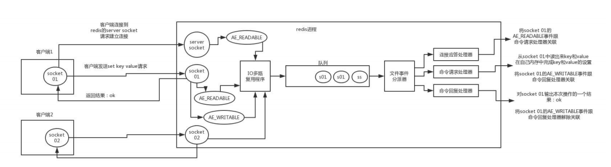
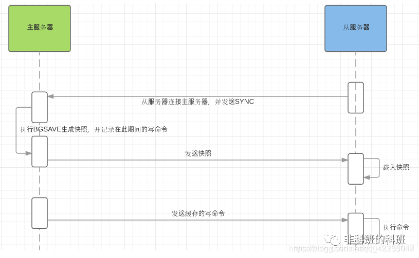
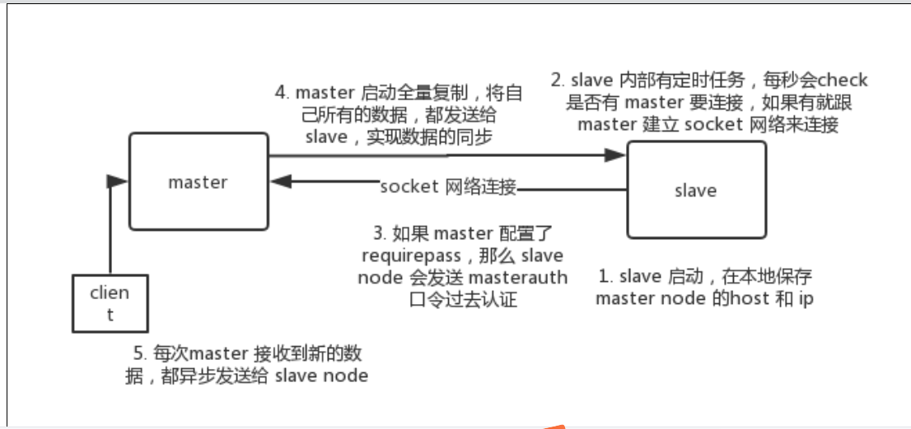
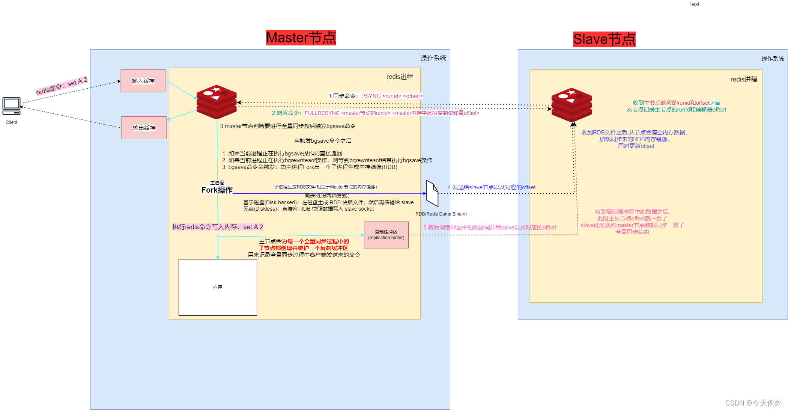
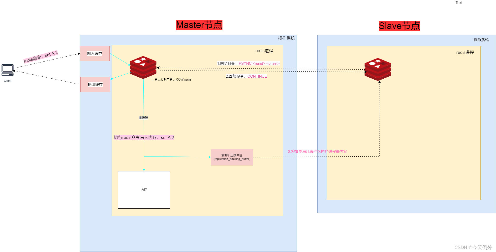
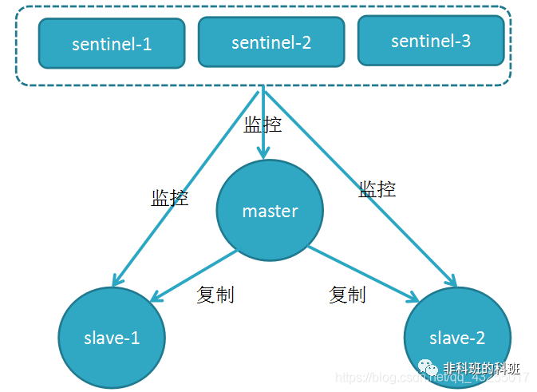
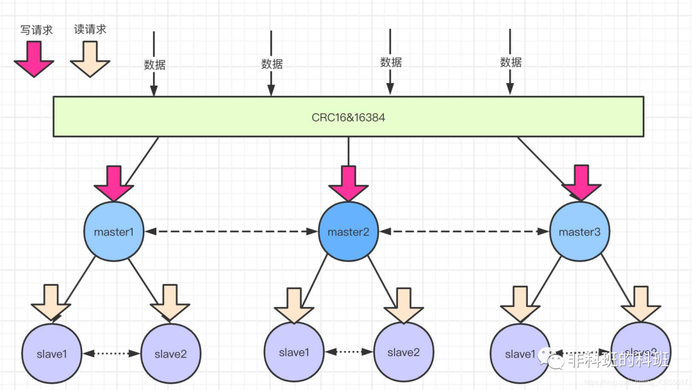
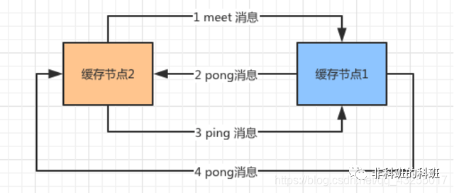
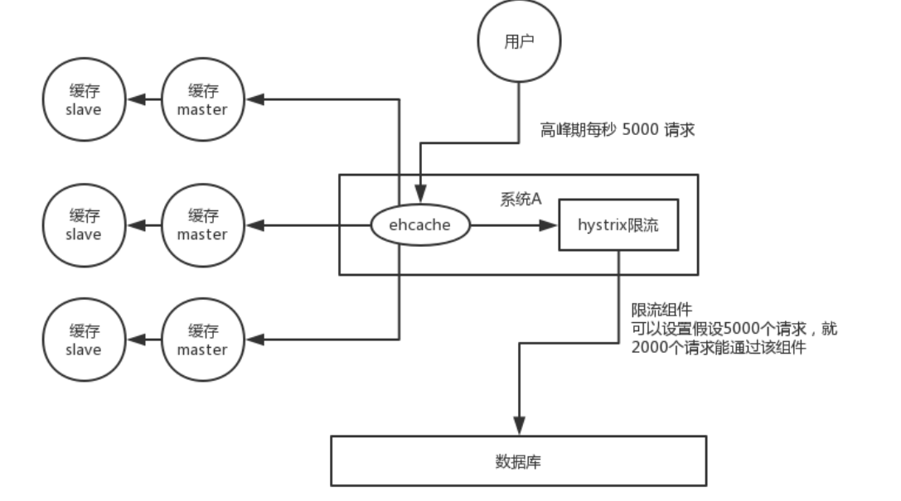
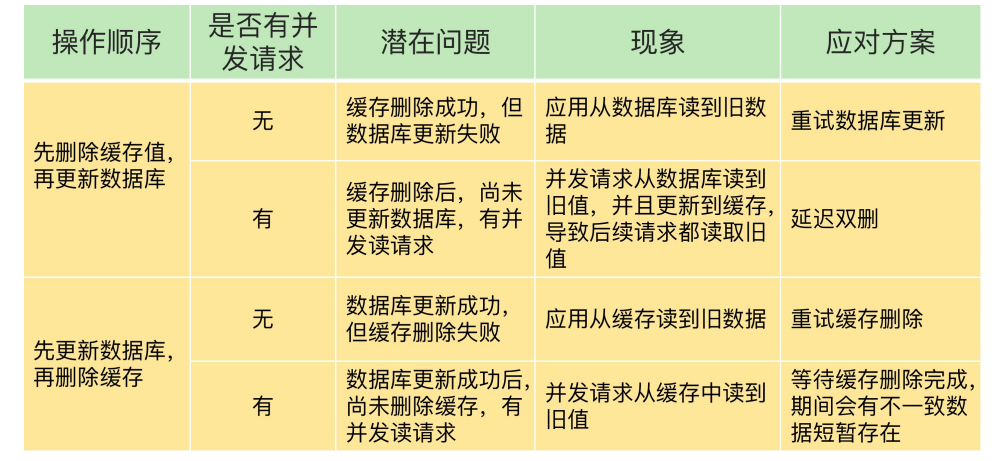

##为什么使用缓存
* 高性能:非实时变化的数据-查询mysql耗时需要300ms,存到缓存redis，每次查询仅仅1ms,性能瞬间提升百倍。    
* 高并发:mysql 单机支撑到2K QPS就容易报警了，但是使用缓存的话，单机支撑的并发量轻松1s几万~十几万。原因是缓存位于内存，内存对高并发的良好支持。
* 现有硬件系统难以处理的高性能高并发都可以用缓存来优化
##缓存的使用方式
* 本地缓存：
    * 局部变量map结构缓存部分业务数据。缺点仅限于类的自身作用域内，类间无法共享缓存
    * 静态变量map一次获取缓存内存中，静态变量实现类间可共享，进程内可共享，缓存的实时性稍差
        * 结合ZooKeeper的自动发现机制，实时变更本地静态变量缓存
        * https://www.jianshu.com/p/40cdd4bfe183
    * Ehcache纯Java的进程内缓存框架
        * https://www.cnblogs.com/liululee/p/13354481.html
    * spring注解
* 分布式缓存 
    * memcached缓存
        * MemCache虽然被称为"分布式缓存"，但是MemCache本身完全不具备分布式的功能，MemCache集群之间不会相互通信，所谓的"分布式"，完全依赖于客户端程序的实现
        * MemCache集群的方式也是从分区容错性的方面考虑的，假如Node1宕机了，此时由于集群中其他节点数据还存在。
    * redis缓存 
* Spring注解缓存
    * 参考文档
        * https://developer.ibm.com/zh/articles/os-cn-spring-cache/
        * https://www.xuebuyuan.com/2174369.html
#为什么要用redis
* Redis 支持更丰富的数据类型，持久化，容灾，集群，更快，事务，lua脚本，多种过期策略等
* redis除了缓存还能实现分布式锁，限流，消息队列，排行榜等等
# redis为什么这么快
* 
* 基于内存:内存的访问速度是磁盘的上千倍；
* 非阻塞IO和 IO 多路复用的单线程模型:基于 Reactor 模式设计开发了一套高效的事件处理模型
    * 
* 数据结构简单:内置了多种优化过后的数据结构实现，查询和修改都是大部分都是o(1)。
* 避免上下文切换：单线程模型，无锁，无死锁
# 为什么说redis是单线程
* redise 基于 Reactor 模式，使用 I/O 多路复用程序用一个线程（bossGroup）也可以来监听多个套接字，文件事件处理器以单线程方式运行（workgroup线程池为1，而netty大于1）
* 单线程易于维护
* redis的性能瓶颈不在在于内存和带宽，而非CPU
* 确切的说redis的工作线程是单线程的
##单线程的缺点
* 使用高耗时的Redis命令是很危险的，会占用唯一的一个线程的大量处理时间，导致所有的请求都被拖慢
* 大key删除
* 其他如hgetall、lrange、smembers、zrange、sinte keys命令等o(n)的命令
##redis多线程
* 为了解决大key删除的问题，redis 4引用多线程解决惰性删除，工作线程依旧是单线程
* redis aof重写 ，bgsave rdb文件保存
* redis 6为了提高网络 IO 读写性能，网络数据的读写这类耗时操作上使用了多线程，工作线程仍然是单线程顺序执行。因此，你也不需要担心线程安全问题。
* redis 6默认关闭多线程的，如需开启配置redis.conf文件
#redis的可靠性保证
## redis数据持久化
* 参考文档：https://mp.weixin.qq.com/s/cOK6IRQkavnV8EUhppfgug   
* AOF:先把命令追加到操作日志的尾部，保存所有的历史操作
    * AOF默认不开启，需要redis.config 配置 appendonly yes
    * 触发机制
        * aways：每次发生变立即记录到磁盘，需要redis.config 配置 appendosync always
        * everysec：每秒同步一次，需要redis.config 配置 appendosync everysec
     * 重写机制
       * 手动触发：直接调用bgrewriteaof命令。
       * 自动触发：根据auto-aof-rewrite-min-size和auto-aof-rewrite-percentage参数确定自动触发时机。
        ````
        auto-aof-rewrite-min-size：表示运行AOF重写时文件最小体积，默认为64MB。
        auto-aof-rewrite-percentage（设为x）：代表当前AOF文件空间（aof_current_size）和上一次重写后AOF文件空间（aof_base_size）的百分比（如auto-aof-rewrite-percentage 100 当为两倍大小是重写）。
        ```` 
       * AOF重写功能不希望阻塞主进程的执行，所以redis把AOF重写放到一个子进程去执行,子进程只能看到fork那一瞬间产生的镜像数据。redis设置了一个 AOF重写缓存区（aof_rewrite_bug） 用来存储AOF重写期间产生的命令，等子进程重写完成后通知父进程，父进程把重写缓存区的数据追加到新的AOF文件(注：这里值得注意，AOF重写期间如果有大量的写入，父进程在把aof_rewrite_buf写到新的aof文件时会造成大量的写盘操作，会造成性能的下降，redis 4.0以后增加管道机制来优化这里（把aof_rewrite_buf追加工作交给子进程去做) 
* RDB:RDB持久化是指在指定的时间间隔内将内存中的数据集快照写入磁盘，实际操作过程是fork一个子进程，先将数据集写入临时文件，写入成功后，再替换之前的文件
    * RDB默认开启
    * 持久化时机
        * save命令：通过阻塞当前redis服务直到RDB完成为止，生产一般不会使用
        * bgsave命令：命令会在后台fork一个与redis主线程一模一样的子线程，由子线程完成数据持久化
        * 配置：redis.config 配置 save 900 1 表示900秒内有1一个key发生变化则进行持久化保存数据
* 混合持久化
    * 4.0版本的混合持久化功能 默认关闭，我们可以通过 aof-use-rdb-preamble配置参数控制该功能的启用。5.0 版本 默认开启。
    * 持久化时机
        * DB-AOF混合持久化体现在aofrewrite时，即在AOF重写时把fork的镜像写成RDB，后续AOF重写缓冲区里的数据继续追加到aof文件中。
        * 混合持久化开启，同时配置RDB的save参数,Redis会生成rdb文件和AOF文件，而不是省略RDB文件。
##redis的高可用高并发
* 参考文档：https://mp.weixin.qq.com/s/cOK6IRQkavnV8EUhppfgug
###主从同步 
####流程
* 
* 
* master 默认每隔 10秒 发送一次 heartbeat，slave node 每隔 1秒 发送一个 heartbeat。
* slave 不会过期 key，只会等待 master淘汰了一个 key，那么会模拟一条 del 命令发送给 slave。
####数据同步
* https://blog.csdn.net/qq_15022971/article/details/123839648
* 全量同步：第一次连接全量复制，后续通过异步命令同步master新增数据

* 部分同步：因为从节点每秒都会和主节点同步自己的偏移量信息，主节点发现从节点的偏移量在复制积压缓冲区里面的时候，就会把数据从复制积压缓冲区同步到从节点

####解决问题
*  主从复制-> 读写分离 -> 水平扩容支撑读高并发
####产生问题
* 同步失败或延迟会造成主从数据不一致的情况
* 主从模式不具备自动容错和恢复的功能，一旦主数据库，从节点晋升为主数据库的过程需要人为操作，维护的成本就会升高
####解决方式
* 强制读主，高可用主库，用缓存提高读性能
* 哨兵模式
###哨兵模式
* 哨兵模式是主从复制的升级版
####流程
* 
####节点通信
* 哨兵间通信：是通过 Redis 的 pub/sub 系统实现的，每个哨兵都会往 __sentinel__:hello 这个 channel 里发送一个消息，这时候所有其他哨兵都可以消费到这个消息，并感知到其他的哨兵的存在。发送的内容包含「哨兵的ip和端口、运行id、配置版本、master名字、master的ip端口还有master的配置版本」
* 哨兵与节点
    * 定期的向master、slave和其它哨兵发送PING命令（每秒一次），以便检测对象是否存活，回复pong
        * 主观下线：若是某一时刻哨兵发送的PING在指定时间内没有收到master回复
        * 客观下线：认为该节点下线的哨兵达到一定的数量（quorum字段配置」
    * 定期会向（10秒一次）master和slave发送INFO命令，若是master被标记为主观下线，频率就会变为1秒一次
####master客观下线故障恢复
* 当master被认为客观下线后，哨兵中首先选举出一个老大哨兵来进行故障恢复
* 选出大佬哨兵后，大佬哨兵就会对故障进行自动回复，从slave中选出一名slave作为主数据库
  ````
  所有的slave中slave-priority优先级最高的会被选中。
  若是优先级相同，会选择偏移量最大的，因为偏移量记录着数据的复制的增量，越大表示数据越完整。
  若是以上两者都相同，选择ID最小的。
  ````
* 当选的slave晋升为master，其它的slave会向新的master复制数据，若是down掉的master重新上线，会被当作slave角色运行
####解决的问题
* 「监控」：监控master和slave是否正常运行，以及哨兵之间也会相互监控,
* 「自动故障恢复」：当master出现故障的时候，会自动选举一个slave作为master顶上去。
####产生问题
* 难以扩容，单机存储，读写受限
* 主备切换数据丢失
    * 异步复制导致的数据丢失
    * 脑裂导致数据丢失
####解决方案
* 集群模式
* 主备数据丢失：从服务器的数量少于1个，或者1个从服务器的延迟（lag）值都大于或等于10秒时，主服务器将拒绝执行写命令
  ````
  min-slaves-to-write 1 
  min-slaves-max-lag 10
  ````   
###集群模式
* 参考文档
    * https://www.jianshu.com/p/ac9bc1bb5337
    * https://blog.csdn.net/men_wen/article/details/72896682
    * https://mp.weixin.qq.com/s/cOK6IRQkavnV8EUhppfgug
* 集群模式实现了Redis数据的分布式存储，实现数据的分片，每个redis节点存储不同的内容，并且解决了在线的节点收缩（下线）和扩容（上线）问题。
####流程
* 
* redis集群分成16384 个槽（0 -16383）,如果三个master节点分成缓存（0-5000）、（5001-11000）、（11001-16383）槽范围
* 当客户端请求过来，会首先通过对key进行CRC16 校验并对 16384 取模（CRC16(key)%16383）计算出key所在的槽，然后再到对应的槽上进行取数据或者存数据
* 分槽存储，防止单台的redis数据量过大
####slot-虚拟槽
* redis的底层维护了myslots数组存放每个节点的槽信息，表示自己是否存储对应的槽数据
* redis底层还维护了一个clusterNode，储存负责对应槽的节点的ip、端口等信息
* 这样每一个redis节点就维护了其它节点的元数据信息和槽信息，
* redis集群中， key 找的是 hash slot，不是机器
####节点通信
* redis cluster 节点间采用 gossip 协议进行通信
* 会通过 Gossip 协议向老成员发送Meet消息，表示自己是新加入的成员。
* 老成员收到Meet消息后，在没有故障的情况下会恢复PONG消息，表示欢迎新结点的加入，除了第一次发送Meet消息后，之后都会发送定期PING消息，实现节点之间的通信。
* 
####解决问题
* https://blog.csdn.net/men_wen/article/details/72896682
* 扩容与收缩
    * 加入集群：新加入的节点没有负责槽位，不能接受任何读写操作
    * 分配槽范围并迁移数据：redis-trib.rb工具
* 主备切换：和哨兵原理一样，不同的每个主节点充当哨兵
* 数据分片
####产生问题
* 最终一致性：主备切换数据丢失
##redis的内存管理
* https://www.cnblogs.com/chenpingzhao/p/5022467.html?utm_source=tuicool&utm_medium=referral
* redis是基于内存的且内存是有限的，如果缓存中的所有数据都是⼀直保存的话，分分钟直接 Out of memory
* 被动删除：当读/写一个已经过期的key时，会触发惰性删除策略，直接删除掉这个过期key
* 定期删除：由于惰性删除策略无法保证冷数据被及时删掉，所以Redis会定期抽样key看是否有过期key，过期便删除
    * Redis 将 serverCron 确保它每隔一段时间就会自动运行一次 serverCron 会一直定期执行，直到服务器关闭为止。
    * 用户可以通过修改 hz选项来调整 serverCron 的每秒执行次数
    * 当REDIS运行在主从模式时，只有主结点才会执行上述这两种过期删除策略，然后把删除操作”del key”同步到从结点
* 被动删除和定期删除执行后，仍有过期的key未被抽查到，导致内存耗尽
* 当前已用内存超过maxmemory限定时，触发主动清理策略，执行配置的缓存淘汰策略
   * https://www.jianshu.com/p/857282187164
   * allkeys-lru: 最近最少使用算法，从所有的键中选择最久没有使用的数据
   * volatile-lru: 最近最少使用算法，从设置了过期时间的键中选择最久没有使用的数
   * allkeys-lfu: 最近最不经常使用算法，从所有的键中选择某段时间之内使用频次最少的键值对清除
   * volatile-lfu: 最近最不经常使用算法，从设置了过期时间的键中选择某段时间之内使用频次最小的键值对清除掉
   * volatile-ttl: 从设置了过期时间的键中选择过期时间最早的键值对清除
   * volatile-random: 从设置了过期时间的键中，随机选择键进行清
   * allkeys-random: 所有的键中，随机选择键进行删除 据
   * noeviction: 不做任何的清理工作，在redis的内存超过限制之后，所有的写入操作都会返回错误；但是读操作都能正常的进行
##缓存应该注意的问题
###缓存雪崩
* 于系统 A，假设本来缓存在高峰期可以扛住4000 QPS，单机数据库最大支持每秒2000QPS，但是缓存机器意外发生了全盘宕机或同时失效，数据库必然扛不住，然后就挂了。此时，如果没用什么特别的方案来处理这个故障，重启数据库，但是数据库立马又被新的流量给打死了。
* 处理方式
    * 批量往Redis存数据的时候，把每个Key的失效时间都加个随机值就好了，避免缓存同时失效
    * 如果redis是集群部署，将热点数据均匀分布在不同的Redis库中也能避免全部失效的问题 
    * 设置热点数据永远不过期，有更新操作就更新缓存就好了
    * 除了redis，本地用 ehcache 缓存 + hystrix 限流&降级 ，先查ehcache 缓存缓存不存在再查数据库
    * redis 持久化，一旦重启，自动从磁盘上加载数据，快速恢复缓存数据
* 
### 缓存穿透
* 对于系统A，假如不做参数校验，每次请求不存在数据库中也不存在缓存中，每次都这样，并发高点就容易崩掉了 
* 处理方式
    * 通过bitMap进行参数校验，不存在数据库的请求直接拦截
    * 数据库不存在缓存中设置一个空值，设置过期时间
###缓存击穿
* 对于系统A，假如每秒5000个请求中4000个请求都是请求同一个key，则当这个Key在失效的瞬间，持续的大并发就穿破缓存，直接请求数据库            
* 处理方式
   * 若缓存的数据是基本不会发生更新的，则可尝试将该热点数据设置为永不过期。
   * 若缓存的数据更新不频繁，且缓存刷新的整个流程耗时较少的情况下，则可以采用基于分布式互斥锁保证仅少量的请求能请求数据库并重新构建缓存，其余线程则在锁释放后能访问到新缓存。
   * 若缓存的数据更新频繁或者在缓存刷新的流程耗时较长的情况下，可以利用定时线程在缓存过期前主动地重新构建缓存或者延后缓存的过期时间，以保证所有的请求能一直访问到对应的缓存
###缓存与数据库双写的一致性 
* https://mp.weixin.qq.com/s?__biz=MzIyOTYxNDI5OA==&mid=2247487312&idx=1&sn=fa19566f5729d6598155b5c676eee62d&chksm=e8beb8e5dfc931f3e35655da9da0b61c79f2843101c130cf38996446975014f958a6481aacf1&scene=178&cur_album_id=1699766580538032128#rd
* 先更新数据库，再更新缓存（不可取）：耗费性能，要符合lazy原则
* 
* 推荐采用「先更新数据库，再删除缓存」方案，并配合「消息队列」或「订阅变更日志」的方式来做,本质是重试
* 延迟双删：读写分离架构，主从同步时间不好估计
    * 先删缓存，再更新数据库,后异步延时（ 1秒+主从同步时间 ）删除缓存，若缓存删除失败则重试
* 订阅数据库变更日志，再操作缓存
    * 「只需」修改数据库，无需操作缓存
    * canal中间件
###热key
* 发现热key：将key值异步上报统计，比如kafka
* 利用二级缓存：比如利用ehcache。在你发现热key以后，把热key加载到本地
* 备份热key：把key，在多个redis上都存一份。请求进来，我们就在有备份的redis上随机选取一台，进行访问取值，返回数据    
````
1、性能和一致性不能同时满足，为了性能考虑，通常会采用「最终一致性」的方案

2、掌握缓存和数据库一致性问题，核心问题有 3 点：缓存利用率、并发、缓存 + 数据库一起成功问题

3、失败场景下要保证一致性，常见手段就是「重试」，同步重试会影响吞吐量，所以通常会采用异步重试的方案

4、订阅变更日志的思想，本质是把权威数据源（例如 MySQL）当做 leader 副本，让其它异质系统（例如 Redis / Elasticsearch）成为它的 follower 副本，通过同步变更日志的方式，保证 leader 和 follower 之间保持一致

很多一致性问题，都会采用这些方案来解决，希望我的这些心得对你有所启发。
````    
## redis优化策略
* https://zhuanlan.zhihu.com/p/293042405
* 配置最大缓存，最佳设置是物理内存的75%(执行缓存淘汰策略)
* 禁止使用keys命令
* 避免一次查询所有成员，使用scan命令进行分批，游标式遍历
* 控制Hash，Set等数据结构的大小
* 在某一些场景，将并集，交集，差集放在客户端处理，以减少Redis服务器的运行压力
* 删除(del)大数据时，可以采用异步删除方式unlink，它会启动一个新的异步线程来删除数据，而不阻塞Redis继续接收处理其它请求
* 过期时间加随机数  
##redis生成部署配置
* Redis cluster，10 台机器，5 台机器部署了 Redis 主实例，另外 5 台机器部署了 Redis 的从实例，每个主实例挂了一个从实例，5 个节点对外提供读写服务，每个节点的读写高峰 QPS 可能
  可以达到每秒 5 万，5 台机器最多是 25 万读写请求每秒。
* 32G 内存+ 8 核 CPU + 1T 磁盘，但是分配给 Redis 进程的是 10g 内存，一般线上生产环境，Redis 的内存尽量不要超过 10g，超过 10g 可能会有问题  
* 你往内存里写的是什么数据？每条数据的大小是多少？商品数据，每条数据是 10kb。100 条数据是 1mb，10 万条数据是 1g。常驻内存的是 200 万条商品数据，占用内存是 20g，仅仅不到总
  内存的 50%。目前高峰期每秒就是 3500 左右的请求量
#redis集群如何指定slot
* 设置key： {XX}:key 
* JedisCluster 会先取大括号的值计算hash
````
  private static String extractHashTag(String key, boolean returnKeyOnAbsence) {
    int s = key.indexOf("{");
    if (s > -1) {
      int e = key.indexOf("}", s + 1);
      if (e > -1 && e != s + 1) {
        return key.substring(s + 1, e);
      }
    }
    return returnKeyOnAbsence ? key : null;
  }
````
#redis实战案例
###微信抢红包 
* 拆红红包算法 
* 放入红包：list
* 抢红包：hash
###聚划算实战+防止缓存击穿
* list
* 双缓存（查询先缓存A后B，更新先B后A）
###亿级ua统计
* HyperLogLog
###其他
* 看redis源码.md

