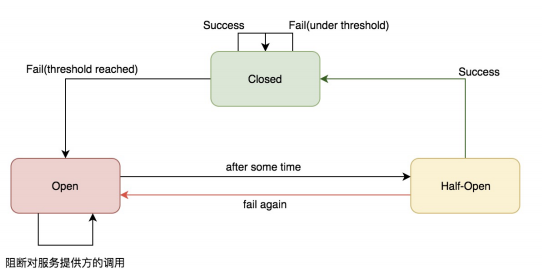
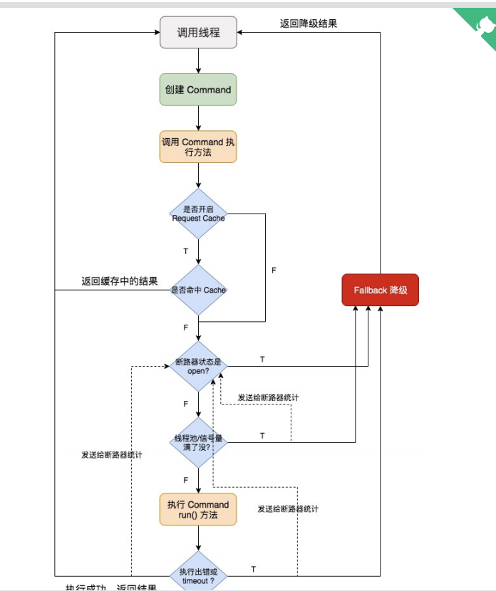

# 为什么要降级限流
* 如果系统访问量很高，Nginx 本地缓存过期失效了，redis 中的缓存也被 LRU 算法给清理掉了。，
* 那么会有较高的访问量，从缓存服务调用商品服务。但如果此时商品服务的接口发生故障，调
  用出现了延时，缓存服务全部的线程都被这个调用商品服务接口给耗尽了
* 此时缓存服务没有足够的线程去调用其它一些服务的接口，从而导致整个大量的商品详情页无法正常显示
* 一个商品接口服务故障导致缓存服务资源耗尽的现象
* 所以需要限流降级快速失败
#Hystrix
* 服务器.http://c.biancheng.net/springcloud/hystrix.html
* https://www.jianshu.com/p/b042b812677c
##资源隔离
* 资源隔离，就是说，你如果要把对某一个依赖服务的所有调用请求，全部隔离在同一份资源池内，不会去用其它资源了，这就叫资源隔离。
* 基于线程池
* 基于信号量
* 区别
    * 线程池隔离技术，是用 Hystrix 自己的线程去执行调用；
    * 而信号量隔离技术，是直接让 tomcat线程去调用依赖服务。信号量隔离，只是一道关卡，信号量有多少，就允许多少个 tomcat 线程通过它，然后去执行。
    * 线程池隔离适合大部分情况
    * semaphore 技术可以用来限流和削峰，但是不能用来对调用延迟的服务进行 timeout 和隔离
###Hystrix隔离粒度设置
* HystrixCommandGroupKey：区分一组服务，一般以接口为粒度(比如同一个fegin接口下的请求)。
* HystrixCommandKey：区分一个方法，一般以方法为粒度（单个方法）。
* HystrixThreadPoolKey：一个HystrixThreadPoolKey下的所有方法共用一个线程池。
* 组合
* 一般资源隔离只有设置线程池就可以，设置CommandKey和CommandGroupKey方便统计
###参数设置
* 线程池设置
* 请求超时时间
````
接口+线程池粒度隔离线程
方法+线程池粒度隔离线程
接口+线程池&方法+线程池。混合隔离粒度
````
##熔断器
###状态机
* 断路器状态机有3中状态：open，close，half-open
* 
###参数
* 在一次统计的时间滑动窗口中：
    * requestVolumeThreshold：至少经过多少个请求，才可能触发断路，默认值 20。
    * errorThresholdPercentage： 失败请求比例，才可能触发断路，默认值 50（%）。
* sleepWindowInMilliseconds：断路时间，5000毫秒后close变为half-open
##降级/限流
###条件
* 执行construct()或run()抛出异常
* 熔断器打开导致命令短路
* 命令的线程池和队列或信号量的容量超额，命令被拒绝
* 命令执行超时
###异同
* hstrix 通过判断线程池或者信号量是否已满，超出容量的请求，直接 Reject 走降级，从而达到 限流的作用。
* hstrix 通过semaphore 技术可以用来限流
* 降级主要作用在快速失败
##原理
* 
#Sentinel
* https://www.cnblogs.com/crazymakercircle/p/14285001.html
* Sentinel是阿里开源的项目，提供了流量控制、熔断降级、系统负载保护等多个维度来保障服务之间的稳定性
* Sentinel 可以简单的分为 Sentinel 核心库和 Dashboard。核心库不依赖任何第三方类库。
##资源
* 资源是 Sentinel 的关键概念。它可以是 Java 应用程序中的任何内容，例如，由应用程序提供的服务，甚至可以是一段代码。
* Sentinel的关键代码 SphU.entry("资源名") 和 entry.exit() 包围起来就是资源，能够被 Sentinel 保护起来。
* 资源注解@SentinelResource也是资源
##规则
* 规则主要有流控规则、 熔断降级规则、系统规则、权限规则、热点参数规则等：
* ````
  FlowRuleManager.loadRules(List<FlowRule> rules); // 修改流控规则
  DegradeRuleManager.loadRules(List<DegradeRule> rules); // 修改降级规则
  SystemRuleManager.loadRules(List<SystemRule> rules); // 修改系统规则
  AuthorityRuleManager.loadRules(List<AuthorityRule> rules); // 修改授权规则
  ````
##资源隔离
* 开发的时候只考虑这个方法/代码是否需要保护，置于用什么来保护，可以任何时候动态实时的区修改。
* 用户可以 根据系统当前的在控制台实时情况去动态地变更规则配置，数据源会将变更推送至 Sentinel 并即时生效
* Sentinel 通过并发线程数模式的流量控制来提供信号量隔离的功能。并且结合基于响应时间的熔断降级模式，可以在不稳定资源的平均响应时间比较高的时候自动降级，防止过多的慢
  调用占满并发数，影响整个系统
##熔断
* Sentinel 和 Hystrix 的熔断降级功能本质上都是基于熔断器模式 Circuit Breaker Pattern 。
##控制台
* 自带控制台，方便线上配置与查看  

