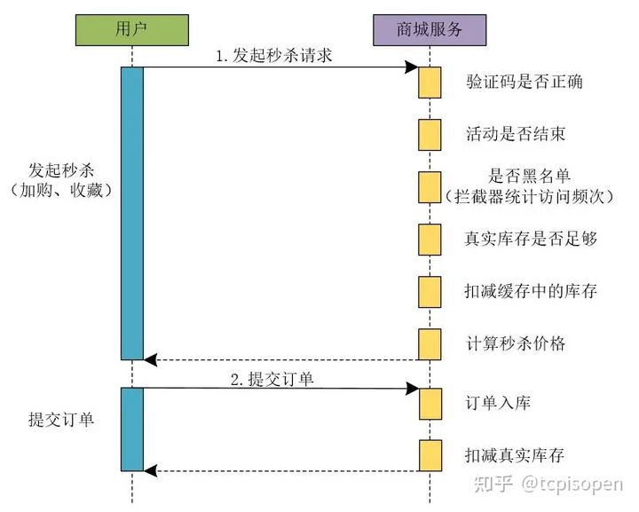

#参考文档
* https://zhuanlan.zhihu.com/p/433618121
* https://blog.csdn.net/qq_40276423/article/details/122179911
* https://zhuanlan.zhihu.com/p/433618121
#假设
* 假设秒杀业务QPS为50w，秒杀商品1W，单机redisQPS性能为5W，tomcat为4核心8Gwork线程为1000,RT为0.3s，商品Id为10000
#特点
* 瞬时并发高
    * 消息队列削谷填峰
    * 限流：秒杀接口通过sentinel限流，
    * 降级
* 读多写少
    * CDN缓存静态页面
    * redis缓存
    * mysql读写分离
* 限时限量限价
    * 下单减库存
* 接口幂等
    * 前端按钮置灰
    * 后端分布式锁，数据唯一索引限制
#如何防止超卖
* redis lua 原子性指令
````
local resultFlag = "0" 
local n = tonumber(ARGV[1]) 
local key = KEYS[1] 
local goodsInfo = redis.call("HMGET",key,"totalCount","seckillCount") 
local total = tonumber(goodsInfo[1]) 
local alloc = tonumber(goodsInfo[2]) 
if not total then 
    return resultFlag 
end 
if total >= alloc + n  then 
    local ret = redis.call("HINCRBY",key,"seckillCount",n) 
    return tostring(ret) 
end 
return resultFlag
````
* 其他原子性指令
````
// 第一步：先检查 库存是否充足
Integer stockNum = (Integer) redisTemplate.get(key);
if (stockNum < 1) {
    ......
}
// 第二步：如果库存充足，减少库存（假设只能购买一件）
Long count = redisTemplate.increment(key, -1);
if (count >= 0) {
     ......
}else{
  ......
}
````
#流程
##同步下单
* 
* 用户请求到返回结果同步，连接不会释放
##异步下单
* 
* 通过kafka异步处理订单，kafka通过pull方式默认拉取500个消息
#保证静态资源可用
* nginx 缓存静态资源（html/js/img）
* 带宽不够：CDN缓存静态资源
* openRestry
#保证微服务可用
*  单机tomcat线程为1000，rt为0.2s，因为没有逻辑只有发送MQ，单台服务QPS 为5000，则需要约1000台机子
*  秒杀接口加限流注解（基于信号量5000），超出的请求走降级
#保证redis可用
* 我们使用redis作为缓存
* QPS为50W，单机redis并发5W，明显不可用。使用redis集群，同一个商品会分配到同一个slot里面，依然不可用。
* 设置12个服务的redis集群，集群负责的slot为0,1,2,3,.....12(简化，其他是16383)
* 将秒杀的相关key设为{1}.shopId...{12}.shopId,如此12个节点都缓存秒杀信息。
#保证MQ可用
* 单挑Kafka支持QPS30W，采用kafka集群，满足
* 发送可靠性
* 处理可靠性
* 数据一致性
#保证mysql可用
* 调用mysql满足条件，都走缓存
#服务器优化
* cpu
* 内存
* 带宽
#压测