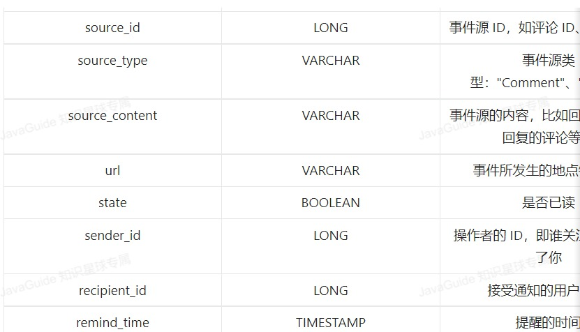

#系统消息
##生成
##推送
* 数据量小，公用一张消息表，批量插入消息
* 数据量大
    * 每位用户单独有一张或者几张专门用来存放站内消息的表，根据 hash(userId)作为表名后缀。
    * 对于系统通知类型，只存放一条数据到 t_user_system_notice 表，用户自己拉取数据然后再判断消息是否已经读取过即可。
#消息提醒
* 
* action +source 定义一个行为
* 聚合根据这两个属性
#私信
* netty服务器 